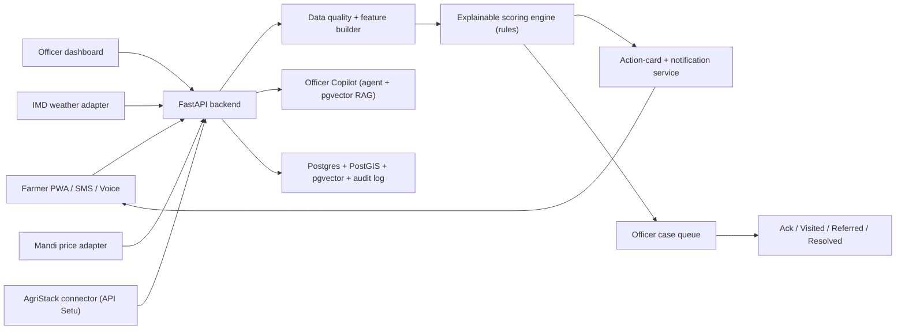

# Master Design Specification (v1)

**An explainable farmer-support radar — not a chatbot.**
It detects when a farmer may need help early, explains *why* in their own language, sends a safe advisory, and routes the case to a human agriculture officer who closes the loop.

- **Problem statement:** PS-02 — Smart Crop Advisory & Farmer Distress Early-Warning System
- **Event:** Internal Hackathon 2026 (SIH-styled). Judging axes: Idea/Innovation · Technical Feasibility · Impact · Prototype/MVP Quality · Presentation.
- **Deliverables:** Working prototype/MVP + SIH-style PPT + 3-min demo video.
- **Version:** v1 · **Date:** 2026-08-18 · **Status:** initial detailed spec, pre-build.

---

## 0. One-paragraph pitch

Every farmer tool today is *reactive*: the farmer must open an app and ask (chatbot), photograph a diseased leaf (Plantix/AgroStar), or check prices (eNAM). Existing agriculture data and service systems support registries, advisory, and credit workflows, but they do not provide this platform's specific human-outreach loop. **The platform detects signals that a farmer may need support, explains why, and connects the case to a person before the farmer has to ask.** It is a transparent, rules-based support-priority radar that runs per village, speaks the farmer's language, and hands a ranked, reason-coded queue to an agriculture officer. The winning line:

> *"The platform doesn't predict who will default. It notices who may need support early, explains why, and connects them to a person."*

---

## 1. Users and outcomes

| User | What they do | What they get |
|---|---|---|
| **Smallholder farmer** | 30–60s voice/tap check-in; receives advisories | Early warning in Marathi/Hindi, an explanation they trust, concrete next steps, a human callback |
| **Agriculture extension officer** | Works a ranked case queue; acknowledges, visits, refers, resolves | Knows *who to call first and why*; less guesswork across 40 villages |
| **District agriculture officer** | Reviews aggregate hotspots and performance | A measurable distress-response instrument (lead time, closure %), never individual surveillance |

---

## 2. Core concept — the Sense → Score → Act → Close loop

The system runs continuously **per village**:

1. **Sense** — adapters pull signals into a common `Observation` shape, each carrying `observed_at`, `quality`, and a `ttl`. A signal past its TTL doesn't vanish — it **lowers confidence**.
2. **Score** — a deterministic rules engine produces a 0–100 support-priority score, a band, the top-3 drivers, a confidence value, and an expiry.
3. **Act** — a Red (or sustained Amber) fires an agronomist-approved **action card**, translated (never generated) into the farmer's language, delivered by PWA/SMS/voice.
4. **Close** — the same event becomes an officer **case** (New → Acknowledged → Visited/Referred → Resolved). District analytics are aggregate-only.

The software's single job: **decide who a human should call today, and prove the call happened.**

---

## 3. Scoring engine (the technical differentiator)

Transparent, rules-based, testable. **The score is never hidden inside a model.**

| Signal | Weight | Source |
|---|---:|---|
| Rainfall / forecast shock | 0–35 | IMD (modulated by `irrigation_type`) |
| Mandi price stress | 0–30 | Agmarknet / eNAM |
| Optional repayment window | 0–20 | Farmer opt-in only |
| Crop / soil vulnerability | 0–10 | Crop + sowing stage + soil context |
| Farmer-reported shock | 0–5 | Farmer input |

**Bands:** Green 0–29 · Amber 30–59 · Red 60–100.

**Every score carries:**
- **Top-3 drivers** — the human-readable *why* ("rainfall −28%, cotton −18%, loan due in 12 days").
- **Confidence** — derived from data freshness + completeness.
- **Hysteresis** — two observations / three days before a band changes (prevents flapping).
- **Expiry** — the score is a perishable claim, not a permanent label.
- **Stale-feed suppression** — a feed past its TTL lowers confidence and can suppress escalation.

**Non-negotiable label on every score:** *"This is not a credit, loan-default, or insurance score."*

---

## 4. Data contract

### 4.1 Data collected *from* the farmer

Minimal; sensitive fields coarse-banded or opt-in. **No Aadhaar, bank account, or lender ID — ever.**

| Field | Type | Why | Capture | Feeds |
|---|---|---|---|---|
| `language` | enum (hi/mr) | I/O | Icon picker, spoken | — |
| `village_id` | ref | Ties to weather, mandi, officer routing | GPS→village / picker / AgriStack | all signals |
| `crop` | enum | Which price to watch + vulnerability | Icon picker | market + crop/soil |
| `sowing_date` | date | Crop stage → vulnerability | Season picker | crop/soil |
| `irrigation_type` | enum (rainfed/irrigated) | Rain exposure weighting | Icon picker | rainfall |
| `area_band` | enum (<1 / 1–2 / >2 ha) | Equity reporting (coarse) | Picker | reporting |
| `phone` | string (encrypted, M2 vault only) | SMS/voice/callback delivery | Onboarding | delivery |
| `consent_flags` | object (M2 consent ledger; not a profile authority) | Legal basis for storage/contact/analytics | Toggle screen | — |
| `due_window` *(opt-in)* | `{due_date_band, amount_band}` | Repayment-stress signal | Explicit opt-in slider | repayment |
| `farmer_report` *(ongoing)* | enum event | "Pest seen", "no buyer", "crop damaged" | Big-button + voice | farmer report |

**Minimum to compute a score:** `village_id` + `crop` + `irrigation_type` + `sowing_date`.

### 4.2 External APIs (system pulls)

Only **two** external sources feed the score — a small, auditable signal set is a strength, not a gap.

| Source | Gives | Feeds | Access | MVP | Refresh / TTL |
|---|---|---|---|---|---|
| **IMD** | Rainfall actual + forecast vs normal | Rainfall shock 0–35 | IMD public weather API | District fixture | Daily · 48h |
| **Agmarknet / eNAM** | Daily modal prices + arrivals | Market stress 0–30 | data.gov.in Agmarknet / eNAM | Price fixture | Daily · 72h |
| **AgriStack** | Farmer/crop/land prefill | *profile only* | Consented pull via API Setu | Mock + consent screen | On onboard |
| **Bhashini** | ASR + TTS + translation (11+ langs) | *I/O layer* | Bhashini public APIs | **Wire live** (differentiator) | Per interaction |
| **Bhuvan / OSM** | Village + mandi coordinates | *map display* | Tiles / geocode | Static GeoJSON | Static |

`repayment` and `farmer_report` sub-scores come **only** from farmer input — no external loan-bureau or credit API. That is the privacy firewall.

### 4.3 Scheme eligibility — retrieval, not a lookup

**No live entitlement query, no farmer's actual PM-Kisan/bank status.** Eligibility is an informational, retrieval-based "you *may* qualify," verified by the officer.

- **Scheme rule corpus** — public PM-Kisan / PMFBY / KCC / state-relief docs chunked into `pgvector` (one-time ingest).
- **Coarse farmer attributes** (`crop`, `area_band`, `state`, `irrigation_type`) filter which schemes surface.
- Output: grounded, **cited** "you may be eligible for PMFBY — an officer will confirm." Never a hallucinated or live-status claim.

### 4.4 Derived data (computed, not collected)

`risk_events`, sub-scores, drivers, confidence, cases, analytics — all generated by the engine.

### 4.5 Privacy & safety firewall (summary)

- Tokenised farmer IDs; `phone` encrypted; no Aadhaar/bank/lender data.
- Opt-in only for the repayment window; coarse bands.
- Consent toggles for storage, contact, and aggregate analytics; withdrawal + deletion supported.
- No automatic pesticide dosage or agronomic/medical diagnosis.
- Stale/missing data reduces confidence — it never manufactures a false alert.
- Aggregate analytics only (cohort suppression); no individual surveillance or disciplinary use.

---

## 5. Data model (core tables)

`farmer_profiles` · `crop_cycles` · `weather_observations` · `market_quotes` · `farmer_reports` · `risk_events` · `action_cards` · `alert_cases` · `case_status_history` · `consents` · `audit_events` · `scheme_chunks` (pgvector).

Key data shapes:

```
FarmerProfile { farmer_token, village_id, locale, crop, sowing_date,
                irrigation_type, area_band, consent_flags }
Observation   { source, observed_at, village_id|plot_grid, metric,
                value: JsonValue, unit, quality, ttl }
MarketQuote   { commodity, mandi_id, date, modal_price, arrivals, source, quality }
DueWindow     { farmer_token, due_date_band, amount_band, consent }
RiskEvent     { event_id, farmer_token, village_id, score, band, confidence,
                contributors[], action_ids[], model_version, expires_at }
AlertCase     { case_id, event_id, farmer_token, village_id, band, confidence,
                recipient_role, channel_preferences[], sent_at, ack_at, status,
                resolution_code, notes }
```

**Indexes:** village + district; crop + date; commodity + mandi + date; risk band; geospatial (village/mandi coordinates, PostGIS); pgvector index on `scheme_chunks`.

---

## 6. Government integration & adaptability

**The rule: adapters, not dependencies.** Every government source sits behind an interface with two implementations — a **mock adapter** (reads 90-day replay fixtures, used in the demo) and a **real adapter** (calls the live API, shown as the production contract). The finale never depends on a live government credential; the code is genuinely production-wired.

```
signal → AdapterInterface → { MockAdapter (fixtures) | RealAdapter (gov API) }
```

| App feature | Gov source | Role | MVP | Guardrail |
|---|---|---|---|---|
| Profile prefill | **AgriStack** (Farmer + Crop Registry, geo maps) | Consented identity/land/crop | Mock + consent screen | Token only; no Aadhaar/bank |
| Rainfall signal | **IMD** | Rainfall-shock sub-score | Fixture | TTL → confidence |
| Price signal + "nearer mandis" | **Agmarknet / eNAM** | Market-stress sub-score + comparison | Fixture | Source + date shown |
| Voice + language | **Bhashini** | Voice UI + spoken explanations | Wire live | Translate templates only |
| Scheme eligibility | **PM-Kisan / PMFBY / KCC** docs | RAG corpus | pgvector ingest | Cited, officer-verified |
| Consented exchange bus | **API Setu** | Standard rails for the pulls above | Named in architecture | Role-based, auditable |
| Complementary handoff | **Kisan e-Mitra / Bharat-VISTAAR** | Deep scheme Q&A + ICAR best practice | Optional handoff | Partner, not competitor |

**Positioning:** the platform is a **human-outreach layer that can interoperate with AgriStack and other agriculture services** — it uses consented, purpose-limited signals to decide *who may need support and a person to call*. It complements government DPI and advisory systems instead of claiming to replace them or make lending decisions.

---

## 7. Voice interface

Voice-first because the target user has low literacy, a basic Android phone, and often 2G.

- **Engine:** Bhashini ASR + TTS + translation (start Hindi + Marathi). Cached/local fallback when offline.
- **Reusable asset:** port the team's existing Gemini Live-style voice stack (VAD, barge-in, low-latency streaming) from prior work — the hard real-time plumbing already exists.
- **Interaction spine:** every screen is operable **eyes-free** — tap anywhere → it speaks; a 🔊 "Hear this" button replays. Barge-in lets the farmer interrupt.
- **Grounding rule:** the voice copilot *narrates* the deterministic score and the scheme RAG — it never invents the score, a diagnosis, or a dosage. Template-first, LLM-polish-second, agronomy-locked.

---

## 8. UI/UX

**Two users, two design languages — never let them bleed together.**

### 8.1 Design principles

- Farmer app: one primary thing per screen, traffic-light status, big thumb-sized targets, high contrast for sunlight, voice on every element, works on 2G/offline.
- Officer dashboard: dense triage cockpit — *who to call first and why* in 5 seconds.
- **Trust through symmetry:** the officer sees the *same* explanation the farmer sees.

### 8.2 Farmer app (voice-first PWA)

- **Onboarding (once):** giant language buttons (script shown in that script, spoken on tap) → crop, village, sowing, irrigation as icon + voice pickers (never text fields) → optional opt-in "loan due window" slider, framed as "so we can warn you before a hard month."
- **Home = one status card:** full-screen traffic-light disc (green/amber/red) + one spoken sentence + replay. Nothing else.
- **The "why" screen:** the three drivers as big pictograms with one line + audio each (rain cloud "28% less rain," falling-price arrow "cotton −18%," calendar "loan due 12 days"). This is what makes the farmer *believe* the alert.
- **Action card (Red):** 1–3 spoken, tappable actions — "See 3 nearer mandis" (map + price + distance), "Hear about PMFBY," "Talk to an officer" (callback).
- **Offline:** last status + card cached; honest banner "Showing yesterday's info (no network)."

### 8.3 Officer dashboard (triage cockpit)

- **Left:** ranked case queue — farmer token + village + band chip + driver icons + confidence + age; Red on top.
- **Center:** map (Leaflet/MapLibre) with village hotspots + mandi pins.
- **Right:** case detail = score breakdown (same as farmer) + history sparkline + action panel (Acknowledge, Log Visit, Refer to FPO/KVK, Resolve with reason code) + one-tap call / send approved message.
- **Top:** district strip — open Red cases, median acknowledgement time, closure %, hotspot villages.
- **Demo micro-moment:** click Red case → see 3 reasons → Refer to FPO + Resolve → farmer app updates → closure metric ticks up. The visible closed loop in 15 seconds.

---

## 9. Onboarding flow (detailed)

1. **Language** — big buttons (हिंदी / मराठी), each spoken aloud on tap.
2. **Location** — GPS → village suggestion, or picker, or "Use my Farmer ID" (AgriStack consent → prefill).
3. **Farm context** — crop (icon grid), sowing month (season wheel), irrigation (rainfed/irrigated icons).
4. **Optional financial window** — a single opt-in toggle; if on, a coarse due-date band + amount band. Copy: "This is only to warn you early. It is *not* a credit or default score."
5. **Consent** — three separate toggles: store my data · let an officer contact me · use anonymised trends. Defaults conservative.
6. **Done** — lands on the Green status home with a spoken welcome. Total: under 60 seconds, zero typed text.

---

## 10. AI / agentic layer — *deterministic core, agentic periphery*

The score (a livelihood decision) stays deterministic. AI lives at the edges where a human validates or where language is the barrier.

- **A. Officer Copilot (highest ROI, build this):** tool-calling agent that drafts the case brief from score + drivers + history, retrieves scheme eligibility via RAG, suggests the next action from a **fixed playbook**, and drafts the local-language outreach message — **officer approves every outward action.** Framework: LangGraph / tool-use loop (Claude or Gemini API) + pgvector retrieval in the same Postgres.
- **B. Farmer Voice Copilot:** Bhashini-backed voice agent (reusing the existing real-time voice stack) that *narrates* the radar and scheme answers in Marathi/Hindi. Never generates the score.
- **C. LLM explainer/translator (narrow, guardrailed):** turns deterministic drivers into natural dialect sentences; template-first, agronomy-locked.
- **D. Shadow ML challenger (roadmap, not MVP):** a calibrated model runs silently alongside the rules, logged but never acting, until labelled outcomes exist. Explicitly out of the safety path.

**Positioning line:** *"Agentic AI does the officer's paperwork and speaks the farmer's language; a transparent rules engine — not a model — decides who needs help."*

---

## 11. Architecture



### Tech stack

| Layer | Choice | Purpose |
|---|---|---|
| Farmer app | React + TS + Vite PWA | Fast, install-free, offline |
| Officer dashboard | React + TS | Queue, maps, cases, analytics |
| Styling | Tailwind CSS | Responsive UI |
| Maps | Leaflet / MapLibre | Villages, mandis, hotspots |
| Backend | Python + FastAPI | APIs, validation, scoring, integrations |
| Validation | Pydantic | Clean data contracts |
| DB access | SQLAlchemy + Alembic | Queries + migrations |
| Database | PostgreSQL + PostGIS + pgvector | Events, geo, RAG vectors |
| Auth | Supabase Auth | Officer/admin login |
| Scoring | Pure Python rules package | Testable, explainable |
| Agent | LangGraph / tool-use loop | Officer copilot + RAG |
| Voice | Bhashini + existing voice stack | ASR/TTS/translation |
| Notifications | Provider adapter | Mock SMS/voice first |
| Testing | Pytest | Scoring, stale data, permissions, workflow |
| CI/CD | GitHub Actions | Tests + deploy |

### Hosting (prototype)

```
Frontend:  https://farmer-app-demo.vercel.app     (Vercel, static PWA)
Backend:   https://farmer-app-api.onrender.com     (Render, Docker + cron/worker for replay)
Database:  private Supabase project               (Postgres + PostGIS + pgvector + Auth)
Repository: GitHub
```

The browser calls FastAPI; the database is never exposed directly to the browser. No live government credential in the finale.

---

## 12. API endpoints

```
POST /api/v1/farmer-profiles
POST /api/v1/observations
POST /api/v1/risk-events/recalculate
GET  /api/v1/risk-events?district_id=...
GET  /api/v1/mandis/compare
POST /api/v1/cases/{case_id}/acknowledge
POST /api/v1/cases/{case_id}/resolve
POST /api/v1/replay/scenario         <-- most important for the demo
GET  /api/v1/analytics/district
POST /api/v1/copilot/brief           <-- officer copilot: case brief + scheme RAG
```

`POST /api/v1/replay/scenario` triggers: (1) normal, (2) rainfall shock, (3) rainfall + price crash, (4) rainfall + price crash + due window, (5) stale-data failure.

---

## 13. MVP boundary

**Build:** one district · two crops · two languages · one weather dataset · one mandi-price dataset · synthetic repayment windows · farmer PWA · officer dashboard · score explanation · mandi comparison · case acknowledge/close · mock SMS/voice · offline replay · (stretch, differentiator) live Bhashini voice + officer copilot brief.

**Do not build (MVP):** general chatbot · all-India coverage · live loan-bureau integration · wearables · onboard NDVI · custom foundation model · 22-language voice · automatic pesticide recommendations.

---

## 14. Acceptance tests

- A drought + 20% price crash + opted-in due window creates a **Red** event within 24h with **all three drivers** shown.
- Stale data **lowers confidence and suppresses escalation** (no false alert).
- Every action card traces to a **rule + source**.
- Red case appears in the officer queue with reason codes; acknowledge → resolve updates the farmer app and district metric.
- Scheme eligibility answers are **cited** and marked "officer will confirm."
- Offline: last status + card render with an honest stale banner.

---

## 15. Execution plan (internal-round window)

Because the round requires a polished 3-min video, invest in demo polish and story, not just features.

- **Phase 1 — Foundations:** district/crops, schemas, consent, 90-day fixtures, adapter interfaces.
- **Phase 2 — Signals & scoring:** IMD/Agmarknet mock adapters, quality/TTL flags, rules scorer, bands, explanations, unit tests.
- **Phase 3 — Farmer app:** onboarding, status home, why-screen, action cards, offline cache, Bhashini voice.
- **Phase 4 — Officer side:** case queue, map, case detail + actions, district strip, copilot brief.
- **Phase 5 — Integration & safety:** replay scenarios (incl. stale-data), RBAC/audit, scheme RAG.
- **Phase 6 — Story:** deck, 3-min video, rehearsal, Q&A prep (every member can answer).

---

## 16. Three-minute demo script

1. Farmer selects Marathi, enters cotton crop. → Green status, normal advisory.
2. Replay rainfall deviation. → Amber; "less rain than usual."
3. Replay mandi price crash + due window. → Red; "you may need support soon."
4. Show the three reasons behind the score.
5. Send a Marathi action card via simulated SMS/voice.
6. Officer dashboard receives the case.
7. Officer acknowledges, refers to FPO, resolves.
8. Remove the price feed. → stale-data warning, confidence drops, escalation held.
9. Close on the line: *"The platform doesn't predict who will default. It notices who may need support early, explains why, and connects them to a person."*

---

## 17. Market landscape & differentiation

| Product | Does | Is *not* |
|---|---|---|
| Plantix | Photo → disease diagnosis | Farmer-pull, single-plant, no distress/officer loop |
| AgroStar Agridoctor | ML crop Q&A + product sales | Commercial, reactive, no distress signal |
| DeHaat Kisan | Inputs + expert consult + satellite | Marketplace; farmer initiates; no early-warning |
| Kisan Suvidha | Govt advisory + pest/weather alerts | Broadcast; not individualised; no case routing |
| Kisan e-Mitra (Wadhwani AI) | Voice AI chatbot for PM-Kisan queries | A Q&A chatbot; no distress detection or officer routing |
| AgriStack + RBI ULI | Registry + sub-30-min loans | The *credit-push* side — the opposite of "who needs support" |

**Whitespace the platform owns:** proactive, explainable, population-scale distress triage routed to a human officer — the "anticipatory support via early warning" the distress literature explicitly calls for and that no shipping product provides.

---

## 18. Risks & mitigations

| Risk | Mitigation |
|---|---|
| "Another advisory chatbot" | Lead with the multi-signal support **radar** + closed-loop officer workflow |
| Dirty/unavailable gov APIs | Adapter contracts + 90-day replay fixtures |
| Sensitive repayment signal | Coarse opt-in window; "not a credit score" everywhere; no lender data |
| Alert fatigue | Hysteresis, confidence, daily caps |
| Unsafe agronomy language | Agronomist-reviewed templates; Bhashini translation only; no generated dosage |
| Crowded PS in the round | Differentiate on the working closed loop + a real named-farmer story in the video |

---

## 19. Impact metrics / KPIs (pilot)

Warning lead ≥7 days · Red precision ≥60% after calibration · delivery ≥90% · officer acknowledgement <24h · case closure ≥80% · action uptake ≥30% · equity reporting by language / land-size / gender. Pilot owner: state agriculture department + FPO/KVK; start in shadow mode, then matched-control live advisories.

---

## 20. Roadmap (post-prototype)

Live AgriStack/IMD/Agmarknet adapters via API Setu → BHASHINI multi-language expansion → shadow ML challenger once labelled outcomes exist → SoilHealthCard + satellite crop-stress signals → district-by-district rollout → integration handoff with Kisan e-Mitra / Bharat-VISTAAR.

---

## 21. References

- AgriStack (DPI for agriculture) — https://agristack.gov.in/
- BHASHINI (Indian-language ASR/TTS/translation) — https://bhashini.gov.in/
- IMD weather API reference — https://api.imd.gov.in/public/api_reference.html
- Agmarknet mandi prices (data.gov.in) — https://data.gov.in/
- eNAM (national agriculture market) — https://enam.gov.in/
- API Setu (consented data exchange) — https://apisetu.gov.in/
- Kisan e-Mitra (Wadhwani AI) — https://www.wadhwaniai.org/impact/agriculture-solutions/kisan-e-mitra/
- Bhuvan (ISRO geospatial) — https://bhuvan.nrsc.gov.in/

---

*Companion documents: the ChatGPT strategy package and PS-02 requirements pack in `~/Documents/ChatGPT/SIH/`. This spec supersedes and consolidates them for the build.*
