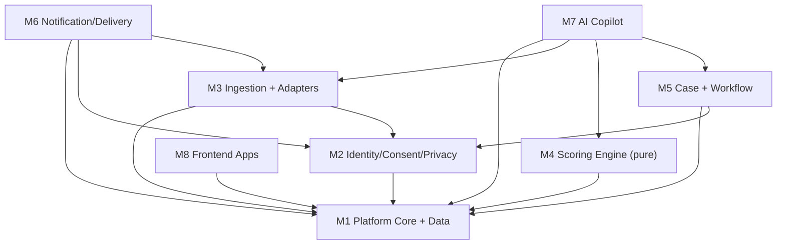

# Module 0 — Architecture Overview & Module Map

Authoritative decomposition of the platform (working name TBD) described in `masterspecv1.md`.
This document defines module boundaries, the dependency graph, and the shared interface contracts
that every module spec must conform to. Read `masterspecv1.md` first, then this file.

> Design intent: clean bounded contexts, one clear owner per concern, deterministic core isolated
> from AI/agentic edges, government sources isolated behind adapters, privacy as a first-class module.
> Optimised for readability, testability, and a swap-a-class path from demo fixtures to production APIs.

---

## 1. Module list

| # | Module | Package / dir | Owner concern |
|---|---|---|---|
| 1 | Platform Core & Data Layer | `services/platform-core` | FastAPI app, API gateway, DB (Postgres/PostGIS/pgvector), shared data models (Pydantic + SQLAlchemy), migrations, config, observability |
| 2 | Identity, Consent & Privacy | `libs/identity-consent` | Auth, RBAC/MFA, farmer tokenisation, consent ledger, retention/deletion, audit log — the privacy firewall |
| 3 | Ingestion & Government Adapters | `libs/adapters` | IMD, Agmarknet/eNAM, AgriStack (via API Setu), Bhashini, Bhuvan/OSM adapters; adapter interface; mock/replay fixtures; data-quality + TTL |
| 4 | Explainable Scoring Engine | `services/scoring-engine` | Deterministic rules: sub-scores, bands, hysteresis, confidence, top-3 drivers, expiry → `RiskEvent` |
| 5 | Case Management & Officer Workflow | `services/case-workflow` | Case lifecycle state machine, routing/prioritisation, SLA, closure, district analytics aggregation |
| 6 | Notification & Multi-Channel Delivery | `services/notification` | PWA push / SMS / voice / IVR delivery, action-card rendering, offline outbox, provider adapters |
| 7 | AI & Agentic Copilot Layer | `services/ai-copilot` | Officer copilot (agentic + RAG over scheme docs), farmer voice copilot, LLM explainer/translator, guardrails, shadow ML |
| 8 | Frontend Apps | `apps/farmer-pwa`, `apps/officer-dashboard`, `packages/ui-kit` | Voice-first farmer PWA + officer triage dashboard + shared design system |

---

## 2. Suggested monorepo layout

```
/apps
  /farmer-pwa           (M8) React + TS + Vite PWA, offline-first, voice
  /officer-dashboard    (M8) React + TS triage cockpit
/packages
  /ui-kit               (M8) shared design system, tokens, components
/services
  /platform-core        (M1) FastAPI, API gateway, models, migrations, config
  /scoring-engine       (M4) pure-Python rules package (no I/O)
  /case-workflow        (M5) case lifecycle + analytics
  /notification         (M6) delivery + action-card render
  /ai-copilot           (M7) agents, RAG, guardrails
/libs
  /adapters             (M3) government/external adapters + fixtures
  /identity-consent     (M2) auth, consent, tokenisation, audit
/fixtures               90-day replay datasets (weather/price/scenario)
/infra                  IaC, CI/CD, docker
```

---

## 3. Dependency graph (who depends on whom)



- **M1** is the foundation; it owns the shared wire contracts and DB models. Every other module depends on M1's contracts.
- **Dependency inversion:** M1 must not import the M2 package. M1 depends only on an `IdentityConsentPort` protocol at its composition seam; M2 implements that protocol and the application composition root injects it at startup. M2 may use M1's DB/session ports, but the packages remain importable without a circular dependency.
- **M4 (scoring)** is deliberately **pure** — no network, no DB writes of its own; it consumes `Observation`s and returns `RiskEvent`s. This keeps it fully unit-testable and defensible ("the score is not a model").
- **M2** is cross-cutting but isolated as its own module because privacy is a flagship concern.
- **M3** is the only module that talks to government/external services.
- **M7 (AI)** sits at the edge and never mutates the score — it consumes M4 output and M5 cases, and produces briefs/voice.

---

## 4. Shared interface contracts (canonical; owned by M1)

All modules import these from M1 `data-models`. Field-level detail lives in `masterspecv1.md §4–5`.

```
Observation   { source, observed_at, village_id|plot_grid, metric, value: JsonValue, unit, quality, ttl }
                # numeric metrics are validated as numbers; closed metrics such as due_window
                # and farmer_report use metric-specific schemas
                # produced by M3, consumed by M4
RiskEvent     { event_id, farmer_token, village_id, score, band, confidence,
                contributors[], action_ids[], model_version, expires_at }
                # produced by M4, consumed by M5, M6, M7
AlertCase     { case_id, event_id, farmer_token, village_id, band, confidence,
                recipient_role, channel_preferences[], sent_at, ack_at, status,
                resolution_code, notes }
                # produced by M5, consumed by M6, M7, M8
ActionCard    { card_id, locale, title, steps[], scheme_refs[], approved_by }
                # authored offline (agronomist), rendered by M6, shown by M8
AuthContext   { principal, role, scopes[], mfa_verified }        # issued by M2
ConsentContext{ farmer_token, storage, contact, analytics, due_window,
                consent_scopes[] }  # issued by M2; includes purpose grants such as agristack_prefill
CopilotBrief  { case_id, summary, drivers[], scheme_matches[], draft_message?, citations[] }
                # produced by M7, shown by M8 officer view
DeliveryAttempt { delivery_id, event_id|case_id, channel, locale, status,
                  attempted_at, delivered_at, provider_ref, failure_reason }
                # produced by M6 (status of record for delivery), read by M5, M7, M8
```

**Contract rules:** modules communicate only through these types + M1's HTTP/service APIs — never by reaching into another module's internals. M4 stays free of M2/M3 imports (purity). M7 is read-only against the score.

## 4b. Resolved cross-module decisions (from the consistency pass)

These seams were flagged by the module specs and are decided here so the specs stay coherent:

1. **`DeliveryAttempt` is promoted to the canonical set** (added above), owned by M6. M6 writes only its own delivery table; M5 joins against it for the case timeline and never treats it as case `status`. M5 owns `AlertCase.status` (New→Acknowledged→Visited/Referred→Resolved); M6 owns delivery status (queued/sent/failed).
2. **`phone_enc` lives in the M2 token vault, not the M1 profile table.** The M1 `farmer_profiles` row holds only `farmer_token`; the encrypted phone and any contact PII sit behind M2's vault with role-restricted access. This keeps the privacy firewall (masterspec §4.5) intact and gives M6 a single consent-gated lookup path for delivery.
3. **Hysteresis vs. the "Red within 24h" acceptance test.** M4's two-observation / three-day hysteresis and masterspec §14's "Red within 24h" test are reconciled at the data layer: the 90-day replay fixtures (M3) space the corroborating observations so the hysteresis condition is satisfied inside the demo window. Hysteresis logic is unchanged; only fixture timestamps are tuned.
4. **Farmer authentication:** `farmer_token` is an identifier, never a bearer credential. Farmer consent/export/delete/status calls require a short-lived farmer session (OTP or signed session token) issued by M2; the token may appear as a scoped resource identifier only after that session is validated.

---

## 5. Per-module spec template (every module_N spec MUST follow this)

1. Module purpose & responsibilities
2. Scope — in-scope / explicitly out-of-scope
3. Position in the architecture (which contracts it consumes/produces, upstream/downstream modules)
4. Internal structure — package/folder layout, key components
5. Data models / contracts owned (vs. imported from M1)
6. Interfaces & APIs — inbound (endpoints/functions) and outbound (calls to other modules/services)
7. Dependencies — internal modules + external libraries/services
8. Tech stack
9. Key workflows / sequences (happy path + at least one failure path)
10. Error handling, failure modes & guardrails (incl. privacy/safety where relevant)
11. Testing strategy & acceptance criteria (map to `masterspecv1.md §14`)
12. MVP boundary vs. stretch (map to `masterspecv1.md §13`)
13. Risks & mitigations
14. Open questions / decisions needed

Keep every spec **name-agnostic** (refer to "the platform", never a brand name). Prefer points, tables,
and small diagrams over paragraphs. Align all choices with `masterspecv1.md`.

---

## 6. Module ownership index

| Module | Spec file | Assigned agent |
|---|---|---|
| 1 | `module_1_platform_core.md` | Agent — Platform Core |
| 2 | `module_2_identity_consent_privacy.md` | Agent — Identity/Consent/Privacy |
| 3 | `module_3_ingestion_adapters.md` | Agent — Ingestion/Adapters |
| 4 | `module_4_scoring_engine.md` | Agent — Scoring Engine |
| 5 | `module_5_case_workflow.md` | Agent — Case/Workflow |
| 6 | `module_6_notification_delivery.md` | Agent — Notification/Delivery |
| 7 | `module_7_ai_copilot.md` | Agent — AI Copilot |
| 8 | `module_8_frontend_apps.md` | Agent — Frontend Apps |
