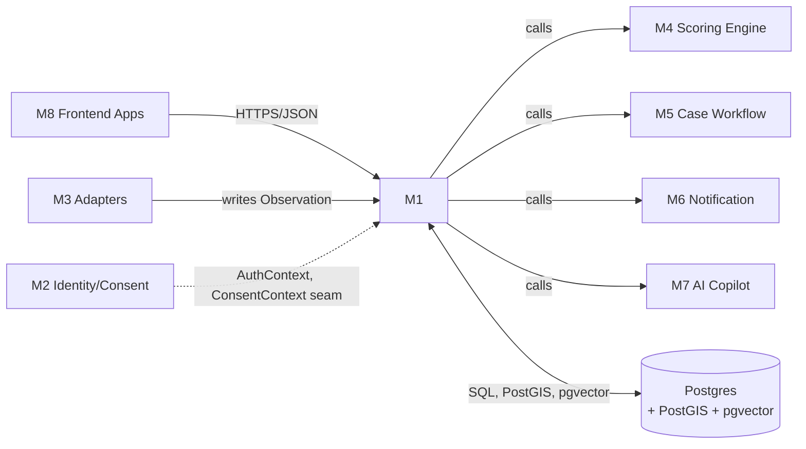
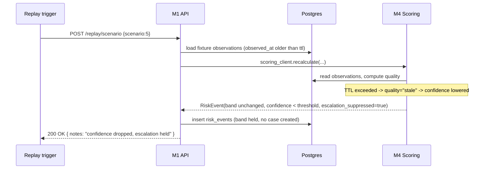

# Module 1 — Platform Core & Data Layer

`services/platform-core` · Owner concern: FastAPI app, API gateway, DB (Postgres/PostGIS/pgvector), shared data models (Pydantic + SQLAlchemy), migrations, config, observability.

> Read `masterspecv1.md` and `module_0_architecture_overview.md` first. This spec follows the module_0 §5 template exactly and is the source of truth for module_0 §4's shared contracts.

---

## 1. Module purpose & responsibilities

The platform is not a brand — this module is its spine. It is the one place every other module plugs into.

- Run the single FastAPI application that fronts all HTTP traffic (farmer PWA, officer dashboard, adapters' callbacks, internal service calls).
- Own the canonical **data models** — SQLAlchemy tables and Pydantic contracts — that every other module imports rather than redefines.
- Own the **database**: schema, migrations, indexes, connection pooling, PostGIS geometry, pgvector embeddings.
- Own **config & secrets** layering across local / demo / prod environments.
- Own **observability**: structured logs, request tracing/correlation IDs, health/readiness checks.
- Own the **API gateway** concerns: routing, request validation, versioning (`/api/v1`), pagination, a uniform error envelope, RBAC enforcement points (auth logic itself is M2's, but M1 provides the dependency-injection seam that calls into it).
- Own the **hosting wiring**: how the Vercel/Render/Supabase pieces from masterspecv1 §11 fit together and how each service is configured to talk to Postgres.

**One-line test:** if two modules need to agree on what a field is called or how a table is shaped, that agreement lives here.

---

## 2. Scope

### 2.1 In scope

- FastAPI app factory, router composition, middleware stack (CORS, request-ID, logging, error handling).
- Full REST API surface listed in masterspecv1 §12, including `POST /api/v1/replay/scenario`.
- Request/response validation via Pydantic v2; a single error-envelope shape used platform-wide.
- Pagination contract for all list endpoints.
- API versioning strategy (`/api/v1` prefix, deprecation policy).
- Canonical SQLAlchemy ORM models for all tables in masterspecv1 §5 (12 tables) — schema, constraints, indexes.
- Canonical Pydantic contracts for every shared type in module_0 §4: `Observation`, `RiskEvent`, `AlertCase`, `ActionCard`, `AuthContext`, `ConsentContext`, `CopilotBrief`.
- PostgreSQL + PostGIS (village/mandi geometry) + pgvector (`scheme_chunks` embeddings) setup.
- Alembic migration chain, seed/fixture loading hooks for the 90-day replay data.
- DB session/connection management (pooling, async engine, per-request session scope).
- Config management: environment layering (local/dev/demo/prod), `.env` + Pydantic `Settings`, secrets handling.
- Observability: structured JSON logs, correlation/request-ID propagation, `/healthz` and `/readyz`, basic timing metrics.
- Hosting wiring for Vercel (frontend), Render (backend + worker/cron for replay), Supabase (Postgres + PostGIS + pgvector + Auth) per masterspecv1 §11.
- Dependency-injection seams (FastAPI `Depends`) that other modules' internals plug into (auth check, consent check, DB session) — the *seam*, not the logic behind it.

### 2.2 Explicitly out of scope

| Concern | Owned by | M1's role |
|---|---|---|
| Deterministic scoring / rules / bands / hysteresis | M4 Scoring Engine | Exposes `POST /api/v1/risk-events/recalculate` route that calls into M4; stores the resulting `RiskEvent` rows |
| Case lifecycle state machine, SLA, routing, district analytics logic | M5 Case & Workflow | Exposes case endpoints that delegate; stores `AlertCase`/`case_status_history` rows |
| Notification rendering & delivery (SMS/voice/push, offline outbox) | M6 Notification | Exposes nothing itself beyond persisting `action_cards`; M6 owns delivery logic |
| Government/external adapters (IMD, Agmarknet, AgriStack, Bhashini, Bhuvan) | M3 Ingestion & Adapters | M1 owns the `Observation` table/model M3 writes into; M1 never calls a government API directly |
| Auth internals (login, MFA, RBAC policy, tokenisation, consent ledger, retention/deletion, audit-log semantics) | M2 Identity/Consent/Privacy | M1 provides the `AuthContext`/`ConsentContext` Pydantic *shapes* and the `Depends()` seam; M2 fills in the logic |
| AI/agentic copilot, RAG generation, guardrails | M7 AI Copilot | M1 owns the `scheme_chunks` pgvector table and `CopilotBrief` shape; M7 owns retrieval + generation |
| Frontend UI | M8 Frontend Apps | M1 only serves JSON |

M1 never implements business logic that belongs to another module — it **routes to** and **stores for** those modules.

---

## 3. Position in the architecture



- **Upstream (calls into M1):** M8 (Frontend), M3 (Adapters write `Observation`s), M2 (issues `AuthContext`/`ConsentContext` that M1's dependencies validate on every request).
- **Downstream (M1 calls into):** M4 (scoring), M5 (case workflow), M6 (notification), M7 (copilot) — each behind a thin service-call boundary so they stay swappable/testable in isolation.
- **Contracts produced by M1 (canonical, module_0 §4):** all seven shared types below — every module imports these, never redefines them.
- **Contracts consumed by M1:** none structurally new; M1 is the definition point. It does *read* the outputs other modules attach back onto its rows (e.g., M4 writes `score`/`band` onto a `risk_events` row it created via M1's model).

---

## 4. Internal structure

```
services/platform-core/
├── app/
│   ├── main.py                  # FastAPI app factory, middleware, router mounting
│   ├── config.py                # Pydantic Settings, env layering
│   ├── deps.py                  # shared Depends(): db session, auth, consent, pagination
│   ├── errors.py                # error envelope, exception handlers
│   ├── observability/
│   │   ├── logging.py           # structured JSON logger setup
│   │   ├── tracing.py           # correlation/request-ID middleware
│   │   └── health.py            # /healthz, /readyz
│   ├── api/
│   │   └── v1/
│   │       ├── router.py        # aggregates all v1 routers
│   │       ├── farmer_profiles.py
│   │       ├── observations.py
│   │       ├── risk_events.py
│   │       ├── mandis.py
│   │       ├── cases.py
│   │       ├── replay.py
│   │       ├── analytics.py
│   │       └── copilot.py
│   ├── models/                  # SQLAlchemy ORM (source of truth, masterspecv1 §5)
│   │   ├── base.py               # declarative base, mixins (timestamps, UUID PK)
│   │   ├── farmer_profile.py
│   │   ├── crop_cycle.py
│   │   ├── weather_observation.py
│   │   ├── market_quote.py
│   │   ├── farmer_report.py
│   │   ├── risk_event.py
│   │   ├── action_card.py
│   │   ├── alert_case.py
│   │   ├── case_status_history.py
│   │   ├── consent.py
│   │   ├── audit_event.py
│   │   └── scheme_chunk.py
│   ├── schemas/                 # Pydantic contracts (source of truth, module_0 §4)
│   │   ├── observation.py
│   │   ├── risk_event.py
│   │   ├── alert_case.py
│   │   ├── action_card.py
│   │   ├── auth_context.py
│   │   ├── consent_context.py
│   │   ├── copilot_brief.py
│   │   ├── pagination.py
│   │   └── envelope.py           # success/error envelope shapes
│   ├── db/
│   │   ├── session.py            # async engine + session factory
│   │   └── geo.py                # PostGIS helpers (WKT/GeoJSON conversion)
│   └── clients/                  # thin internal call boundaries to other services
│       ├── scoring_client.py     # -> M4
│       ├── workflow_client.py    # -> M5
│       ├── notification_client.py# -> M6
│       └── copilot_client.py     # -> M7
├── alembic/
│   ├── env.py
│   └── versions/
├── tests/
│   ├── test_models.py
│   ├── test_api_contracts.py
│   ├── test_migrations.py
│   └── test_health.py
├── alembic.ini
├── pyproject.toml
└── Dockerfile
```

**Key components**

| Component | Role |
|---|---|
| `app/main.py` | App factory pattern (`create_app()`); mounts `/api/v1` router, health routes, middleware stack |
| `app/deps.py` | Single place other modules' logic is invoked: `get_db()`, `get_auth_context()`, `get_consent_context()`, `get_pagination()` |
| `app/models/*` | SQLAlchemy declarative models — **the only place table shape is defined** |
| `app/schemas/*` | Pydantic contracts — **the only place the wire shape of shared types is defined** |
| `app/clients/*` | Internal HTTP/function-call clients to M4–M7 so M1's routers stay thin and other modules stay swappable (in MVP these may be direct in-process calls to sibling packages; interface is kept identical to a future network call) |

---

## 5. Data models / contracts owned

All of the following are **owned and defined by M1**. Every other module imports them — never redeclares a field.

### 5.1 Canonical SQLAlchemy tables (masterspecv1 §5 — 12 tables)

| # | Table | Key columns (beyond PK/timestamps) | Notes |
|---|---|---|---|
| 1 | `farmer_profiles` | `farmer_token` (unique, indexed), `village_id` (FK), `locale`, `crop`, `sowing_date`, `irrigation_type`, `area_band` | Contact PII is not stored here; `phone_enc` lives only in M2's vault. Consent state is read from M2's versioned ledger, not duplicated as a writable profile field. |
| 2 | `crop_cycles` | `farmer_token` (FK), `crop`, `sowing_date`, `season`, `stage_computed` | One row per season per farmer; feeds crop/soil vulnerability sub-score |
| 3 | `weather_observations` | `village_id`, `metric`, `value`, `unit`, `observed_at`, `quality`, `ttl`, `source` | Concrete table backing the generic `Observation` contract for weather; written by M3's IMD adapter |
| 4 | `market_quotes` | `commodity`, `mandi_id` (FK, PostGIS point), `date`, `modal_price`, `arrivals`, `source`, `quality` | Written by M3's Agmarknet/eNAM adapter |
| 5 | `farmer_reports` | `farmer_token` (FK), `event_type` (enum), `reported_at`, `note` | Farmer-initiated shock signal |
| 6 | `risk_events` | `event_id` (PK), `farmer_token` (FK), `village_id` (FK), `score`, `band`, `confidence`, `contributors` (JSONB array), `action_ids` (array FK), `model_version`, `expires_at` | Written by M4 via `scoring_client`; M1 owns the table, M4 owns what goes in `score`/`band`/`contributors` |
| 7 | `action_cards` | `card_id` (PK), `locale`, `title`, `steps` (JSONB), `scheme_refs` (array), `approved_by` | Authored offline by agronomists; referenced by `risk_events.action_ids` and rendered by M6 |
| 8 | `alert_cases` | `case_id` (PK), `event_id` (FK, unique), `farmer_token`, `village_id`, `band`, `confidence`, `recipient_role`, `channel_preferences`, `sent_at`, `ack_at`, `status`, `resolution_code`, `notes` | Written by M5; M1 owns table + indexes |
| 9 | `case_status_history` | `case_id` (FK), `from_status`, `to_status`, `changed_by`, `changed_at`, `reason_code` | Append-only audit trail of case transitions, owned structurally by M1, written by M5 |
| 10 | `consents` | `farmer_token` (FK), `storage`, `contact`, `analytics`, `due_window_opt_in`, `consent_scopes`, `updated_at` | M1 provides the table/migration; M2 owns write/read *logic* (consent ledger semantics, withdrawal) |
| 11 | `audit_events` | `actor`, `action`, `entity_type`, `entity_id`, `at`, `metadata` (JSONB) | Append-only; M2 writes to it via M1's model for any privacy-relevant action |
| 12 | `scheme_chunks` | `chunk_id`, `scheme_name`, `text`, `embedding` (pgvector), `source_url`, `citation` | One-time ingest corpus for RAG; M1 owns table + pgvector index, M7 owns retrieval logic |

**Indexes (masterspecv1 §5):**

| Index | Table(s) | Purpose |
|---|---|---|
| `village_id, district_id` | `farmer_profiles`, `weather_observations` | Village/district roll-ups |
| `crop, date` | `crop_cycles`, `market_quotes` | Crop-stage + price-date joins |
| `commodity, mandi_id, date` | `market_quotes` | Mandi comparison queries |
| `band` (partial index on `Red`/`Amber`) | `risk_events` | Fast officer-queue reads |
| GiST geospatial | `farmer_profiles.village_geom`, `market_quotes.mandi_geom` (PostGIS) | Map/hotspot queries |
| IVFFlat/HNSW vector index | `scheme_chunks.embedding` (pgvector) | RAG similarity search |
| unique | `farmer_profiles.farmer_token`, `alert_cases.event_id` | Integrity |

### 5.2 Canonical Pydantic contracts (module_0 §4 — shared across modules)

```python
# app/schemas/observation.py — produced by M3, consumed by M4
class Observation(BaseModel):
    source: str
    observed_at: datetime
    village_id: str | None = None
    plot_grid: str | None = None
    metric: str
    value: JsonValue  # scalar for numeric metrics; metric-specific closed schema for due_window/farmer_report
    unit: str
    quality: Literal["good", "degraded", "stale"]
    ttl: timedelta

# app/schemas/risk_event.py — produced by M4, consumed by M5/M6/M7
class RiskEvent(BaseModel):
    event_id: UUID
    farmer_token: str
    village_id: str
    score: int = Field(ge=0, le=100)
    band: Literal["Green", "Amber", "Red"]
    confidence: float = Field(ge=0.0, le=1.0)
    contributors: list[Contributor]        # top-3 drivers, human-readable
    action_ids: list[UUID]
    model_version: str
    expires_at: datetime

# app/schemas/alert_case.py — produced by M5, consumed by M6/M7/M8
class AlertCase(BaseModel):
    case_id: UUID
    event_id: UUID
    farmer_token: str
    village_id: str
    band: Literal["Green", "Amber", "Red"]
    confidence: float = Field(ge=0.0, le=1.0)
    recipient_role: Literal["extension_officer", "district_admin"]
    channel_preferences: list[Literal["push", "sms", "voice", "ivr", "whatsapp"]]
    sent_at: datetime | None
    ack_at: datetime | None
    status: Literal["New", "Acknowledged", "Visited", "Referred", "Resolved"]
    resolution_code: str | None
    notes: str | None

# app/schemas/action_card.py — authored offline, rendered by M6, shown by M8
class ActionCard(BaseModel):
    card_id: UUID
    locale: Literal["hi", "mr"]
    title: str
    steps: list[str]
    scheme_refs: list[str]
    approved_by: str

# app/schemas/auth_context.py — issued by M2
class AuthContext(BaseModel):
    principal: str
    role: Literal["farmer", "extension_officer", "district_admin", "admin"]
    scopes: list[str]
    mfa_verified: bool

# app/schemas/consent_context.py — issued by M2
class ConsentContext(BaseModel):
    farmer_token: str
    storage: bool
    contact: bool
    analytics: bool
    due_window: bool
    consent_scopes: list[str] = []  # purpose grants, e.g. agristack_prefill; not authentication scopes

# app/schemas/copilot_brief.py — produced by M7, shown by M8 officer view
class CopilotBrief(BaseModel):
    case_id: UUID
    summary: str
    drivers: list[Contributor]
    scheme_matches: list[SchemeMatch]
    draft_message: str | None
    citations: list[str]
```

**Contract rule (module_0 §4):** all modules communicate only through these types + M1's HTTP/service APIs. M4 stays free of M2/M3 imports. M7 is read-only against the score. M1 enforces this at the package level — `app/schemas/*` has zero imports from `libs/adapters`, `libs/identity-consent`, or any `services/*` package.

### 5.3 Error envelope & pagination (owned by M1, used platform-wide)

```python
# app/schemas/envelope.py
class ErrorEnvelope(BaseModel):
    error: ErrorDetail

class ErrorDetail(BaseModel):
    code: str            # machine-readable, e.g. "STALE_DATA", "VALIDATION_ERROR"
    message: str          # human-readable
    request_id: str        # ties to trace/log
    details: dict | None = None

class Page(BaseModel, Generic[T]):
    items: list[T]
    total: int
    page: int
    page_size: int
    has_next: bool
```

- Every non-2xx response body is `ErrorEnvelope`. No bare stack traces, no unstructured strings.
- Every list endpoint accepts `?page=&page_size=` (default 1/20, max page_size 100) and returns `Page[T]`.

---

## 6. Interfaces & APIs

### 6.1 Inbound — full REST surface (masterspecv1 §12)

| Method & path | Purpose | Auth (via M2 seam) | Delegates to |
|---|---|---|---|
| `POST /api/v1/farmer-profiles` | Create/update a farmer profile | farmer or officer scope | M1 model write; M2 consent check |
| `POST /api/v1/observations` | Ingest a signal (weather/price/report) | adapter/service scope | M1 model write (M3 is the caller) |
| `POST /api/v1/risk-events/recalculate` | Trigger a rescore for a farmer/village | officer/admin scope | `scoring_client` → M4 |
| `GET /api/v1/risk-events?district_id=...` | List risk events, paginated, filterable by band/village/district | officer scope | M1 query (read-only) |
| `GET /api/v1/mandis/compare` | Compare nearby mandi prices for a commodity | farmer/officer scope | M1 query over `market_quotes` + PostGIS distance |
| `POST /api/v1/cases/{case_id}/acknowledge` | Officer acknowledges a case | officer scope | `workflow_client` → M5 |
| `POST /api/v1/cases/{case_id}/resolve` | Officer resolves a case with a reason code | officer scope | `workflow_client` → M5 |
| `POST /api/v1/replay/scenario` | Trigger a demo replay scenario (1–5, masterspecv1 §12) | admin/demo scope | Orchestrates M3 fixture load → M4 rescore → M5/M6 side effects |
| `GET /api/v1/analytics/district` | Aggregate district metrics (lead time, closure %, hotspots) | district_admin scope | `workflow_client` → M5 aggregation |
| `POST /api/v1/copilot/brief` | Generate an officer case brief (summary + scheme RAG) | officer scope | `copilot_client` → M7 |

**Versioning:** all routes under `/api/v1`. Breaking changes ship as `/api/v2` with both mounted during a deprecation window; additive changes (new optional fields) do not bump the version.

**Validation:** every request body is a Pydantic model from `app/schemas/`; FastAPI's automatic 422 is intercepted and re-shaped into `ErrorEnvelope` with `code="VALIDATION_ERROR"`.

**`POST /api/v1/replay/scenario` contract:**

```python
class ReplayRequest(BaseModel):
    scenario: Literal[1, 2, 3, 4, 5]
    village_id: str
    farmer_token: str | None = None

class ReplayResponse(BaseModel):
    scenario: int
    observations_loaded: int
    risk_event: RiskEvent | None
    case: AlertCase | None
    notes: str
```

Scenario 5 ("stale-data failure") deliberately loads observations with `observed_at` past their `ttl` and asserts (in the response `notes`) that confidence dropped and escalation was suppressed — this is the acceptance test from masterspecv1 §14 made callable.

### 6.2 Outbound — M1's calls into sibling modules

| Client | Target module | Call | When |
|---|---|---|---|
| `scoring_client.recalculate()` | M4 | in-process function call (MVP) / internal HTTP (scale-out) | `POST /risk-events/recalculate`, replay scenarios |
| `workflow_client.acknowledge()/resolve()/aggregate()` | M5 | same | case endpoints, analytics endpoint |
| `notification_client.dispatch()` | M6 | same | after M4 produces a Red/Amber-sustained `RiskEvent` |
| `copilot_client.brief()` | M7 | same | `POST /copilot/brief` |
| `get_auth_context()` | M2 | `Depends()` seam, M2 supplies implementation | every authenticated route |
| `get_consent_context()` | M2 | `Depends()` seam | routes touching farmer PII or contact |

M1 defines these client interfaces as Python protocols/abstract classes so each downstream module can be developed and tested against a fake implementation before the real one lands — mirrors the mock/real adapter pattern M3 uses for government APIs (masterspecv1 §6).

---

## 7. Dependencies

### 7.1 Internal modules

| Module | Relationship |
|---|---|
| M2 Identity/Consent/Privacy | M1 depends on M2's `AuthContext`/`ConsentContext` *implementations* being injected at the `Depends()` seam; M2 depends on M1's DB session + `consents`/`audit_events` tables |
| M3 Ingestion/Adapters | M3 depends on M1's `Observation` model/table + DB session; M1 depends on nothing from M3 |
| M4 Scoring Engine | M1 depends on M4's pure-Python interface (`score(observations) -> RiskEvent`); M4 depends on nothing from M1 (kept pure per module_0 §3) |
| M5 Case Workflow | M1 depends on M5's workflow functions; M5 depends on M1's `alert_cases`/`case_status_history` tables |
| M6 Notification | M1 depends on M6's dispatch interface; M6 depends on M1's `action_cards` table + DB session |
| M7 AI Copilot | M1 depends on M7's brief-generation interface; M7 depends on M1's `scheme_chunks` table + `RiskEvent`/`AlertCase` read access |
| M8 Frontend Apps | Pure consumer of M1's HTTP API; no code dependency |

### 7.2 External libraries/services

| Library/service | Purpose |
|---|---|
| FastAPI | Web framework, routing, OpenAPI generation |
| Pydantic v2 | Request/response validation, shared contracts |
| SQLAlchemy 2.0 (async) | ORM, table definitions |
| Alembic | Migrations |
| asyncpg | Postgres async driver |
| PostgreSQL 15+ | Primary datastore |
| PostGIS extension | Village/mandi geometry, distance queries |
| pgvector extension | `scheme_chunks` embeddings, similarity search |
| Uvicorn/Gunicorn | ASGI server |
| structlog (or stdlib `logging` + JSON formatter) | Structured logs |
| Supabase (Postgres + Auth) | Hosted DB instance; Auth used by M2, DB used by M1 |
| Render | Backend hosting (Docker) + cron/worker for replay jobs |
| Vercel | Frontend hosting (consumes M1's API only) |
| Pytest + httpx (ASGI test client) | Testing |
| GitHub Actions | CI: lint, test, migration-check, deploy |

---

## 8. Tech stack

| Layer | Choice | Notes |
|---|---|---|
| Language | Python 3.11+ | Matches masterspecv1 §11 |
| Web framework | FastAPI | Async, OpenAPI-native |
| Validation | Pydantic v2 | Shared contracts live here |
| ORM | SQLAlchemy 2.0 async + Alembic | Canonical models + migrations |
| DB | PostgreSQL 15+ / PostGIS / pgvector | Supabase-hosted |
| Auth integration point | Supabase Auth (via M2) | M1 only consumes the resulting `AuthContext` |
| Server | Uvicorn behind Gunicorn workers | Render Docker deploy |
| Config | Pydantic `Settings` + `.env` per environment | See §10 |
| Observability | structlog JSON logs + request-ID middleware + `/healthz`/`/readyz` | No external APM in MVP; log-based |
| Testing | Pytest + httpx ASGI client + Alembic upgrade/downgrade tests | See §11 |
| CI/CD | GitHub Actions | Lint (ruff), type-check (mypy optional), test, migration dry-run, deploy to Render |

---

## 9. Key workflows / sequences

### 9.1 Happy path — observation ingested → rescore → case created → officer resolves

```mermaid
sequenceDiagram
    participant M3 as M3 Adapter
    participant API as M1 API
    participant DB as Postgres
    participant M4 as M4 Scoring
    participant M5 as M5 Workflow
    participant M6 as M6 Notification
    participant OFF as Officer (M8)

    M3->>API: POST /observations (rainfall shock)
    API->>DB: insert weather_observations
    API-->>M3: 201 Created
    API->>M4: scoring_client.recalculate(farmer_token)
    M4->>DB: read recent observations
    M4-->>API: RiskEvent(band=Red, contributors=[...])
    API->>DB: insert risk_events
    API->>M6: notification_client.dispatch(risk_event)
    M6-->>API: ActionCard sent
    API->>M5: workflow_client.create_case(risk_event)
    M5->>DB: insert alert_cases (status=New)
    OFF->>API: POST /cases/{id}/acknowledge
    API->>M5: workflow_client.acknowledge(case_id, actor)
    M5->>DB: update alert_cases, insert case_status_history
    API-->>OFF: 200 OK (AlertCase, status=Acknowledged)
```

### 9.2 Failure path — stale feed suppresses escalation (replay scenario 5)



### 9.3 Failure path — DB unavailable at request time

```mermaid
sequenceDiagram
    participant Client
    participant API as M1 API
    participant DB as Postgres

    Client->>API: any request
    API->>DB: acquire session
    DB--xAPI: connection error / timeout
    API-->>Client: 503 { error: { code: "DB_UNAVAILABLE", request_id } }
    Note over API: /readyz flips to fail; retried by orchestrator; logged with correlation ID
```

---

## 10. Error handling, failure modes & guardrails

| Failure mode | Handling |
|---|---|
| Invalid request body | FastAPI 422 → re-shaped to `ErrorEnvelope{code: "VALIDATION_ERROR"}` |
| Unauthenticated/unauthorized | 401/403 via M2's `AuthContext` dependency; `ErrorEnvelope{code: "AUTH_REQUIRED"/"FORBIDDEN"}` |
| Missing/expired consent for a contact action | 403 `ErrorEnvelope{code: "CONSENT_MISSING"}` — checked before any M6 dispatch call |
| DB connection lost | 503 with `code: "DB_UNAVAILABLE"`; `/readyz` reports not-ready; connection pool retries with backoff |
| Downstream module (M4/M5/M6/M7) call fails or times out | Circuit-broken at the client layer; 502 `code: "UPSTREAM_UNAVAILABLE"`; the write that already succeeded (e.g. observation insert) is **not** rolled back — ingestion is decoupled from scoring so a scoring outage never drops data |
| Stale/expired observation (`ttl` exceeded) | Never rejected — accepted and stored with `quality="stale"`; **never manufactures a false alert** (masterspecv1 §4.5); M4 lowers confidence, M1 just stores what M4 returns |
| Duplicate observation / idempotency | Unique constraint on `(source, village_id, metric, observed_at)`; re-POST is upsert, not error |
| Migration failure on deploy | CI runs `alembic upgrade head --sql` dry-run before deploy; deploy blocked on failure; rollback = redeploy previous image + `alembic downgrade -1` runbook |
| PII exposure risk | Schema-level: no Aadhaar/bank/lender columns exist anywhere; `phone_enc` stored encrypted at rest (M2-managed key); logs scrub `phone`, `phone_enc`, and raw `farmer_token` is logged only as a truncated hash |
| Pagination abuse | `page_size` capped at 100 server-side regardless of client input |
| Long-running replay scenario | Runs via Render worker/cron job, not inline in the request handler, to avoid blocking the API process |

**Guardrail specific to this module:** M1's schema is the enforcement point for the "no Aadhaar/bank/lender ID — ever" rule (masterspecv1 §4.1/§4.5) — those fields simply do not exist in `app/models/`, so no other module can accidentally introduce them without a schema change that's visible in review.

---

## 11. Testing strategy & acceptance criteria

| Test area | Approach | Maps to masterspecv1 §14 |
|---|---|---|
| Model/schema unit tests | Every SQLAlchemy model has a round-trip test (insert → query → assert shape); every Pydantic contract has a validation test (valid + invalid payloads) | Foundation for all acceptance tests |
| API contract tests | httpx ASGI client hits every endpoint in §6.1 with valid/invalid payloads, asserts status + envelope shape | — |
| Migration tests | CI runs `alembic upgrade head` then `alembic downgrade base` against a throwaway DB per PR | — |
| Replay scenario 1–5 integration test | Calls `POST /replay/scenario` for each of the 5 scenarios against a test DB with fixtures, asserts response shape | "A drought + price crash + due window creates a Red event within 24h with all three drivers shown"; "Stale data lowers confidence and suppresses escalation" |
| Pagination test | List endpoint with >1 page of data asserts `has_next`, `page`, correct slicing | — |
| Index/perf smoke test | `EXPLAIN ANALYZE` on the officer-queue query (`risk_events` filtered by `band`) against a seeded 10k-row table stays under a target latency | Supports "officer acknowledgement <24h" KPI at scale |
| Consent-gate test | Attempt to dispatch/contact without `contact=true` in `ConsentContext` returns 403 | "No individual surveillance or disciplinary use"; privacy firewall |
| Audit trail test | Every case status transition produces a `case_status_history` row; every consent-sensitive action produces an `audit_events` row | Traceability for "every action card traces to a rule + source" |
| Health check test | `/healthz` always 200 when process is up; `/readyz` reflects DB connectivity | Operational readiness |

**Acceptance criteria for M1 specifically (derived, not restating masterspecv1 §14 verbatim):**
- All 12 tables exist, migrated, indexed as specified; `alembic upgrade head` is reproducible from empty DB.
- All 10 endpoints in masterspecv1 §12 respond per contract with correct auth gating.
- All 7 shared Pydantic types importable from a single `app/schemas` package with zero circular imports from other modules.
- Replay scenario 5 demonstrably returns a response showing suppressed escalation + lowered confidence, without needing M4/M5 to be fully built (can run against a stub scoring client returning a fixed low-confidence `RiskEvent`).

---

## 12. MVP boundary vs. stretch

**MVP (build, maps to masterspecv1 §13):**
- Full FastAPI app + all 10 §12 endpoints, one district's worth of data.
- All 12 tables + indexes; Alembic migrations from scratch.
- PostGIS for village/mandi points (not full polygon geometry) — points are sufficient for distance/hotspot queries at MVP scale.
- pgvector table + index for `scheme_chunks` (ingest is a one-time script, not a live pipeline — still M1's table).
- Structured logging + `/healthz`/`/readyz`; correlation IDs.
- Config layering for local/demo (Render+Supabase) — a single "prod" env is sufficient, no multi-region.
- Replay endpoint fully wired for all 5 scenarios (this is explicitly "most important for the demo" per masterspecv1 §12).

**Stretch (post-prototype, not MVP):**
- API versioning beyond `/api/v1` (no `/v2` needed until a real breaking change exists).
- Read replicas / connection-pool tuning beyond defaults.
- Full OpenTelemetry tracing / external APM (structured logs are enough for a district-scale demo).
- Multi-tenant config for all-India rollout (masterspecv1 §13 explicitly excludes all-India coverage from MVP).
- Rate limiting / API keys for third-party consumers (no third parties in MVP).
- Blue/green migration strategy (single-district demo tolerates a short deploy window).

---

## 13. Risks & mitigations

| Risk | Mitigation |
|---|---|
| Other modules drift from the canonical schema (redefine a field locally) | `app/schemas` and `app/models` are the only allowed definition point; CI lint rule / code-review checklist item forbidding duplicate Pydantic models for shared types outside M1's package |
| PostGIS/pgvector extensions unavailable on a given Postgres instance (e.g. a stripped-down free tier) | Verify extensions are enabled in Supabase project setup before Phase 1 sign-off; migration includes `CREATE EXTENSION IF NOT EXISTS postgis / vector` guarded and documented |
| Migration conflicts when multiple module owners touch the schema in parallel (e.g. M5 needs a new `alert_cases` column) | M1 owns final migration authorship; other modules propose schema changes as reviewed PRs against `app/models/`, never direct DB edits |
| Downstream module not ready when M1's endpoint needs to call it | Client interfaces (`scoring_client`, `workflow_client`, etc.) are protocols with a fake/stub implementation from day one, so M1's API can be demoed end-to-end before every module lands |
| Replay endpoint becomes the de facto "everything" endpoint and gets bloated | Keep `POST /replay/scenario` as an orchestration thin-layer only — it loads fixtures via M3's interface and calls the same `scoring_client`/`workflow_client` any other flow uses, no special-cased logic |
| Sensitive fields leak into logs or error details | Central `errors.py` exception handler strips known-sensitive keys (`phone`, `phone_enc`) before logging; unit test asserts this |
| Connection pool exhaustion under demo load (judges hammering the replay endpoint) | Bounded async pool size + request-level session scoping (session per request, closed on response) tested under a quick load smoke test before demo day |

---

## 14. Open questions / decisions needed

- **In-process vs. network calls between M1 and M4–M7 for MVP:** spec assumes in-process function calls behind a protocol interface (simplest for a hackathon timeline) with the interface shaped so it *could* become an HTTP call later. Confirm this with whoever owns the deploy topology (single Render service vs. multiple).
- **Consent reads:** M2's versioned ledger is the only source of truth. M1 must not add a writable `consent_flags` cache to `farmer_profiles`; any read model must be explicitly derived and non-authoritative.
- **pgvector embedding model/dimension for `scheme_chunks`:** M1 needs the vector column's dimension fixed before the first migration; depends on M7's choice of embedding model. Needs an answer from the M7 owner before Phase 1 migrations are finalized.
- **Auth scope taxonomy:** `AuthContext.scopes[]` is defined as `list[str]` here; the actual scope strings (e.g. `"case:acknowledge"`) need to be enumerated jointly with M2 so M1's route-level scope checks and M2's token issuance agree. Consent purpose scopes are separate (`ConsentContext.consent_scopes[]`).
- **Retention/deletion mechanics:** masterspecv1 §4.5 requires "withdrawal + deletion supported." M2 owns the trigger and policy; M1 owns downstream tombstone migrations. The decision is fixed for implementation: preserve aggregate/operational rows only after replacing the farmer token with an irreversible deletion tombstone, remove direct PII/contact data, and retain only the minimum audit metadata required by policy. No downstream table may keep a live join to the deleted farmer identity.
