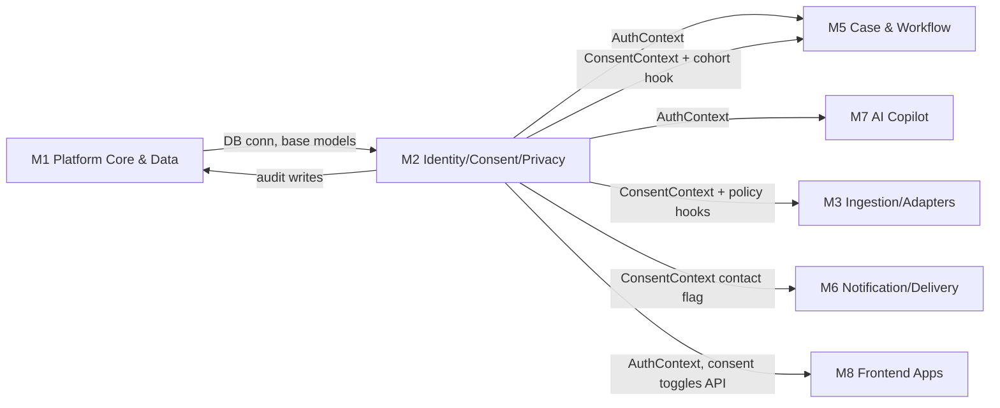
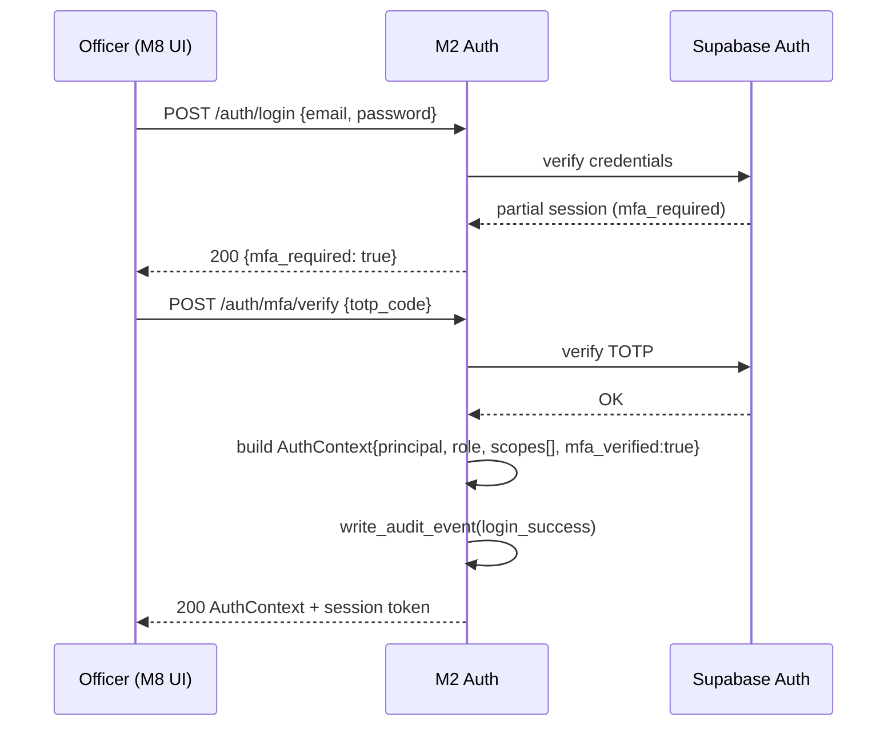
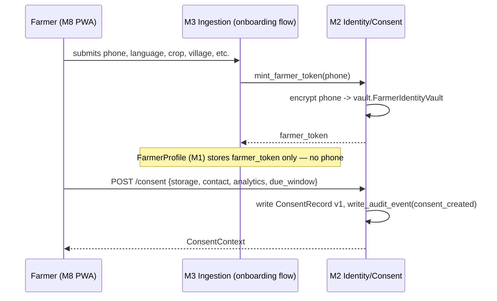
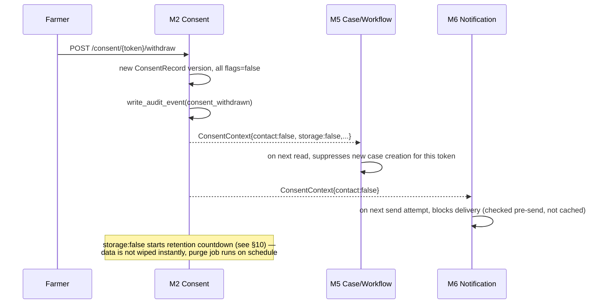
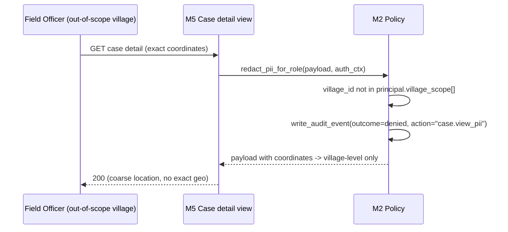
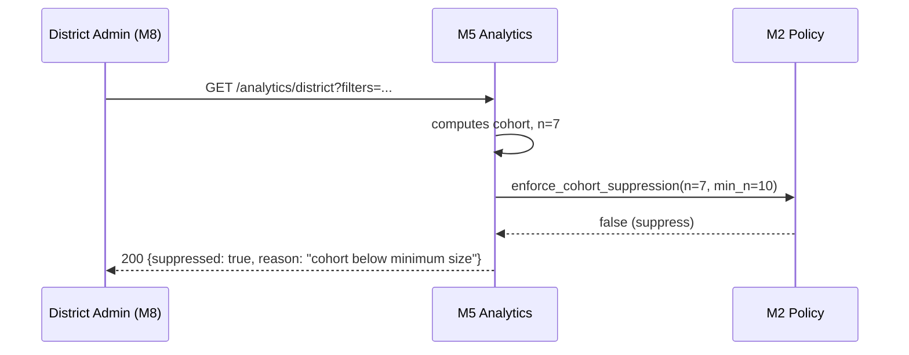

# Module 2 — Identity, Consent & Privacy

**Package:** `libs/identity-consent` · **Owner concern:** the privacy firewall — auth, RBAC/MFA, farmer tokenisation, consent ledger, retention/deletion, data-use policy enforcement, audit log.

> Read `masterspecv1.md` and `module_0_architecture_overview.md` first. This spec follows the 14-section template in module_0 §5 and must not contradict masterspecv1.md or redesign sibling modules. Name-agnostic throughout: "the platform," never a brand name.

---

## 1. Module purpose & responsibilities

The platform makes two irreversible promises, and this module is the only place that can keep them:

1. **"This is not a credit, loan-default, or insurance score."** No sensitive individual data — Aadhaar, bank account, lender ID — is ever collected, and the repayment signal is opt-in and coarse.
2. **A farmer can see, withdraw, and delete what the platform knows about them, and every human who touched their data is logged.**

Responsibilities:

- Authenticate officers/admins (Supabase Auth), enforce RBAC + MFA, issue and refresh `AuthContext`.
- Own the **farmer token vault** — pseudonymous `farmer_token` generation, and physical separation of any raw identifier (phone) from the farmer's profile/behavioural data.
- Own the **consent ledger** — four independently-toggleable grants (`storage`, `contact`, `analytics`, `due_window`), versioned, with withdrawal, export, and deletion flows. Issue `ConsentContext`.
- Enforce **data-use policy** as callable guard functions other modules invoke before they act: the "not a score" label, cohort-suppression (n≥10) for aggregate analytics, role-gating of exact coordinates/PII.
- Write an **audit event** for every sensitive read/write (who, what, when, why, on whose data).

This module does **not** decide *what* action to take on data (that's M4/M5/M6/M7) — it decides *who is allowed to*, and *proves it happened*.

---

## 2. Scope

### In-scope

- Officer/admin identity: signup (invite-only), login, MFA (TOTP), session issuance/refresh/revocation, password reset.
- RBAC role/scope model and the `AuthContext` contract.
- Farmer pseudonymisation: `farmer_token` minting, token↔raw-identifier vault, phone encryption at rest.
- Consent capture, versioning, withdrawal, and the cascading effects (see §9.3).
- Data subject rights: export-my-data, delete-my-data, for a given `farmer_token`.
- Policy hook library: `assert_not_scoring_language()`, `enforce_cohort_suppression(n)`, `redact_pii_for_role()`, `require_scope()`.
- Audit log: append-only `audit_events`, query API for admins/auditors.
- Retention scheduler (TTL-based purge of expired/withdrawn data), coordinated with M1.

### Explicitly out-of-scope

- **Does not compute any score** or touch `RiskEvent` contents (M4).
- **Does not deliver notifications** — it only tells M6 *whether contact is permitted* (M2 → boolean/`ConsentContext`, never the send).
- **Does not manage cases** or the officer workflow state machine (M5) — it only tells M5 *whether the officer is allowed to see a field*.
- Does not own the DB engine, migrations, or shared Pydantic/SQLAlchemy base models — those are M1. M2 owns specific tables (vault, consents, audit) but runs on M1's Postgres/PostGIS instance via M1's connection layer.
- Does not do farmer-facing UI (M8) — it exposes the consent-toggle *state and API*, M8 renders the screen.
- No biometric identity, no Aadhaar e-KYC, no AgriStack credential storage (AgriStack consent handshake is orchestrated by M3, but the *consent record* it produces is still written through this module's consent ledger).

---

## 3. Position in the architecture



- **Upstream:** M1 only (shared models, DB access, migrations run through M1's Alembic).
- **Downstream consumers:** M3 (may onboarding-pull only what consent allows), M5 (RBAC-gates case fields, cohort-suppresses district analytics), M6 (checks `contact` consent before sending), M7 (`AuthContext` for officer copilot actions; never sees raw phone/coordinates unless role permits), M8 (login screens, consent-toggle UI, farmer "my data" screen).
- **Contracts produced:** `AuthContext`, `ConsentContext` (both canonical, defined in M1's shared types per module_0 §4 — M2 is the sole *issuer*).
- **Contracts consumed:** none structurally; M2 reads `farmer_token` references that M1/M3 pass in, but never reaches into another module's internals.

---

## 4. Internal structure

```
libs/identity-consent/
  auth/
    supabase_client.py        # Supabase Auth wrapper (login, MFA, session)
    rbac.py                   # role -> scopes table, require_scope() decorator
    context.py                # AuthContext builder/validator
  tokenisation/
    token_vault.py            # farmer_token mint + vault CRUD (isolated schema)
    encryption.py             # phone field encryption (KMS-backed envelope)
  consent/
    ledger.py                 # consent CRUD, versioning, withdrawal
    context.py                # ConsentContext builder
    rights.py                 # export_my_data(), delete_my_data()
  policy/
    guardrails.py             # assert_not_scoring_language, enforce_cohort_suppression,
                               # redact_pii_for_role
  audit/
    logger.py                 # write_audit_event()
    query.py                  # admin/auditor read API
  retention/
    scheduler.py               # TTL purge job (cron via M1 worker)
  api/
    routes_auth.py            # /auth/*
    routes_consent.py         # /consent/*
    routes_rights.py          # /me/export, /me/delete
    routes_audit.py           # /audit/* (admin/auditor only)
  tests/
    test_rbac.py, test_tokenisation.py, test_consent.py,
    test_policy_guardrails.py, test_audit.py, test_retention.py
```

- **Isolation principle:** `tokenisation/token_vault.py` is the *only* code path in the entire platform allowed to read the raw phone number or resolve `farmer_token → phone`. It runs against a **separate Postgres schema** (`vault`) with its own DB role (`vault_svc`) that other services' DB roles cannot `SELECT` from directly — access is only through this module's functions/API, which write an audit event on every resolve.

---

## 5. Data models / contracts owned vs. imported

### 5.1 Imported from M1 (per module_0 §4 — consumed, never redefined)

`Observation`, `RiskEvent`, `AlertCase`, `ActionCard` — M2 never reads/writes these directly; it only gates *who* may.

### 5.2 Owned by M2 (new tables, migrations authored here, applied via M1's Alembic)

```
# schema: vault (locked down — vault_svc role only)
FarmerIdentityVault {
  farmer_token      uuid PK              # same token used everywhere else
  phone_enc         bytea                # envelope-encrypted (KMS data key)
  phone_kms_key_id  text
  created_at        timestamptz
  last_resolved_at  timestamptz          # updated on every legitimate read
}

# schema: public (owned by M2, readable by app roles per RBAC)
Principal {                              # officer/admin/service account
  principal_id      uuid PK
  email             text unique
  role              enum(extension_officer, district_admin, super_admin,
                          auditor, service_account)
  village_scope[]   uuid[]               # villages this officer may see
  district_scope    uuid
  mfa_enrolled      bool
  status            enum(active, suspended, revoked)
  created_at        timestamptz
}

ConsentRecord {
  consent_id        uuid PK
  farmer_token      uuid FK -> vault.FarmerIdentityVault
  storage           bool
  contact           bool
  analytics         bool
  due_window        bool                 # opt-in repayment signal, off by default
  version           int                  # increments on every change
  effective_from    timestamptz
  superseded_at     timestamptz null     # null = current
  source            enum(onboarding, farmer_edit, officer_assisted, system_default)
}

AuditEvent {
  event_id          uuid PK
  actor_principal_id uuid null           # null = system/service
  actor_role        text
  action            text                 # e.g. "vault.resolve_phone", "consent.withdraw",
                                          # "case.view_pii", "analytics.query"
  subject_type      enum(farmer_token, principal, case, cohort)
  subject_id        text
  village_id        uuid null
  reason_code       text null            # required for PII reads outside normal workflow
  outcome           enum(allowed, denied)
  occurred_at       timestamptz
  metadata          jsonb                # request context, no raw PII ever stored here
}

DataRightsRequest {
  request_id        uuid PK
  farmer_token       uuid
  request_type       enum(export, delete)
  status             enum(pending, in_progress, completed, rejected)
  requested_via      enum(farmer_app, officer_assisted)
  requested_at        timestamptz
  completed_at        timestamptz null
}
```

### 5.3 Contracts issued (canonical shape owned by M1, populated by M2)

```
AuthContext    { principal, role, scopes[], mfa_verified }
ConsentContext { farmer_token, storage, contact, analytics, due_window, consent_scopes[] }

`farmer_token` is an opaque resource identifier, not an authentication credential. Farmer-facing
consent, status, export, and deletion calls require a short-lived `FarmerSession` issued after an OTP
or equivalent verified onboarding step; the session is validated before the token is accepted. A raw
token in a URL, local storage, or request body never grants access by itself.
```

---

## 6. Interfaces & APIs

### 6.1 Inbound — HTTP endpoints (mounted under `/api/v1` by M1's gateway)

| Endpoint | Method | Auth | Purpose |
|---|---|---|---|
| `/auth/login` | POST | none → session | Email/password (Supabase Auth) |
| `/auth/mfa/verify` | POST | partial session | TOTP challenge → full `AuthContext` |
| `/auth/refresh` | POST | refresh token | Rotate session |
| `/auth/logout` | POST | session | Revoke session |
| `/consent` | POST | farmer_token (onboarding) or officer-assisted + reason_code | Create initial `ConsentRecord` |
| `/consent/{farmer_token}` | GET | validated `FarmerSession` or scope `read:consent:officer` | Current consent state |
| `/consent/{farmer_token}` | PATCH | validated `FarmerSession` or officer-assisted + reason_code | Toggle one or more flags → new version |
| `/consent/{farmer_token}/withdraw` | POST | validated `FarmerSession` | Sets `storage=contact=analytics=due_window=false`, triggers §9.3 cascade |
| `/me/export` | POST | validated `FarmerSession` | Creates `DataRightsRequest(export)`, returns signed download URL when ready |
| `/me/delete` | POST | validated `FarmerSession` | Creates `DataRightsRequest(delete)`, triggers deletion workflow |
| `/audit` | GET | scope `read:audit` (auditor/super_admin only) | Filterable audit query |

### 6.2 Inbound — library functions (called in-process by other modules)

```python
require_scope(auth_ctx: AuthContext, scope: str) -> None        # raises 403, audits denial
get_consent(farmer_token: str, purpose: str | None = None) -> ConsentContext  # M3, M5, M6, M7
verify_consent(farmer_token: str, scope: str) -> ConsentContext           # purpose-gated pull, e.g. agristack_prefill
resolve_phone(farmer_token: str, actor: AuthContext, reason: str) -> str
                                                                  # M6 only, audited every call
mint_farmer_token(phone: str) -> str                             # M3 onboarding only
enforce_cohort_suppression(n: int, min_n: int = 10) -> bool      # M5 analytics
redact_pii_for_role(payload: dict, auth_ctx: AuthContext) -> dict  # M5, M8
assert_not_scoring_language(text: str) -> None                   # guardrail used by M6/M7/M8
                                                                  # copy that renders driver text
write_audit_event(...) -> None                                   # any module, sensitive action
```

### 6.3 Outbound calls M2 makes

| To | What | Why |
|---|---|---|
| M1 Postgres | reads/writes to `vault`, `public.consents`, `public.audit_events`, `public.principals` schemas | own tables |
| Supabase Auth | login, MFA, session issuance | delegated identity provider |
| KMS (cloud provider or local dev equivalent) | envelope encryption key for `phone_enc` | never stores plaintext keys in DB |

M2 makes **no calls to M3/M4/M5/M6/M7** — it is called by them.

---

## 7. Dependencies

### Internal

- **M1 (hard dependency):** DB connection pool, base SQLAlchemy models, Alembic migration runner, FastAPI app/gateway mounts M2's routers.

### External

| Library/service | Purpose | MVP |
|---|---|---|
| Supabase Auth | Officer/admin identity, MFA, session tokens | Live (real project) |
| `pyotp` or Supabase built-in TOTP | MFA codes | Live |
| `cryptography` (Fernet/AES-GCM) | Envelope encryption for `phone_enc` | Live, KMS-backed key in prod / local key in dev |
| SQLAlchemy + Alembic | Vault/consent/audit table migrations (via M1) | Live |
| Pydantic | `AuthContext`/`ConsentContext` validation | Live |
| Pytest | Unit + policy tests | Live |

---

## 8. Tech stack

| Layer | Choice |
|---|---|
| Language | Python (FastAPI-compatible library, mounted into M1's app) |
| Auth provider | Supabase Auth (email+password + TOTP MFA) |
| DB | PostgreSQL (M1-managed instance), separate `vault` schema + separate DB role |
| Encryption | AES-GCM envelope encryption, KMS-managed data key (mock KMS for demo) |
| Validation | Pydantic v2 |
| Testing | Pytest, `pytest-cov` for guardrail coverage |
| Migrations | Alembic (run through M1's migration chain, M2 owns its revision files) |

---

## 9. Key workflows

### 9.1 Officer login + MFA (happy path)



### 9.2 Farmer onboarding: tokenisation + consent capture



### 9.3 Consent withdrawal → cascading effect (failure/degradation path)



### 9.4 Role-gated PII access (guardrail denial path)



### 9.5 Aggregate analytics cohort suppression



---

## 10. Error handling, failure modes & guardrails

| Failure mode | Handling |
|---|---|
| MFA fails 3x | Lock session attempt for 15 min, audit each failure, no lockout email leak of "account exists" |
| Session expired mid-request | 401 + refresh flow; downstream modules must re-check `AuthContext.mfa_verified` per request, never cache trust beyond token TTL |
| `resolve_phone()` called without a valid `reason_code` from a non-M6 caller | Hard-deny, `outcome=denied` audit entry, raises `PolicyViolation` |
| Consent withdrawn but a score/case is already in flight | M5/M6 re-check `ConsentContext` at point of action, not at read time — no stale-consent contact |
| Cohort size < 10 requested by any analytics query | `enforce_cohort_suppression` returns false; caller MUST render a suppressed-result state, never partial data |
| Attempt to store Aadhaar/bank/lender field | Schema-level: no such column exists anywhere in M2 or M1 models; API layer rejects unknown fields (Pydantic `extra="forbid"`) |
| Officer requests raw phone outside a notification-send context | Denied unless `role in (super_admin)` AND `reason_code` provided AND logged — used only for manual callback fallback |
| Vault DB role compromise (defense in depth) | `vault` schema access is network-isolated to the M2 service process; app-tier DB role has zero grants on `vault.*` |
| Deletion request for a `farmer_token` referenced by an open `alert_case` | Deletion proceeds on M2-owned data (vault, consent, audit-subject linkage anonymised); M5/M1 downstream records are tombstoned per M1's retention contract — M2 emits a `data_deleted` event other modules subscribe to |
| Copy/text rendered to farmer or officer that could read as a credit/default score | `assert_not_scoring_language()` scans rendered strings for a deny-list (e.g. "credit score", "default risk", "loan eligibility score") before M6/M8 render — fails closed (blocks render, logs) |

**Non-negotiable guardrails (from masterspecv1 §4.5, enforced here):**
- No Aadhaar/bank/lender identifiers anywhere in the schema — verified by a CI check that greps M2's and M1's model definitions for a banned-field list.
- `phone` is only ever accessible through `resolve_phone()`, always audited.
- Aggregate analytics is cohort-suppressed at n≥10, no exceptions, no admin override without a documented, audited exception (stretch — not MVP).
- Stale/missing consent data never "opts a farmer in by default" — `source=system_default` records are always `False` for `contact`/`analytics`/`due_window`.

---

## 11. Testing strategy & acceptance criteria

Maps to `masterspecv1.md §14` acceptance tests plus module-specific criteria.

| Test | Type | Criteria |
|---|---|---|
| Officer login + MFA happy path | Integration | Valid creds + valid TOTP → `AuthContext.mfa_verified == true` |
| RBAC scope enforcement | Unit | Officer outside `village_scope` denied on `case.view_pii`; matches masterspec's role-restricted access requirement |
| Farmer tokenisation isolation | Unit | No code path outside `tokenisation/` can join `vault.FarmerIdentityVault` to any other table by anything but `farmer_token` |
| Consent CRUD + versioning | Unit | Every PATCH creates a new version, prior version `superseded_at` set, never mutated in place |
| Consent withdrawal cascade | Integration | Withdraw → `ConsentContext.contact == false` observed by a mock M6 caller within one request |
| Cohort suppression | Unit | `enforce_cohort_suppression(9, 10) == False`; `enforce_cohort_suppression(10, 10) == True` |
| "Not a credit score" guardrail | Unit | Deny-list phrase in rendered copy → `assert_not_scoring_language` raises |
| Audit completeness | Integration | Every sensitive action in §6.2 produces exactly one `AuditEvent`; no PII in `AuditEvent.metadata` |
| Data export | Integration | `/me/export` returns all `ConsentRecord` versions + non-vault profile fields for the token, excludes other farmers' data |
| Data deletion | Integration | `/me/delete` removes vault entry + emits `data_deleted`; downstream tombstone verified via M1 fixture |
| Stale consent default-safe | Unit | A `farmer_token` with no `ConsentRecord` yet resolves to all-false `ConsentContext`, never all-true |
| No banned fields | CI/static | Grep-based check across M1 + M2 models for `aadhaar|bank_account|lender_id` fails the build if found |

---

## 12. MVP boundary vs. stretch

**MVP (build for the demo):**
- Supabase Auth login + TOTP MFA for officers/admins.
- RBAC roles: `extension_officer`, `district_admin`, `super_admin`, `service_account`; village/district scoping.
- Farmer token vault with encrypted phone, separate schema.
- Consent capture with all four toggles at onboarding; withdrawal endpoint.
- Cohort suppression hook wired into M5's district analytics (demo can show a suppressed cohort).
- Audit log for login, consent changes, and PII resolves; admin-only query endpoint.
- `assert_not_scoring_language` guardrail wired into at least the farmer app's driver-text render path.

**Stretch (post-prototype / roadmap):**
- Full self-serve `/me/export` signed-download flow (MVP can do this via officer-assisted admin action instead).
- Automated retention/purge scheduler running on a cron worker (MVP: manual/admin-triggered purge acceptable).
- `auditor` role with a dedicated read-only audit UI (M8) — MVP: raw `GET /audit` sufficient, no dedicated screen.
- Fine-grained per-field consent (beyond the four flags) — not needed for MVP scope.
- Break-glass emergency access with time-boxed elevated scope + mandatory post-hoc review.

---

## 13. Risks & mitigations

| Risk | Mitigation |
|---|---|
| Phone number leaks via a join/logging path outside the vault module | Isolated schema + DB role; code review checklist item; CI grep for direct `vault.` table access outside `tokenisation/` |
| Consent toggle UI defaults get flipped to opt-in by a future contributor | Guardrail unit test asserts system-default consent is always all-false; PR template calls this out |
| Cohort suppression bypassed by a module querying the DB directly instead of through M5→M2 | Document as an M1/M5 contract rule (module_0 §4: "communicate only through these types... never by reaching into another module's internals"); add integration test at M5 boundary |
| MFA friction slows the officer demo | Allow a demo-mode officer account with MFA pre-verified in fixtures (clearly flagged, never in a path reachable in a real deployment) |
| Audit log becomes a second place PII quietly accumulates | `AuditEvent.metadata` schema-validated to reject phone/GPS-precision fields; code review checklist |
| Deletion request races with an in-flight score/notification | M5/M6 re-check consent at point of action (see §9.3); accept a small window where a legitimately-queued action from before withdrawal completes, documented as expected behaviour |

---

## 14. Open questions / decisions needed

1. **`phone_enc` field location — resolved:** an earlier master draft showed contact data alongside the profile. The canonical design now places `phone_enc` only in the separate `vault.FarmerIdentityVault` table keyed by `farmer_token`; M1's `FarmerProfile` retains only the identifier and M2 owns the vault.
2. **KMS in the demo environment:** real KMS vs. a mocked local envelope key for the hackathon build — affects the "genuinely production-wired" claim in masterspecv1 §6. Recommendation: mock KMS with the same interface as a real one (swap-a-class), consistent with the adapter pattern used elsewhere.
3. **Officer account provisioning:** invite-only via `super_admin`, or self-registration with district-admin approval? Affects onboarding demo flow.
4. **Break-glass access** (emergency PII access bypassing normal scope) — is it in scope for the pilot KPIs in masterspecv1 §19, or deferred entirely? Currently deferred to stretch (§12).
5. **Retention TTL default** — masterspec doesn't specify a concrete number of days for `storage=false` purge; needs a policy decision (proposed default: 30 days from withdrawal, configurable per deployment) before the retention scheduler (§7 stretch) is built.
6. **Auditor role UI** — does the officer dashboard (M8) need a dedicated audit-review screen for the judged demo, or is the raw API sufficient for MVP? Currently assumed API-only for MVP (§12).
