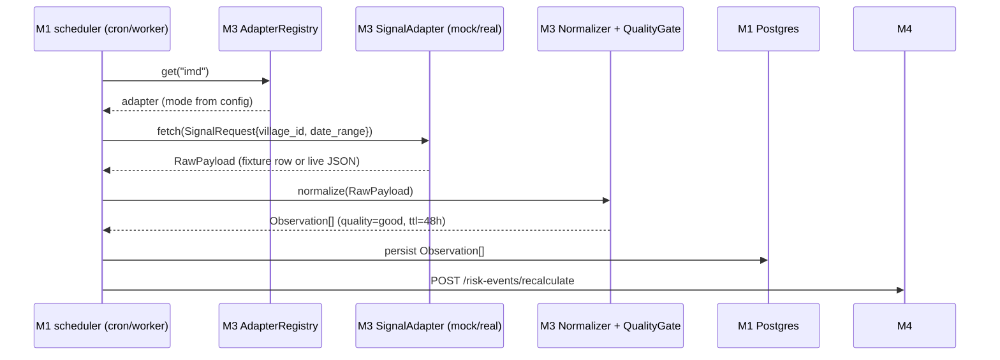
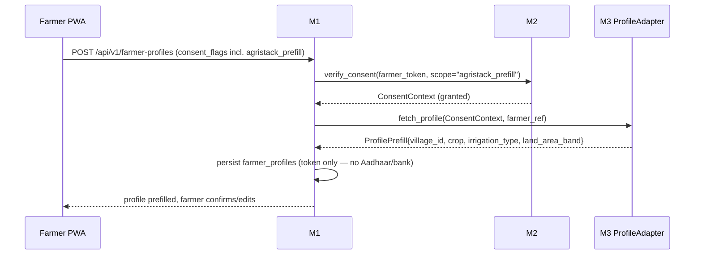
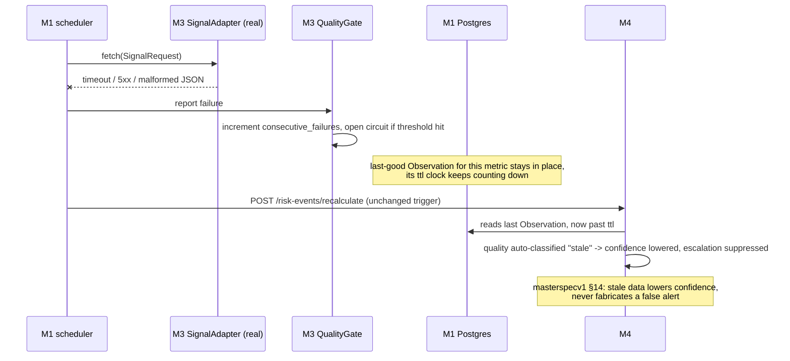
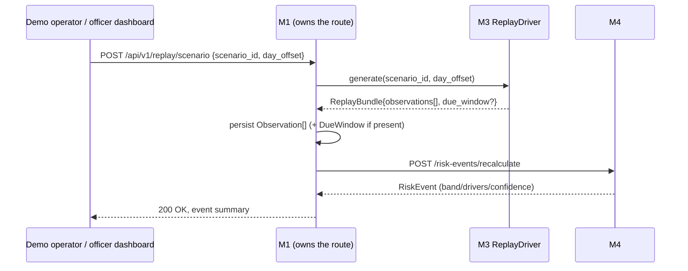

# Module 3 — Ingestion & Government Adapters

`libs/adapters` · Owner concern: IMD, Agmarknet/eNAM, AgriStack (via API Setu), Bhashini, Bhuvan/OSM
adapters; the common adapter interface; mock/replay fixtures; data-quality + TTL normalisation.

> Read `masterspecv1.md` and `module_0_architecture_overview.md` first. This spec follows the
> module_0 §5 template and must not contradict either document or redesign a sibling module.

---

## 1. Module purpose & responsibilities

The platform's single rule for external dependence: **adapters, not dependencies**
(masterspecv1 §6). Module 3 is the *only* module permitted to talk to a government or
third-party service. Its job:

- Own one `AdapterInterface` family, each source implemented twice — **Mock** (90-day replay
  fixtures) and **Real** (live API) — swappable by config, never by code change.
- Pull raw signals for weather, mandi prices, consented farmer/crop profile, voice I/O, and geo
  layers.
- Run every raw payload through a **data-quality gate** and normalise it into the shared
  `Observation` contract (owned by M1, defined in module_0 §4).
- Own **TTL and staleness semantics**: a signal past its TTL is degraded, not deleted — it lowers
  M4's confidence, it never manufactures or suppresses an alert on its own.
- Own the **90-day replay dataset** and the **replay signal-generation driver** that backs
  `POST /api/v1/replay/scenario` (M1 owns the HTTP route and persistence; M3 only produces the
  signals for a scenario/day).

**Module 3 is a library, not a service.** It has no HTTP surface, no DB connection, and no
scoring logic. It is called in-process by M1 (scheduled ingestion, replay, onboarding prefill)
and directly by M6/M7 for the Bhashini voice I/O calls.

---

## 2. Scope

### In scope
- `AdapterInterface` contracts + `AdapterMode` (mock/real) switching.
- Five adapters: **IMD**, **Agmarknet/eNAM**, **AgriStack**, **Bhashini**, **Bhuvan/OSM**.
- Normalisation of raw source payloads → `Observation` (weather, price, geo) or the profile-prefill
  / voice-I/O shapes described in §5.
- Data-quality gate: schema validation, range checks, de-duplication, staleness classification.
- TTL table per source and the stale→confidence-lowering rule.
- 90-day replay fixture dataset + `ReplayDriver` (scenario → signals for a given day offset).
- Health/status reporting per adapter (for the officer/district ops view and demo narration).

### Explicitly out of scope
- **Scoring.** M3 never computes a sub-score, band, or `RiskEvent` — that is M4, and M4 stays free
  of M3 imports beyond the `Observation` type (module_0 §4 purity rule).
- **Persistence.** M3 returns Python objects; M1 writes them to `weather_observations`,
  `market_quotes`, `farmer_profiles`, etc. M3 holds no DB connection.
- **The HTTP route** for `/api/v1/replay/scenario`, `/api/v1/farmer-profiles`, or any other
  endpoint — those live in M1 (and call into M3).
- **Consent decisions.** M3 calls M2 to check consent before an AgriStack pull; it never stores,
  grants, or evaluates consent itself.
- **Scheme eligibility RAG / pgvector ingest** of PM-Kisan/PMFBY docs — that's M7.
- **Delivery** of the resulting advisory (SMS/voice/push) — that's M6, which *calls* M3's Bhashini
  adapter for TTS but does not own it.
- Live loan-bureau / lender / bank data of any kind (privacy firewall — masterspecv1 §4.5).

---

## 3. Position in the architecture

**Upstream (M3 depends on):**

| Module | What M3 uses from it |
|---|---|
| M1 (Platform Core) | `Observation`, `ConsentContext` type definitions; persistence is M1's job, not M3's |
| M2 (Identity/Consent) | `verify_consent(farmer_token, scope="agristack_prefill")` before any AgriStack pull |

**Downstream (depends on M3):**

| Module | What it consumes from M3 |
|---|---|
| M1 | Calls M3 adapters on a schedule / on replay / on onboarding; persists the returned `Observation`s and profile prefill |
| M4 (Scoring) | Consumes `Observation` rows M1 persisted from M3 output — never calls M3 directly |
| M6 (Notification) | Calls the Bhashini adapter directly (TTS for action cards, ASR for IVR input) |
| M7 (AI Copilot) | Calls the Bhashini adapter directly (voice copilot narration); reads M3 adapter health for its brief |

```mermaid
flowchart LR
    M1["M1 Platform Core<br/>(scheduler, HTTP, DB)"] -->|invokes in-process| M3["M3 Adapters<br/>(this module)"]
    M2["M2 Consent"] -->|verify_consent| M3
    M3 -->|raw payload, mock or real| EXT["IMD · Agmarknet/eNAM ·<br/>AgriStack/API Setu ·<br/>Bhashini · Bhuvan/OSM"]
    M3 -->|Observation[] / ProfilePrefill| M1
    M1 -->|persists, then| M4["M4 Scoring<br/>(reads Observation from DB)"]
    M6["M6 Notification"] -->|transcribe/synthesize| M3
    M7["M7 AI Copilot"] -->|translate/synthesize| M3
```

**Contract produced:** `Observation` (canonical, module_0 §4) — the *only* thing M4 ever reads
from this module's output chain, and always via M1's DB, never in-process.

---

## 4. Internal structure

```
/libs/adapters
  core/
    interfaces.py        # SignalAdapter, ProfileAdapter, VoiceAdapter protocols; AdapterMode
    registry.py           # source name -> Mock|Real instance, selected by config/env per source
    normalizer.py          # raw payload -> Observation; unit conversion; metric-name mapping
    quality.py              # schema/range validation, de-dup, staleness classification
    ttl.py                   # per-source TTL table + "past-TTL -> quality=stale" rule
    health.py                 # AdapterHealth tracking (last_success_at, last_error, circuit state)
  sources/
    imd/          {mock.py, real.py, schemas.py, fixtures/}
    agmarknet/    {mock.py, real.py, schemas.py, fixtures/}
    agristack/    {mock.py, real.py, schemas.py, fixtures/}
    bhashini/     {mock.py, real.py, schemas.py}          # no fixtures needed — wired live per masterspec §4.2
    bhuvan/       {mock.py, real.py, schemas.py, fixtures/}  # static GeoJSON per masterspec §4.2
  replay/
    driver.py             # ReplayDriver.generate(scenario_id, day_offset) -> ReplayBundle
    scenarios.py            # the 5 named scenarios + their day-offset signal recipes
  fixtures/
    90_day/
      imd_<village_id>.jsonl          # 90 rows, one per day
      agmarknet_<commodity>_<mandi_id>.jsonl
      agristack_profiles.jsonl         # synthetic consented profiles for demo farmers
      bhuvan_villages.geojson
    scenarios/
      normal.json
      rainfall_shock.json
      price_crash.json
      due_window.json
      stale_data.json
  tests/
    test_normalizer.py
    test_quality_and_ttl.py
    test_registry_mock_vs_real_swap.py
    test_each_source_contract.py       # every Mock+Real pair returns a schema-valid Observation
    test_replay_scenarios.py            # 5 scenarios match masterspecv1 §12 / §14 expectations
```

**Key components:**

| Component | Responsibility |
|---|---|
| `AdapterRegistry` | `registry.get("imd")` → configured `SignalAdapter` instance (mock or real, from env `ADAPTER_MODE_IMD=mock\|real`) |
| `Normalizer` | Maps each source's native fields/units to `Observation.metric` + `unit`, e.g. IMD `rainfall_mm_24h` → `metric="rainfall_actual", unit="mm"` |
| `QualityGate` | Rejects malformed payloads, flags out-of-range values, de-dupes repeated pulls, classifies `quality ∈ {good, degraded, stale, missing}` |
| `TTLPolicy` | Per-source TTL lookup + the "past TTL → degrade, don't drop" rule |
| `ReplayDriver` | Deterministic function: `(scenario_id, day_offset) → Observation[] (+ optional DueWindow)` |
| `AdapterHealth` tracker | Per-source last success/error/circuit-breaker state, surfaced to M1/M7 for demo narration ("live feed" vs "stale") |

---

## 5. Data models / contracts

### 5.1 Imported from M1 (canonical, not redefined here)

```
Observation      { source, observed_at, village_id | plot_grid, metric, value: JsonValue, unit, quality, ttl }
ConsentContext   { farmer_token, storage, contact, analytics, due_window, consent_scopes[] }
```

### 5.2 Owned by M3 (internal — never imported by M4/M5)

```python
class AdapterMode(str, Enum):
    MOCK = "mock"
    REAL = "real"

class AdapterHealth(BaseModel):
    source: str
    mode: AdapterMode
    ok: bool
    last_success_at: datetime | None
    last_error: str | None
    consecutive_failures: int

class RawPayload(BaseModel):
    """Untyped envelope before normalisation — schema per source lives in sources/<x>/schemas.py"""
    source: str
    fetched_at: datetime
    body: dict

class ProfilePrefill(BaseModel):
    """AgriStack result — feeds M1's farmer_profiles, not an Observation."""
    farmer_ref: str
    village_id: str
    crop: str | None
    land_area_band: str | None
    irrigation_type: str | None
    source: Literal["agristack"]
    fetched_at: datetime

class ASRResult(BaseModel):
    text: str
    lang: str
    confidence: float

class ReplayBundle(BaseModel):
    scenario_id: str
    day_offset: int
    observations: list[Observation]
    due_window: DueWindow | None = None   # only for the "+due window" scenario
```

### 5.3 Metric-name mapping (M3 → M4 contract alignment)

Cross-checked against masterspecv1 §3's signal table so M4 can consume without translation:

| Source | `Observation.metric` | `unit` | Feeds M4 sub-score |
|---|---|---|---|
| IMD | `rainfall_actual`, `rainfall_forecast`, `rainfall_normal` | mm | Rainfall/forecast shock (0–35) |
| Agmarknet/eNAM | `mandi_modal_price`, `mandi_arrivals` | INR/quintal, quintal | Mandi price stress (0–30) |
| Bhuvan/OSM | `village_coordinates`, `mandi_coordinates` | lat/lon (GeoJSON) | Map display only — not scored |
| AgriStack | *(not an Observation — `ProfilePrefill`)* | — | Onboarding prefill only |
| Bhashini | *(not an Observation — stateless call)* | — | I/O layer only |

`due_window` and `farmer_report` sub-scores never come from government sources — masterspecv1 §4.2 confirms both
are farmer-input-only, which is the privacy firewall; M3 does not touch them except when the
**replay driver** synthesises a `DueWindow` for the demo scenario.

---

## 6. Interfaces & APIs

M3 exposes **Python interfaces**, not HTTP endpoints. All I/O with the outside world (gov API or
fixture file) happens inside a `Real`/`Mock` implementation; callers only ever see the protocol.

### 6.1 Core protocols (inbound — called by M1/M6/M7)

```python
class SignalAdapter(Protocol):
    """IMD, Agmarknet/eNAM, Bhuvan/OSM — anything that yields Observations."""
    source: str
    mode: AdapterMode

    def fetch(self, req: SignalRequest) -> list[Observation]: ...
    def health(self) -> AdapterHealth: ...

class SignalRequest(BaseModel):
    village_id: str | None = None
    district_id: str | None = None
    mandi_id: str | None = None
    commodity: str | None = None
    date_range: tuple[date, date]

class ProfileAdapter(Protocol):
    """AgriStack — consented profile/land/crop prefill. Requires a verified ConsentContext."""
    source: Literal["agristack"] = "agristack"
    mode: AdapterMode

    def fetch_profile(self, consent: ConsentContext, farmer_ref: str) -> ProfilePrefill: ...
    def health(self) -> AdapterHealth: ...

class VoiceAdapter(Protocol):
    """Bhashini — stateless ASR/TTS/translation, shared I/O for M6 + M7."""
    source: Literal["bhashini"] = "bhashini"
    mode: AdapterMode

    def transcribe(self, audio: bytes, lang: str) -> ASRResult: ...
    def synthesize(self, text: str, lang: str) -> bytes: ...
    def translate(self, text: str, src_lang: str, tgt_lang: str) -> str: ...
    def health(self) -> AdapterHealth: ...
```

### 6.2 Registry (how M1/M6/M7 obtain an instance)

```python
registry.get("imd")         -> SignalAdapter   # ADAPTER_MODE_IMD=mock|real
registry.get("agmarknet")   -> SignalAdapter   # ADAPTER_MODE_AGMARKNET=mock|real
registry.get("bhuvan")      -> SignalAdapter   # ADAPTER_MODE_BHUVAN=mock|real
registry.get("agristack")   -> ProfileAdapter  # ADAPTER_MODE_AGRISTACK=mock|real
registry.get("bhashini")    -> VoiceAdapter    # ADAPTER_MODE_BHASHINI=mock|real (real by default — masterspec §4.2 "Wire live")
```

### 6.3 Replay driver (backs M1's `POST /api/v1/replay/scenario`)

```python
class ReplayDriver:
    def generate(self, scenario_id: ScenarioId, day_offset: int) -> ReplayBundle: ...
    def list_scenarios(self) -> list[ScenarioId]: ...
```

M1's route handler is the only caller: it invokes `ReplayDriver.generate(...)`, persists the
returned `Observation`s (and `DueWindow`, if present) exactly as it would for a live pull, then
triggers `M4 /risk-events/recalculate`. **M3 never touches the HTTP layer or the DB.**

### 6.4 Outbound (M3 → external)

| Adapter | Mock reads | Real calls |
|---|---|---|
| IMD | `fixtures/90_day/imd_*.jsonl` | IMD public weather API |
| Agmarknet/eNAM | `fixtures/90_day/agmarknet_*.jsonl` | data.gov.in Agmarknet API / eNAM API |
| AgriStack | `fixtures/90_day/agristack_profiles.jsonl` | API Setu-mediated AgriStack Farmer/Crop Registry |
| Bhashini | *(none — real by default)* | Bhashini ASR/TTS/translation APIs |
| Bhuvan/OSM | `fixtures/90_day/bhuvan_villages.geojson` | Bhuvan tile/geocode API or OSM Nominatim |

---

## 7. Dependencies

**Internal:**
- M1 — type definitions (`Observation`, `ConsentContext`), the caller/orchestrator, the persister.
- M2 — `verify_consent()` gate before every AgriStack pull.

**External services (Real mode only):**
- IMD public weather API
- data.gov.in Agmarknet API / eNAM API
- API Setu (AgriStack Farmer/Crop Registry access)
- Bhashini ASR/TTS/translation APIs
- Bhuvan (ISRO) or OpenStreetMap/Nominatim

**Libraries:** `httpx` (async HTTP client, timeouts + retries), `pydantic` (schema validation),
`tenacity` (backoff/retry policy), `orjson` (fixture parsing), `pytest` + `respx` (HTTP mocking in
tests).

---

## 8. Tech stack

| Concern | Choice |
|---|---|
| Language | Python 3.11+, fully typed (`mypy` clean) |
| HTTP client (Real adapters) | `httpx` async, per-source timeout + `tenacity` retry/backoff |
| Fixture format | JSONL (time series) + GeoJSON (Bhuvan static layer) |
| Validation | Pydantic v2 models per source schema |
| Config | env vars (`ADAPTER_MODE_<SOURCE>=mock|real`), 12-factor — no code branch needed to swap |
| Testing | Pytest, `respx` for HTTP stubbing, golden-fixture assertions |
| Packaging | Installable as `libs/adapters`, imported by `services/platform-core`, `services/notification`, `services/ai-copilot` |

---

## 9. Key workflows / sequences

### 9.1 Happy path — scheduled ingestion cycle (IMD/Agmarknet)



### 9.2 Consented AgriStack prefill (onboarding)



### 9.3 Failure path — source down / malformed payload / stale



### 9.4 Replay scenario (demo driver)



---

## 10. Error handling, failure modes & guardrails

| Failure mode | Handling |
|---|---|
| External API timeout / 5xx | `tenacity` retry with exponential backoff (max 3 attempts); on exhaustion, mark `AdapterHealth.ok=False`, keep last-good `Observation` in place |
| Malformed / schema-invalid payload | `QualityGate` rejects the payload before it becomes an `Observation`; logged, not persisted; does not overwrite a prior good value |
| Rate-limit / quota exceeded (gov APIs) | Circuit breaker opens per source after N consecutive failures; scheduler backs off; `AdapterHealth` surfaces "degraded" to M1/M7 for honest demo narration |
| Data past TTL | `TTLPolicy` reclassifies `quality → stale` at read time (not deleted) — M4's confidence calculation lowers, escalation can be suppressed. **Never** produces a false Red. This is the mechanism behind masterspecv1 §14's stale-data acceptance test and demo step §16.8 |
| AgriStack pull without valid consent | `ProfileAdapter.fetch_profile` **must not be called** without a `ConsentContext` where `scope=agristack_prefill` is granted — enforced by M1's call site; M3 itself has no fallback path that bypasses M2 |
| AgriStack payload contains out-of-scope fields (bank/Aadhaar) | `QualityGate`/schema for `ProfilePrefill` has no such fields — anything beyond `village_id/crop/irrigation_type/land_area_band` is dropped at the schema boundary, never reaches M1 |
| Bhashini latency / outage | M6/M7 callers get a typed error, not a hang — timeout budget short (voice UX); fallback to cached/template TTS per masterspecv1 §7 "cached/local fallback when offline" is a M6 concern, M3 only reports health honestly |
| Replay scenario id/day_offset out of range | `ReplayDriver.generate` raises a typed `ScenarioNotFound`/`DayOffsetOutOfRange`; M1 route returns 400 — no silent fallback to a random scenario |
| Duplicate pulls (scheduler re-run) | `QualityGate` de-dupes by `(source, metric, village_id, observed_at)` before returning — idempotent |

**Guardrails (cross-cutting):**
- No adapter writes to the DB. This keeps the "adapters, not dependencies" boundary literal —
  swapping Mock↔Real never touches persistence code.
- No adapter ever fabricates a value to fill a gap — missing stays `quality=missing`, surfaced
  honestly, resolved only by M4's confidence math, never by M3 interpolating.
- Real-mode credentials (API keys) are read from env/secret store only; never hardcoded, never
  logged, never present in fixture files.

---

## 11. Testing strategy & acceptance criteria

| Test | Validates |
|---|---|
| `test_each_source_contract.py` | Every Mock **and** Real adapter (schema-mocked via `respx` for Real) returns a schema-valid `Observation`/`ProfilePrefill` for the same protocol — Mock/Real are interchangeable |
| `test_normalizer.py` | Raw source fields map to the correct `metric`/`unit` per §5.3 table |
| `test_quality_and_ttl.py` | Value past TTL → `quality=stale`; malformed payload → rejected, not persisted; out-of-range value → `quality=degraded` |
| `test_registry_mock_vs_real_swap.py` | Changing `ADAPTER_MODE_<SOURCE>` env var swaps implementation with zero caller-code change |
| `test_replay_scenarios.py` | Each of the 5 scenarios produces the `Observation`/`DueWindow` set the scoring engine needs to reach the masterspecv1 §14 acceptance outcomes:<br/>• *rainfall shock + price crash + due window* → all three driver-feeding Observations present<br/>• *stale data* scenario → at least one Observation is TTL-expired by construction |
| Consent-gate test | `ProfileAdapter.fetch_profile` call without a granted `ConsentContext` raises, never silently proceeds |
| Field-leak test | `ProfilePrefill` schema statically cannot carry Aadhaar/bank/lender fields (no such field exists on the model — compile-time guarantee, not just a runtime check) |
| Health/circuit-breaker test | N consecutive failures flips `AdapterHealth.ok=False`; recovery resets it |

**Acceptance criteria (traceable to masterspecv1 §14):**
- A rainfall-shock + price-crash + due-window replay produces Observations for all three drivers
  within the same call, so M4 can reach Red within the demo's "24h" simulated window.
- The stale-data scenario demonstrably lowers confidence and does not, by itself, cause M4 to
  escalate — verified at the M3 boundary (Observation is correctly flagged `stale`) and left to
  M4's own test suite to verify the confidence/escalation math.
- Every persisted Observation carries `source` + `observed_at`, satisfying masterspecv1 §14's "every
  action card traces to a rule + source."

---

## 12. MVP boundary vs. stretch

Aligned to masterspecv1 §13.

| Adapter | MVP mode | Stretch |
|---|---|---|
| IMD | Mock (district fixture, 90-day) | Real adapter coded and unit-tested against a recorded response, not demoed live |
| Agmarknet/eNAM | Mock (price fixture, 90-day) | Same — Real path exists, not credentialed for the demo |
| AgriStack | Mock + real consent screen (masterspecv1 §4.2: "Mock + consent screen") | Real API Setu pull if a sandbox credential becomes available |
| Bhashini | **Real, wired live** — masterspecv1 §4.2/§7 names this the differentiator | Expand beyond Hindi/Marathi |
| Bhuvan/OSM | Static GeoJSON (masterspecv1 §4.2: "Static") | Live tile/geocode calls |

**Build for MVP:** `AdapterInterface` family, all five Mock adapters, the 90-day fixture set, the
5 replay scenarios + `ReplayDriver`, quality gate + TTL policy, Bhashini wired live.

**Do not build (MVP):** live IMD/Agmarknet/AgriStack credentials in the demo path, multi-district
fixture coverage, >2 languages in Bhashini, any adapter beyond the five named in masterspecv1 §6.

---

## 13. Risks & mitigations

| Risk | Mitigation |
|---|---|
| Government APIs are dirty, rate-limited, or unavailable during the round | Adapter interface + 90-day replay fixtures — the whole point of masterspecv1 §6 and §18; demo never depends on a live credential |
| Bhashini latency/quota threatens the "wire live" differentiator | Timeout budget + graceful fallback owned by M6 (cached/template TTS); M3 only needs to fail fast and report health honestly |
| AgriStack scope creep (fields beyond profile prefill) | `ProfilePrefill` schema is closed by design — no Aadhaar/bank/lender field exists to leak |
| Fixture drift from real API shape (fixtures rot vs. actual gov schema) | `sources/<x>/schemas.py` models the *real* payload shape; fixtures are validated against that schema in CI, not hand-authored freeform JSON |
| Replay scenarios silently diverge from masterspecv1 §12's five named scenarios | `replay/scenarios.py` names match masterspecv1 §12 literally (`normal`, `rainfall_shock`, `price_crash`, `due_window`, `stale_data`); tested by name |
| Mock/Real behavioural drift (Mock passes tests, Real adapter subtly different) | `test_each_source_contract.py` runs the same assertions against both, using `respx`-stubbed HTTP for Real |

---

## 14. Open questions / decisions needed

- **IMD granularity:** district-level fixture only, or per-village interpolation? masterspecv1 §4.2
  says "District fixture" for MVP — confirm M4 accepts district-level rainfall for a village-scored
  event, or whether M3 needs a district→village mapping step.
- **Agmarknet vs eNAM as the Real source of record:** both are named in masterspecv1 §4.2/§6; MVP
  picks one Real implementation to actually code against (data.gov.in Agmarknet is the more stable
  public dataset) — needs a decision before the Real adapter is built, not blocking Mock.
- **MarketQuote vs Observation duplication:** masterspecv1 §5 lists a separate `market_quotes` table
  for the "nearer mandis" comparison UI (§8.2). Does M3 emit `Observation` only (M4's need) and let
  M1 separately persist the raw quote for the comparison feature, or does M3 emit both shapes from
  one normalisation pass? Recommendation: M3 returns `Observation`; M1 derives the `market_quotes`
  row from the same raw payload M3 already validated, to avoid a second external call — needs M1
  sign-off.
- **Bhuvan vs plain OSM/Nominatim:** Bhuvan is the government-aligned choice (positioning value in
  masterspecv1 §6), OSM is simpler to wire. MVP ships static GeoJSON either way — decide the Real
  adapter target before Phase 5 hardening.
- **Replay isolation:** should replay-generated Observations be tagged (`source_tag="replay"`) so a
  demo run never contaminates a real-data view, or does the single-district MVP not need the
  distinction? Needs a decision with M1 (who owns persistence) and M5 (whose district strip
  aggregates on top of this data).
- **Circuit-breaker thresholds and backoff timing** — not yet numerically specified; needs a
  decision shared with M1 (who owns the scheduler that respects them).
