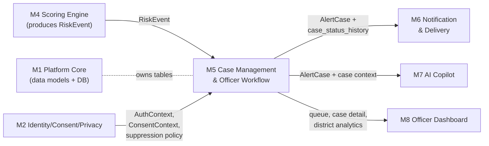
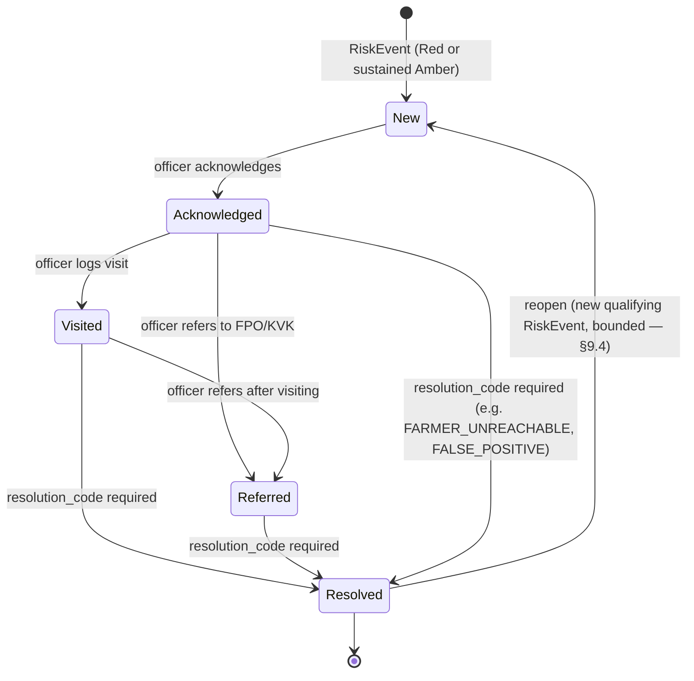

# Module 5 — Case Management & Officer Workflow

`services/case-workflow` · Owner concern: case lifecycle state machine, routing/prioritisation, SLA, closure, district analytics aggregation.

This spec follows the template in `module_0_architecture_overview.md §5` and the shared contracts in `module_0_architecture_overview.md §4`. It does not redefine or contradict `masterspecv1.md`.

---

## 1. Module purpose & responsibilities

Module 5 owns the **"Close"** step of the platform's Sense → Score → Act → Close loop (`masterspecv1.md §2`, §11 nodes `J`/`K`). It turns a machine-generated `RiskEvent` into a trackable, auditable human task, and proves the loop closed.

Responsibilities:

- Consume `RiskEvent` (Red, or sustained Amber per hysteresis) and create/maintain an `AlertCase`.
- Own the case lifecycle **state machine**: New → Acknowledged → Visited/Referred → Resolved, with resolution codes.
- Own `case_status_history` — the immutable, append-only audit trail of every transition.
- **Route** each case to the correct agriculture officer / district.
- Produce a **ranked queue** ordering (Red first, then by confidence/age) for the officer dashboard.
- Track **SLA timers** (acknowledgement target) and flag breaches.
- Aggregate **district analytics** (hotspots, closure %, acknowledgement time, operational lead time) — aggregate-only, cohort-suppressed.

Explicitly **not** this module's job (see §2):

- Deciding the score/band/confidence — that is M4.
- Sending any notification (SMS/voice/PWA push) — that is M6.
- Authoring officer briefs or scheme-matched copilot text — that is M7.
- AuthN/AuthZ, consent, or the cohort-suppression *policy* itself — that is M2 (M5 only *calls* it).

---

## 2. Scope

### In scope

| Area | Detail |
|---|---|
| Case creation | Consume `RiskEvent`, dedupe against existing open case, create `AlertCase` |
| State machine | Legal transitions, guards, resolution codes, illegal-transition rejection |
| History | `case_status_history` write on every transition (append-only) |
| Routing | village → officer/district assignment, fallback queue on routing miss |
| Prioritisation | Ranked queue query: band → confidence → age |
| SLA | Acknowledgement-target timers, breach flagging |
| Analytics | District-level aggregate metrics, cohort-suppressed via M2 policy |
| Reopen/dedup | Prevent duplicate open cases per farmer; bounded reopen after resolution |

### Explicitly out of scope

| Excluded | Owner |
|---|---|
| Computing score / band / confidence / drivers | M4 |
| Sending SMS / voice / push / IVR, rendering action cards | M6 |
| Officer copilot brief generation, scheme RAG, draft outreach text | M7 |
| Auth, RBAC, consent decisions, cohort-suppression policy definition | M2 |
| Farmer-facing or officer-facing UI rendering | M8 |
| Individual-level surveillance, officer performance leaderboards | Nobody — disallowed by `masterspecv1.md §4.5` |
| Predictive "warning lead" evaluation (alert date vs. actual shock date) | M4 / roadmap (shadow ML, `masterspecv1.md §10.D`) |

> **Naming note on "lead time":** `masterspecv1.md §19` KPI "warning lead ≥7 days" is a *predictive* evaluation metric (needs labelled outcomes) and belongs to M4/roadmap, not M5. What M5 computes and exposes in district analytics is **operational lead time**: case-creation → acknowledgement → resolution turnaround. The two must not be conflated in the dashboard or docs.

---

## 3. Position in the architecture



- **Upstream (hard deps):** M1 (data layer, DB, migrations), M2 (auth/consent/suppression policy).
- **Upstream (data contract only, no runtime call):** M4. M4 is pure (`module_0 §3`) and does not write to the DB itself; M5 reads `RiskEvent` rows persisted by the M1 orchestration layer after it invokes the M4 scorer. M5 never calls M4's code directly.
- **Downstream consumers of `AlertCase`:** M6 (delivery/escalation notifications), M7 (copilot brief context), M8 (dashboard queue/detail/analytics). All three **pull** — M5 does not push to them (see §6).

---

## 4. Internal structure

```
services/case-workflow/
  api/
    cases.py            # queue, detail, acknowledge, visit, refer, resolve
    analytics.py         # GET /analytics/district
  domain/
    state_machine.py     # transition table + guards
    routing.py           # village -> officer/district assignment, fallback
    sla.py                # ack-target computation, breach detection
    dedup.py              # open-case-per-farmer dedup, reopen policy
    ranking.py            # queue ordering (band, confidence, age)
  workers/
    risk_event_consumer.py   # polls/consumes new RiskEvent rows -> creates/updates cases
    sla_breach_scanner.py    # periodic job, flags overdue acknowledgements
  repositories/
    case_repo.py
    routing_repo.py
    analytics_repo.py
  schemas/
    case_schemas.py       # Pydantic request/response (imports canonical AlertCase from M1)
  tests/
```

- Domain logic (`state_machine.py`, `routing.py`, `sla.py`) has no FastAPI/HTTP imports — testable in isolation, mirroring M4's purity discipline.
- `risk_event_consumer.py` is the only place that reads `RiskEvent`; everything downstream works off `AlertCase`.

---

## 5. Data models / contracts

### 5.1 Imported from M1 (canonical — do not redefine)

```
RiskEvent  { event_id, farmer_token, village_id, score, band, confidence,
             contributors[], action_ids[], model_version, expires_at }
AlertCase  { case_id, event_id, farmer_token, village_id, band, confidence,
             recipient_role, channel_preferences[], sent_at, ack_at, status,
             resolution_code, notes }
AuthContext    { principal, role, scopes[], mfa_verified }        # from M2
ConsentContext { farmer_token, storage, contact, analytics, due_window, consent_scopes[] }  # from M2
```

### 5.2 Owned by M5 (operational extension — additive, non-breaking to the M1 contract)

The canonical `AlertCase` in `module_0 §4` is the minimum cross-module contract. M5 is the *owning* service for the `alert_cases` and `case_status_history` tables (`masterspecv1.md §5`) and persists these additional operational fields alongside the canonical ones:

```
AlertCase (M5-owned columns, superset of canonical)
  case_id            uuid, PK
  event_id           fk -> RiskEvent.event_id      # canonical
  farmer_token        fk -> FarmerProfile.farmer_token
  village_id          fk -> village
  district_id         fk -> district               # denormalised for queue/analytics
  band                enum(green, amber, red)        # denormalised from RiskEvent at creation
  confidence           float                          # denormalised from RiskEvent at creation
  assigned_officer_id  fk -> officer (nullable = routing miss)
  status               enum (see §6 state machine)     # canonical `status`
  recipient_role       enum(extension_officer, district_admin)   # canonical
  channel_preferences  enum[] (push, sms, voice, ivr, whatsapp)  # delivery preference; M6 owns actual attempts
  created_at           timestamp
  sla_ack_due_at        timestamp                        # created_at + SLA target (§6.3)
  sla_breached          bool, default false
  ack_at                timestamp, nullable               # canonical
  visit_notes           text, nullable
  referred_to           enum(fpo, kvk, other), nullable
  resolved_at            timestamp, nullable
  resolution_code        enum (§6.2), nullable            # canonical
  notes                  text, nullable                     # canonical
  reopen_count            int, default 0

CaseStatusHistory
  history_id    uuid, PK
  case_id       fk -> AlertCase.case_id
  from_status    enum, nullable  (null on creation)
  to_status      enum
  actor          fk -> AuthContext.principal  (officer/system)
  reason         text, nullable   (free text, e.g. visit/referral/resolution note)
  occurred_at    timestamp

VillageOfficerAssignment      # routing table
  village_id     fk -> village, PK
  district_id    fk -> district
  officer_id     fk -> officer
  active         bool

DistrictAnalyticsSnapshot      # materialised aggregate, refreshed periodically
  district_id           fk -> district
  window_start/end       timestamp
  open_red_count         int
  median_ack_time_hours    float
  closure_pct              float
  median_resolution_hours   float
  hotspot_villages[]        { village_id, red_count }   # suppressed per M2 policy, see §10
```

Append-only rule: `case_status_history` rows are **never updated or deleted** — corrections are new rows, matching the audit-log discipline M2 enforces elsewhere (`masterspecv1.md §4.5`).

---

## 6. Interfaces & APIs

### 6.1 Inbound

| Endpoint | Method | Purpose | Auth (via M2) |
|---|---|---|---|
| `/api/v1/cases` | GET | Ranked queue; filters `district_id`, `officer_id`, `band`, `status` | extension_officer/district_admin, scoped to assigned district/villages |
| `/api/v1/cases/{case_id}` | GET | Case detail + status history + `RiskEvent.contributors[]` (referenced, not recomputed) | scoped |
| `/api/v1/cases/{case_id}/acknowledge` | POST | New → Acknowledged | officer assigned to case |
| `/api/v1/cases/{case_id}/visit` | POST | Acknowledged → Visited (`visit_notes`) | officer assigned to case |
| `/api/v1/cases/{case_id}/refer` | POST | Acknowledged/Visited → Referred (`referred_to`) | officer assigned to case |
| `/api/v1/cases/{case_id}/resolve` | POST | → Resolved (`resolution_code`, `notes`) — from `masterspecv1.md §12` | officer assigned to case |
| `/api/v1/analytics/district` | GET | Aggregate district metrics — from `masterspecv1.md §12` | district_admin |
| `/api/v1/cases/{case_id}/context` *(internal)* | GET | Read-only case + history bundle for M7's copilot brief | service-to-service (M2 scope) |

Not HTTP — background workers:

| Worker | Trigger | Action |
|---|---|---|
| `risk_event_consumer` | Poll on interval (MVP) / DB `LISTEN`+`NOTIFY` (stretch) | New/updated `RiskEvent` → create or update `AlertCase` per dedup rule (§9) |
| `sla_breach_scanner` | Periodic (e.g. hourly) | Flag `sla_breached=true` on overdue New/Acknowledged cases |

### 6.2 Resolution codes (fixed enum — no free-text-only close)

| Code | Meaning |
|---|---|
| `SUPPORT_PROVIDED` | Officer visited/contacted, support/advice given |
| `REFERRED_EXTERNAL` | Handed to FPO/KVK, resolved from M5's perspective |
| `FARMER_UNREACHABLE` | Contact attempted, no response within policy window |
| `FALSE_POSITIVE` | Officer determined no real distress on inspection |
| `DUPLICATE` | Superseded by another open case for the same farmer |
| `NO_ACTION_NEEDED` | Contacted, farmer confirmed no support needed |

### 6.3 SLA targets (MVP defaults — see §14 open question on hard vs. soft)

| Band | Acknowledgement target | Source |
|---|---|---|
| Red | 24h wall-clock | `masterspecv1.md §19` — "officer acknowledgement <24h" |
| Amber (sustained) | 48h wall-clock | Derived; no explicit masterspec value — flagged §14 |

`sla_ack_due_at = created_at + target`. Breach sets `sla_breached=true`; does not change `status`.

### 6.4 Outbound calls M5 makes

| Call | To | Purpose |
|---|---|---|
| Persist/query `alert_cases`, `case_status_history`, `village_officer_assignment` | M1 (data layer) | All storage, via SQLAlchemy models owned by M5 |
| Validate `AuthContext` on every mutating call | M2 | Reject unscoped/unauthenticated officer actions (403) |
| Write `audit_events` on every transition | M2 | Immutable audit trail (M2-owned table) |
| Check `ConsentContext.contact` before exposing farmer contact fields | M2 | Redact contact details if consent withdrawn |
| Apply cohort-suppression policy before returning analytics | M2 | Suppress `hotspot_villages` cells below minimum-n threshold |

M5 makes **no** outbound calls to M6, M7, or M8 — those modules pull `AlertCase`/analytics data from M5's read endpoints on their own schedule/trigger.

---

## 7. Dependencies

| Dependency | Type | Why |
|---|---|---|
| M1 Platform Core | Hard (`module_0` graph: M5 → M1) | Data models, DB, migrations |
| M2 Identity/Consent/Privacy | Hard (`module_0` graph: M5 → M2) | Auth, audit log, consent gating, suppression policy |
| M4 Scoring Engine | Data-contract only, no runtime call | `RiskEvent` shape (read persisted rows only) |
| FastAPI, Pydantic, SQLAlchemy + Alembic | External libs | API + ORM + migrations, per `masterspecv1.md §11` stack |
| APScheduler (or equivalent simple cron) | External lib | `risk_event_consumer` poll loop, `sla_breach_scanner` |
| pytest | External lib | Testing, per `masterspecv1.md §11` |

---

## 8. Tech stack

| Layer | Choice | Notes |
|---|---|---|
| Service framework | Python + FastAPI | Consistent with `masterspecv1.md §11` |
| Validation | Pydantic | Request/response schemas, imports canonical types from M1 |
| DB access | SQLAlchemy + Alembic | Owns migrations for `alert_cases`, `case_status_history`, `village_officer_assignment` |
| Database | PostgreSQL + PostGIS | PostGIS for village/district geospatial hotspot joins |
| Background jobs | APScheduler (in-process, MVP) | Stretch: move to a real queue/worker if scaled beyond one district |
| Testing | Pytest | Domain logic unit tests + API integration tests |
| CI/CD | GitHub Actions | Per `masterspecv1.md §11` |

---

## 9. Key workflows / sequences

### 9.1 Happy path — RiskEvent → case → resolution

```mermaid
sequenceDiagram
    participant M4 as M4 Scoring Engine
    participant DB as M1 Postgres (risk_events)
    participant W as M5 risk_event_consumer
    participant CW as M5 Case API
    participant Off as Officer (via M8)

    M4->>DB: RiskEvent{band=Red} persisted (by M1 orchestration)
    W->>DB: poll new/updated risk_events
    W->>W: dedup check: open case exists for farmer_token?
    alt no open case
        W->>DB: create AlertCase(status=New), route via VillageOfficerAssignment
        W->>DB: insert case_status_history(New)
    else open case exists
        W->>DB: update denormalised band/confidence on existing case
    end
    Off->>CW: GET /cases (ranked queue)
    Off->>CW: POST /cases/{id}/acknowledge
    CW->>DB: status=Acknowledged, ack_at=now, history row
    Off->>CW: POST /cases/{id}/visit
    CW->>DB: status=Visited, visit_notes, history row
    Off->>CW: POST /cases/{id}/resolve {resolution_code}
    CW->>DB: status=Resolved, resolved_at, history row
```

### 9.2 State machine



Guards (strict mode, MVP default — see §10):

- `New → Acknowledged`: actor must be `assigned_officer_id` for the case (or a district_admin fallback).
- `* → Resolved`: `resolution_code` is required and must be one of §6.2's fixed enum values.
- `Resolved → New` (reopen): only via a new `RiskEvent` for the same `farmer_token`, band ≥ Amber, and only within the reopen-cooldown policy (§9.4).
- All other transitions not drawn above are rejected with `409 Conflict`.

### 9.3 Failure path A — duplicate/flapping RiskEvent for an already-open case

- `risk_event_consumer` finds an existing case with `status NOT IN (Resolved)` for the same `farmer_token`.
- No new case is created. The case's denormalised `band`/`confidence` fields are updated so the queue reflects the latest state, and a `case_status_history` row is written with `from_status = to_status` and `reason="risk_event_updated"` (audit trail of the refresh, not a state transition).
- This is separate from — and in addition to — M4's own hysteresis (`masterspecv1.md §3`), which already prevents band flapping upstream.

### 9.4 Failure path B — routing miss / no officer assigned to a village

- `VillageOfficerAssignment` lookup returns no active row for `village_id`.
- Case is still created with `assigned_officer_id = null` and routed to a **district-level fallback queue** (visible to `district_admin` role only).
- A `case_status_history` entry logs `reason="routing_miss"`.
- This never blocks case creation — a case with no assignable officer is worse than a case with a *late* one, but a **lost** case (never created) is worst of all; masterspec's non-negotiable is that Red always creates a case.

### 9.5 Failure path C — SLA breach

- `sla_breach_scanner` finds cases in `New`/`Acknowledged` past `sla_ack_due_at`.
- Sets `sla_breached=true`. This changes queue **ranking weight** (§ranking below) but not `status`.
- MVP: flag only, surfaced to the dashboard and available for M6 to poll and turn into an escalation notification (M5 does not send anything itself — see §2 out-of-scope).
- Stretch: automatic reassignment to a backup officer (§12 stretch, §14 open question).

### 9.6 Reopen policy (dedup, §9.2)

- A `Resolved` case for a `farmer_token` may reopen (`case_id` reused, `status → New`, `reopen_count += 1`) if a new `RiskEvent` with band ≥ Amber arrives.
- Guard: **cooldown window** (MVP default 72h) after `resolved_at` before a reopen is allowed to prevent an officer's own resolution action from immediately re-triggering (e.g. race between resolve and a stale RiskEvent already in flight). Reopens within the cooldown are logged but merged silently into the existing resolved case's notes rather than reopened. Exact cooldown value is a product decision — flagged in §14.

### 9.7 Ranked queue ordering

```
ORDER BY
  CASE band WHEN 'red' THEN 0 WHEN 'amber' THEN 1 ELSE 2 END ASC,
  sla_breached DESC,          -- breached cases surface first within a band
  confidence DESC,
  created_at ASC               -- older (longer-waiting) cases first, tie-break
```

This satisfies the required behaviour: **Red first, by confidence/age** (per this module's bounded scope), with SLA breaches additionally pulled to the top of their band so a stalling case doesn't silently rot at the bottom of a long Red list.

---

## 10. Error handling, failure modes & guardrails

| Failure / risk | Guardrail |
|---|---|
| No `RiskEvent` behind an `AlertCase` | FK constraint: `alert_cases.event_id` references `risk_events.event_id`; case cannot exist without a scored event |
| Duplicate case creation from repeated/flapping events | `dedup.py` — one open (non-Resolved) case per `farmer_token`, enforced at creation |
| Illegal state transition (e.g. skip Acknowledge, resolve New directly without a code) | State machine rejects with `409`; strict mode is MVP default |
| Unaccountable/silent closure | `resolution_code` is mandatory and drawn from a fixed enum, never free-text-only |
| Unauthorised officer acting outside their district/village scope | Every mutating endpoint validates `AuthContext.scopes` via M2; `403` otherwise |
| Farmer withdrew contact consent | `ConsentContext.contact == false` → case still routes and is workable, but phone/direct-contact fields are redacted in the detail response; UI note "village-level outreach only" |
| SLA breach | Never silently dropped — `sla_breached` flag persists, reorders the queue, is queryable by M6 for escalation (M5 doesn't notify itself) |
| Analytics re-identification via small cohorts | `GET /analytics/district` calls M2's cohort-suppression policy before returning `hotspot_villages`; cells below the minimum-n threshold return a `suppressed: true` marker, never a raw small count or zero-vs-suppressed ambiguity |
| Routing table gap (village with no officer) | Falls to district-level fallback queue, never blocks case creation (§9.4) |
| History tampering / retroactive editing | `case_status_history` is insert-only at the ORM layer — no `UPDATE`/`DELETE` path exposed |
| Score-recomputation drift | M5 never recomputes score/band/confidence — it only reads and denormalises the values M4 already produced on the `RiskEvent`; if M4 later revises an event, the consumer refresh (§9.3) is the only sync path |
| Stale upstream feed (rain/price data outage) | Not M5's concern to detect — M4 already reflects staleness as lower `confidence`, which M5 denormalises and surfaces in ranking as-is |

---

## 11. Testing strategy & acceptance criteria

Maps to `masterspecv1.md §14`:

| Acceptance criterion (masterspec) | M5 test |
|---|---|
| "Red case appears in the officer queue with reason codes" | Integration test: post a Red `RiskEvent` fixture → assert case appears in `GET /cases`, ordered ahead of Amber/Green, `contributors[]` referenced correctly |
| "acknowledge → resolve updates the farmer app and district metric" | Integration test: full lifecycle New→Ack→Visit→Resolve → assert `case_status_history` has 4 rows, `closure_pct` in district analytics increments |

Additional M5-specific tests:

| Area | Test |
|---|---|
| State machine | Every legal transition succeeds; every drawn-out illegal transition returns `409` |
| Routing | Village with mapping routes correctly; village without mapping falls to district fallback queue |
| Ranking | Fixture set of mixed bands/confidence/ages sorts per §9.7 order exactly |
| SLA | Case past `sla_ack_due_at` flips `sla_breached`; case acknowledged in time never flips it |
| Dedup | Second Red event for an already-open case does not create a duplicate `AlertCase` |
| Reopen | Resolved case reopens on new qualifying event outside cooldown; merges silently within cooldown |
| Consent gating | `ConsentContext.contact=false` redacts phone in `GET /cases/{id}` response |
| Analytics suppression | Cohort `n<10` returns `suppressed:true`; `n>=10` returns real count |
| Perf | Queue query returns `<300ms` for a district-scale fixture (~a few hundred open cases) — requires composite index on `(district_id, status, band, created_at)` |

---

## 12. MVP boundary vs. stretch

Maps to `masterspecv1.md §13`.

**MVP (build):**

- One district, static `VillageOfficerAssignment` seed table.
- Full state machine: New → Acknowledged → Visited/Referred → Resolved.
- Resolution codes enum (§6.2).
- Ranked queue with Red-first ordering (§9.7).
- SLA acknowledgement-target flagging (breach flag only, no auto-escalation).
- District analytics: open Red count, median acknowledgement time, closure %, suppressed hotspot villages — the "district strip" data for `masterspecv1.md §8.3`.
- Reopen with a fixed cooldown window.

**Stretch:**

- Dynamic officer load-balancing / automatic reassignment on SLA breach.
- Backup-officer coverage per village (currently 1:1 assumed).
- Geospatial hotspot clustering beyond simple per-village red counts (e.g. kernel density on the map).
- Configurable, band-specific SLA policy (currently fixed defaults, §6.3).

**Explicitly not building (aligned with `masterspecv1.md §13` and §4.5):**

- Any per-officer performance leaderboard or ranking — would violate the "never individual surveillance or disciplinary use" principle extended here to officer-level shaming/incentive risk (see §13 risks).
- Predictive warning-lead evaluation — that's M4/roadmap territory (shadow ML, `masterspecv1.md §10.D`), not M5.

---

## 13. Risks & mitigations

| Risk | Mitigation |
|---|---|
| Officers under-acknowledge, cases pile up | Visible `sla_breached` flag reorders the queue; escalation notification is M6's job once M5 exposes the flag |
| Duplicate/flapping cases from repeated Red events | M4's hysteresis (upstream) + M5's own open-case dedup (§9.3) — belt and suspenders |
| Village with no officer assigned (routing gap in a fast-moving MVP seed) | District-level fallback queue, never silently drops the case (§9.4) |
| Small-cohort analytics re-identifying a farmer or a single household | Server-side cohort suppression enforced via M2 policy, not left to the frontend (§10) |
| Officers game the state machine (skip steps to inflate closure %) | Strict legal-transition enforcement, mandatory `resolution_code`, immutable audit history (§9.2, §10) |
| Case-level metrics repurposed into an officer performance/ranking tool | Explicitly excluded from scope (§12) — all exposed analytics stay district/village aggregate, never per-officer |
| Reopen logic creates confusing case history for officers | `reopen_count` visible on case detail; history preserves every prior cycle, never overwritten |

---

## 14. Open questions / decisions needed

- **SLA hardness:** `masterspecv1.md §19` states officer acknowledgement `<24h` as a *pilot KPI average*. Is that also the intended *per-case* hard SLA for Red (as assumed in §6.3), or only a rolling aggregate target? Amber's 48h target has no masterspec source and needs product sign-off.
- **Reopen cooldown window:** 72h is an assumed MVP default (§9.6) — not specified anywhere upstream; needs a product decision, especially against the "two observations / three days" hysteresis window M4 already applies.
- **Officer/village assignment source of truth:** MVP uses a static seed table. Whether this should eventually sync from a real HR/org roster is out of scope for the hackathon build but should be flagged for the pilot owner (`masterspecv1.md §19`, "state agriculture department + FPO/KVK").
- **SLA breach → auto-escalation:** kept as flag-only in MVP (§9.5); whether M6 auto-escalates on breach or a human must notice needs confirmation before Phase 4/5 (`masterspecv1.md §15`).
- **Backup coverage:** current design assumes exactly one officer per village. Multi-officer/backup coverage (e.g. officer on leave) is unaddressed and deferred to stretch (§12).
- **Strict vs. lenient state machine:** MVP defaults to strict (no skipping Acknowledged before Resolved). If a real-world officer needs to close a case immediately (e.g. `FALSE_POSITIVE` on inspection before formally acknowledging in-app), the current model still requires an audit-trail-preserving `Acknowledged → Resolved` hop rather than `New → Resolved` directly — confirm this matches officer field reality before build.
