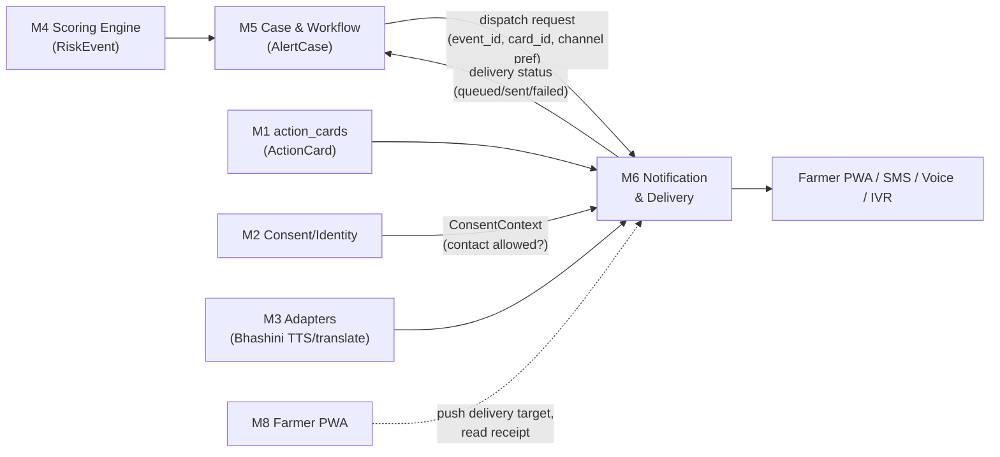
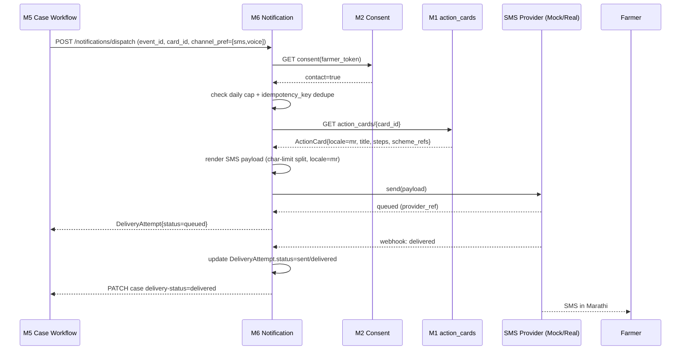

# Module 6 — Notification & Multi-Channel Delivery

> **Runtime amendment (August 2026):** Farmer outbound delivery is now
> WhatsApp-first. `whatsapp` sends a Cloud API message/template; optional
> `whatsapp_call` routes through an explicitly configured, approved calling
> partner or Sarvam Voice Agents outbound telephony. The outbox never reports a
> call as placed when that provider is not configured. WhatsApp voice is
> account/enterprise gated. Legacy SMS/voice values remain accepted only for migration.

Spec owner: Agent — Notification/Delivery · Package: `services/notification`
Conforms to the template in `module_0_architecture_overview.md §5`. Aligns with `masterspecv1.md` (esp. §3 hysteresis/alert-fatigue, §6 adapters, §7 voice, §17 risks).

> **Amendment (outreach strategy).** M6 executes; **[Module 9](./module_9_outreach_automation.md)
> decides** *whether, when and by which channel*. Two rules from M9 bind this module:
>
> 1. **Channel priority is now WhatsApp-first:** a `whatsapp` message is the default farmer
>    path; an opted-in `whatsapp_call` is requested only when an approved call provider is configured;
>    PWA push remains an additive fallback. Legacy SMS/IVR values are accepted only for migration.
> 2. **Red band dispatches the selected WhatsApp path once per idempotency window** and records the
>    provider receipt. A call that cannot be confirmed remains queued/failed; it is never reported as
>    placed. Email is not a farmer channel — officers only.
>
> M6 also serves M9's inbound paths by exposing delivery status for missed-call callbacks and
> IVR keypress sessions.

---

## 1. Module purpose & responsibilities

The platform's **"Act" delivery layer**: turns an approved `ActionCard` attached to a `RiskEvent`/`AlertCase` into an actual message the farmer receives, on whatever channel reaches them, in their language, and reports back — truthfully — whether it arrived.

Responsibilities:

- Render the shared `ActionCard` contract into channel-specific payloads (PWA push, SMS, voice/IVR).
- Route each send through a **provider-adapter abstraction** (MockProvider first; real providers swappable later — same pattern as M3).
- Localise output using the `ActionCard`'s pre-approved locale variants; use the M3 Bhashini adapter only to **speak/translate pre-approved template text**, never to author new copy.
- Maintain an **offline outbox** with idempotent retries when a channel/provider is unavailable.
- Enforce **daily send caps per farmer** to prevent alert fatigue, coordinating with M4's hysteresis so a case doesn't get re-notified every time the score is recomputed.
- Surface truthful delivery status (`queued` / `sent` / `failed` / `delivered` where the channel supports receipts) back to `AlertCase` in M5.

---

## 2. Scope

### In scope

- Channel adapters: PWA push, SMS, voice (TTS call), IVR fallback (menu-driven callback request).
- `MockProvider` implementations for every channel (default for demo).
- Channel-specific payload rendering from `ActionCard` + `RiskEvent` context.
- Consent gate check (via M2) before every send attempt.
- Idempotent dispatch, offline outbox, retry/backoff, dead-letter after max attempts.
- Daily cap / quiet-hours enforcement per farmer.
- Delivery status reporting API consumed by M5 (case timeline) and M8 (farmer app "message sent" indicator).
- Provider webhook ingestion (delivery receipts) — mocked in MVP, real endpoint shape defined for production swap.

### Explicitly out of scope

- **Authoring agronomy/advisory content.** `ActionCard` text, steps, and scheme references are agronomist-approved and owned upstream (offline authoring process feeding M1's `action_cards` table); M6 only renders and sends them.
- **Computing scores, bands, drivers, or confidence** — owned by M4. M6 never re-scores or reinterprets a `RiskEvent`.
- **Case state / lifecycle** (New → Acknowledged → Visited/Referred → Resolved) — owned by M5. M6 reports *delivery* status only; it does not set `alert_cases.status` beyond the delivery sub-field it owns (see §5).
- **Deciding whether an event should fire** — M4/M5 decide *that* a Red (or sustained Amber) fires an action; M6 decides *how* it reaches the farmer.
- **Farmer voice copilot conversation** (real-time ASR/VAD/barge-in dialogue) — owned by M7; M6's "voice" channel is one-way TTS playback of a fixed template, not a conversation.
- Building/training translation models — Bhashini is called, not reimplemented.

---

## 3. Position in the architecture



**Consumes (contracts, per M0 §4):**

| Contract | From | Used for |
|---|---|---|
| `RiskEvent` | M4 (via M5) | Context for the message: band, drivers, event_id, expiry |
| `AlertCase` | M5 | `case_id`, `event_id`, `recipient_role`, `channel_preferences`, current `status` (don't resend a Resolved case) |
| `ActionCard` | M1 (`action_cards` table, agronomist-authored) | The content to render — title, steps, scheme_refs, approved_by, locale |
| `ConsentContext` | M2 | `contact` flag — gates every send; `storage` flag — gates whether outbox may persist farmer phone/contact beyond send |
| `AuthContext` | M2 | Officer-triggered manual resend / test-send endpoints |
| Bhashini adapter | M3 | TTS synthesis + translation lookup for voice/IVR channel, template text only |

**Produces (owned by M6, new to the contract set — see §5):**

| Contract | Consumed by |
|---|---|
| `DeliveryAttempt` | M5 (case timeline / SLA), M8 (farmer app "sent" indicator), M7 (copilot brief context) |

**Upstream:** M1, M2, M3, M4 (indirectly via M5), M5.
**Downstream:** M5 (status callback), M8 (farmer-facing delivery indicator), M7 (copilot may read delivery history for brief context, read-only).

---

## 4. Internal structure

```
/services/notification
  /api
    dispatch.py          # POST /notifications/dispatch (called by M5)
    status.py             # GET  /notifications/{event_id}/status
    webhooks.py           # provider delivery-receipt callbacks
    admin.py               # test-send, outbox inspection (officer/admin only, AuthContext-gated)
  /render
    card_renderer.py       # ActionCard -> channel-specific payload
    templates/              # channel-shape templates (SMS char-limit split, IVR menu tree, push payload)
    locale_resolver.py      # picks ActionCard locale variant; falls back to nearest supported
  /channels
    base.py                 # NotificationProvider interface (send, get_status)
    push_provider.py         # PWA Web Push (VAPID)
    sms_provider.py           # SMS
    voice_provider.py         # outbound TTS call
    ivr_provider.py            # IVR fallback / callback-request menu
    mock/
      mock_push.py
      mock_sms.py
      mock_voice.py
      mock_ivr.py
  /outbox
    queue.py                  # offline outbox model + enqueue
    retry_worker.py             # backoff scheduler, dead-letter
    idempotency.py               # dedupe key derivation + check
  /caps
    daily_cap.py                 # per-farmer send-cap + quiet-hours policy
  /bhashini_bridge
    tts_client.py                 # thin wrapper over M3's Bhashini adapter (voice/IVR only)
  /models
    delivery_attempt.py            # DeliveryAttempt ORM (M6-owned table)
    outbox_entry.py
  /tests
    test_render.py, test_caps.py, test_idempotency.py, test_retry.py, test_consent_gate.py
```

---

## 5. Data models / contracts

### 5.1 Imported unchanged from M1 (per M0 §4)

`RiskEvent`, `AlertCase`, `ActionCard`, `ConsentContext`, `AuthContext`.

### 5.2 Owned by M6 — proposed addition to the shared contract set

```
DeliveryAttempt {
  delivery_id       : uuid
  event_id          : ref(RiskEvent)
  case_id           : ref(AlertCase)
  card_id           : ref(ActionCard)
  channel           : enum(push, sms, voice, ivr)
  provider          : string            # "mock" | "twilio" | "web-push" | ...
  locale            : enum(hi, mr, ...)
  idempotency_key    : string            # hash(event_id + card_id + channel + day-bucket)
  status             : enum(queued, sending, sent, delivered, failed, suppressed)
  suppression_reason  : enum(consent_denied, daily_cap, stale_event, duplicate, null)
  attempt_count       : int
  last_attempted_at    : timestamp
  provider_ref          : string          # provider's message/call SID, for receipt correlation
  error_code             : string | null
  created_at, updated_at : timestamp
}

OutboxEntry {
  outbox_id       : uuid
  delivery_id     : ref(DeliveryAttempt)
  payload         : jsonb            # rendered channel payload, redacted of raw phone after send
  next_attempt_at : timestamp
  backoff_step    : int
  max_attempts     : int              # default 5
  dead_lettered     : bool
}
```

`DeliveryAttempt` is the **status of record** M5 reads for the case timeline; M6 never writes to `alert_cases.status` (New/Acknowledged/etc.) — only to its own table, which M5 joins against.

### 5.3 Owned tables (in M1's Postgres, M6-managed migrations under its own Alembic branch)

`delivery_attempts`, `outbox_entries`, `daily_send_counters (farmer_token, date, channel, count)`.

---

## 6. Interfaces & APIs

### 6.1 Inbound (called by other modules)

| Endpoint | Caller | Purpose |
|---|---|---|
| `POST /api/v1/notifications/dispatch` | M5 (on Red fire / sustained Amber, per M4 hysteresis) | `{event_id, case_id, card_id, channel_pref[]}` → enqueues delivery |
| `GET /api/v1/notifications/{event_id}/status` | M5, M7, M8 | Returns latest `DeliveryAttempt[]` for the event |
| `POST /api/v1/notifications/{event_id}/resend` | M5 / officer action (AuthContext role=extension_officer) | Manual resend, still consent- and cap-gated |
| `POST /api/v1/notifications/webhooks/{provider}` | External provider (SMS/voice gateway) | Delivery receipt callback → updates `DeliveryAttempt.status` |

### 6.2 Outbound (M6 calls other modules/services)

| Call | Target | Purpose |
|---|---|---|
| `GET /consent/{farmer_token}` | M2 | Check `contact` flag before every send; check `storage` before persisting payload beyond delivery |
| `GET /action-cards/{card_id}` | M1 | Fetch rendered content + locale variants (cached, action cards change rarely) |
| `translate/synthesize(text, locale)` | M3 Bhashini adapter | TTS audio for voice/IVR channel; text is always a pre-approved template — never free text |
| `PATCH /cases/{case_id}/delivery-status` | M5 | Push status change so the case timeline updates without polling (best-effort; M5 also can pull via 6.1) |

### 6.3 Provider adapter interface (internal, mirrors M3's adapter pattern)

```python
class NotificationProvider(Protocol):
    def send(self, payload: ChannelPayload) -> ProviderResult: ...
    def get_status(self, provider_ref: str) -> DeliveryStatus: ...
```
Every channel has exactly one `MockProvider` (always available, deterministic, logs to `delivery_attempts`) and a stubbed real-provider class with the same interface, unimplemented method bodies raising `NotImplementedError("wire production credentials")` — same swap-a-class contract M3 uses for government adapters.

---

## 7. Dependencies

**Internal modules:**

| Module | Why |
|---|---|
| M1 | DB access, `ActionCard` read, shared Pydantic models, migrations |
| M2 | Consent gate (`contact`), phone number decryption for send (scoped, never logged raw), RBAC for admin/resend endpoints |
| M3 | Bhashini adapter for TTS/translation of pre-approved templates only |
| M5 | Source of dispatch requests; sink of delivery status |

**External services / libraries:**

| Library | Purpose |
|---|---|
| `pywebpush` | Web Push (VAPID) for PWA channel |
| Twilio SDK (or equivalent) — **real provider only, not MVP** | SMS + outbound voice |
| APScheduler / Celery beat (or simple cron worker) | Outbox retry scheduler |
| Pydantic | `DeliveryAttempt` / `OutboxEntry` validation |

---

## 8. Tech stack

| Layer | Choice | Notes |
|---|---|---|
| Service | Python + FastAPI | Consistent with M1/M4/M5 |
| Queue/outbox | Postgres-backed table (`outbox_entries`) + polling worker | No separate broker needed for MVP scale; swappable for SQS/Redis later |
| Push | Web Push / VAPID | Standard PWA push, no vendor lock-in |
| SMS/voice provider | `MockProvider` (MVP) → Twilio-shaped `RealProvider` (production contract, unwired) | Matches M3's mock/real adapter pattern |
| Voice synthesis | M3 Bhashini adapter (TTS) | M6 does not call Bhashini directly; goes through M3's client |
| Testing | Pytest | Render, caps, idempotency, retry, consent-gate suites |

---

## 9. Key workflows

### 9.1 Happy path — Red event → SMS delivered



### 9.2 Failure path — provider unavailable → offline outbox → retry → dead-letter

```mermaid
sequenceDiagram
    participant M5 as M5
    participant M6 as M6
    participant P as Provider
    participant W as Retry Worker

    M5->>M6: POST /notifications/dispatch
    M6->>P: send(payload)
    P-->>M6: error (timeout / 5xx / no network)
    M6->>M6: OutboxEntry{status=queued, backoff_step=1, next_attempt_at=+30s}
    M6-->>M5: DeliveryAttempt{status=queued} (never claim "sent" falsely)
    loop backoff: 30s, 2m, 10m, 1h, 6h (max 5 attempts)
        W->>M6: pop due outbox entries
        M6->>M6: re-check consent + cap still valid (not stale)
        M6->>P: send(payload)
        alt still failing
            P-->>M6: error
            M6->>M6: backoff_step += 1
        else succeeds
            P-->>M6: queued/sent
            M6->>M6: DeliveryAttempt.status=sent; remove from outbox
        end
    end
    alt max_attempts exceeded
        M6->>M6: dead_lettered=true, DeliveryAttempt.status=failed
        M6-->>M5: PATCH case delivery-status=failed (case stays open, officer sees it)
    end
```

### 9.3 Consent-denied / cap-exceeded short-circuit

- Dispatch request arrives → M2 says `contact=false`, or `daily_send_counters` already at cap for that farmer/day/channel → M6 **never calls a provider**, writes `DeliveryAttempt{status=suppressed, suppression_reason}`, and reports that back to M5 so the case shows *why* nothing went out (not silently dropped).

---

## 10. Error handling, failure modes & guardrails

| Failure mode | Handling |
|---|---|
| Provider timeout / 5xx / network drop | Outbox retry with exponential backoff, capped at 5 attempts, then dead-letter → status `failed`, visible to officer, never silently swallowed |
| Duplicate dispatch (M5 retries the call, or event recomputed) | `idempotency_key = hash(event_id, card_id, channel, day-bucket)` — a duplicate dispatch for the same key within the same day returns the existing `DeliveryAttempt` instead of sending twice |
| Consent withdrawn mid-flight (farmer revokes contact after enqueue, before send fires) | Every outbox pop **re-checks consent** immediately before send, not just at enqueue time; a withdrawal cancels pending sends |
| Alert fatigue | `daily_send_counters` enforces a per-farmer, per-channel daily cap (config default: 1 Red notification / day, coordinated with M4's hysteresis so the same event isn't re-notified on every recompute — dedupe key includes `event_id`, so a still-open Red event doesn't re-fire on unrelated score recalculation) |
| Stale event (card queued but `RiskEvent.expires_at` passed before send fires) | Outbox worker checks event expiry before every send attempt; expired → `status=suppressed, reason=stale_event`, never delivers an out-of-date claim |
| ActionCard not agronomist-approved / missing `approved_by` | Hard reject at render time — M6 refuses to render/send any `ActionCard` without a non-null `approved_by`; this is a guardrail, not a business rule the caller can override |
| Bhashini adapter (M3) unavailable for voice/IVR | Falls back to SMS/push channel if farmer has one on file; otherwise queues and retries voice separately; never invents TTS text locally |
| Raw phone number exposure | Phone decrypted only inside the provider-call boundary; never logged raw; `OutboxEntry.payload` redacts phone after a successful send; `storage=false` consent means the outbox entry is purged immediately after terminal status (sent/failed) rather than retained |
| Officer/admin resend abuse | `POST /resend` is AuthContext-gated (officer role) and still passes through consent + cap checks — no bypass path |
| Locale not covered by ActionCard variants | `locale_resolver` falls back to the farmer's `village_id` default language, then to Hindi; never sends an unrendered/blank template |

---

## 11. Testing strategy & acceptance criteria

Maps to `masterspecv1.md §14`.

| Test | Validates |
|---|---|
| `test_consent_gate.py` — consent denied → no provider call, `status=suppressed` | Privacy firewall honoured at delivery time, not just intake |
| `test_idempotency.py` — same `event_id/card_id/channel` dispatched twice same day → one `DeliveryAttempt` | No duplicate SMS/voice spam |
| `test_caps.py` — Nth send in a day beyond cap → suppressed | Alert-fatigue mitigation (masterspecv1 §18) |
| `test_retry.py` — mock provider fails N times then succeeds / exhausts → correct backoff schedule + dead-letter | Offline outbox correctness |
| `test_render.py` — `ActionCard` with 3 steps + scheme_refs renders within SMS char budget, correct locale text selected | Faithful, non-generative rendering |
| `test_stale_event.py` — event past `expires_at` at send time → suppressed, not delivered | "Score is a perishable claim" honoured downstream |
| `test_status_report.py` — `DeliveryAttempt` truthfully reflects `queued/sent/failed` at each stage, never optimistic | "Truthful delivery status" requirement |
| Acceptance: "Every action card traces to a rule + source" | End-to-end: `DeliveryAttempt` carries `event_id`→`RiskEvent.contributors[]` traceable, `card_id`→agronomist `approved_by` |
| Acceptance: replay scenario 5 (stale-data failure) | M6 must suppress/queue rather than falsely report delivery under stale conditions, matching M4's confidence suppression |

---

## 12. MVP boundary vs. stretch

**Build (MVP):**
- `MockProvider` for all four channels (push, SMS, voice, IVR), fully wired end-to-end and visible as a demo "message log."
- Full render pipeline from `ActionCard` → channel payload, locale-aware.
- Offline outbox + retry/backoff + dead-letter, tested with a forced-failure scenario in the demo.
- Consent gate, daily cap, idempotency — all enforced even against the mock provider (so the guardrails are demonstrably real, not decorative).
- Delivery status surfaced in both officer dashboard (case timeline) and farmer PWA ("your alert was sent").
- Bhashini-backed **voice/IVR template TTS** (stretch differentiator) — if time-boxed out, voice/IVR fall back to mock with pre-recorded audio.

**Do not build (MVP):**
- Real Twilio/telecom SMS or PSTN voice integration — interface defined, class stubbed, not credentialed.
- Real push notification infra beyond a basic VAPID demo (no APNs/FCM production setup).
- Rich two-way IVR menus — MVP IVR is a single "press 1 to request a callback" stub, not a full menu tree.
- Any A/B testing or send-time optimisation — out of scope entirely; fixed dispatch-on-fire behaviour.

---

## 13. Risks & mitigations

| Risk | Mitigation |
|---|---|
| Over-notifying → farmer distrust / opt-out (masterspecv1 §18 alert fatigue) | Daily caps + idempotency dedupe + coordination with M4 hysteresis so a still-open event doesn't re-fire |
| Claiming "delivered" when it wasn't | Status starts `queued`, only promoted on provider confirmation/webhook; failure defaults to `failed`, never silently assumed sent |
| Provider outage during a real crisis window (e.g. monsoon-wide SMS congestion) | Multi-channel fallback order (push → SMS → voice → IVR) configurable per case; outbox persists across outages, no data loss |
| Unsafe/unapproved content reaching a farmer | Hard reject at render time on missing `approved_by`; M6 has no code path that constructs message text outside the `ActionCard`/template system |
| Sensitive contact data leakage (phone numbers in logs/queues) | Decrypt only at provider-call boundary; redact payload post-send; honour `storage=false` by purging outbox entries after terminal status |
| Bhashini dependency flakiness affecting voice channel only | Isolated failure — voice/IVR degrade to SMS/push fallback, doesn't block other channels |

---

## 14. Open questions / decisions needed

1. **Default daily cap value and quiet hours** (e.g. no sends 9pm–6am local) — needs a policy owner decision, currently a config default in `daily_cap.py`, not hardcoded.
2. **Channel fallback order** — is push → SMS → voice → IVR the right default, or should M5/officer be able to override per case (e.g. force voice for low-literacy-flagged farmers)?
3. **Real provider choice for production** (Twilio vs. a DLT-registered Indian SMS aggregator, required for commercial SMS in India) — out of MVP scope but affects the `RealProvider` stub's exact interface shape.
4. **Delivery receipt latency** — MVP mock providers can resolve status instantly; real providers (esp. voice) may take minutes. Does M5's case SLA clock start at `dispatch` or at confirmed `delivered`? Recommend `dispatch` (matches "prove the call happened" framing in masterspecv1 §2) but needs M5 sign-off.
5. **Should `DeliveryAttempt` be formally added to M1's shared contract list (M0 §4)?** Recommended yes, since M5/M7/M8 all read it — needs M1 owner to fold it into the canonical schema rather than leaving it M6-local.
