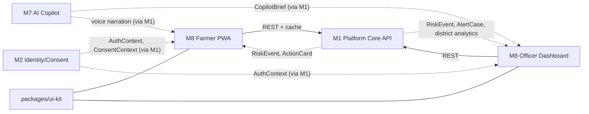
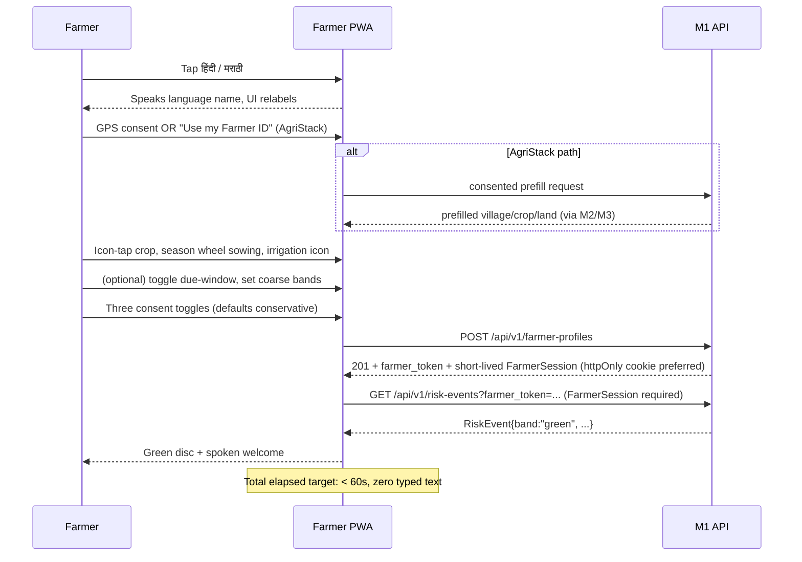
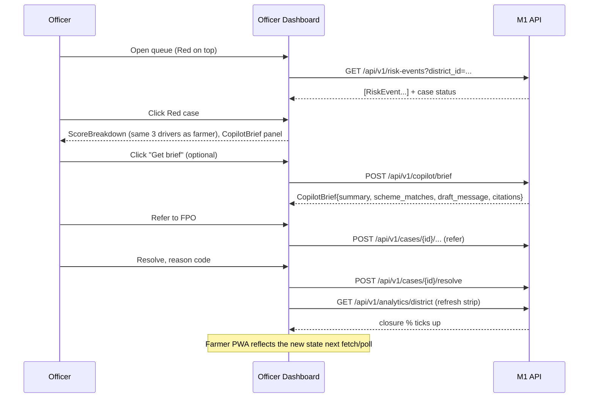
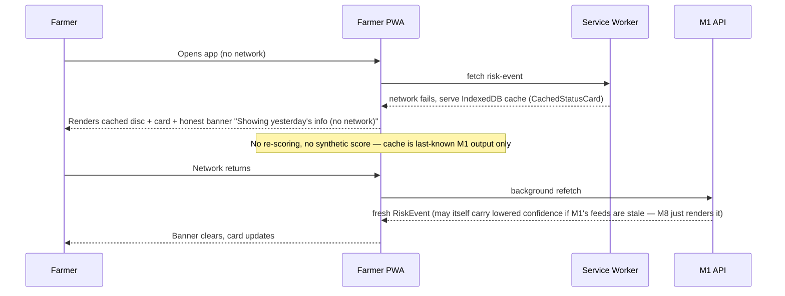

# Module 8 — Frontend Apps

> **Runtime amendment (August 2026):** The farmer voice surface uses Sarvam through server-side
> endpoints; API keys never reach the PWA. Bhashini remains a historical compatibility reference
> only. The client still treats voice as additive and retains a tap/text/offline fallback.

Spec for `apps/farmer-pwa`, `apps/officer-dashboard`, `packages/ui-kit` in the platform's monorepo.
Read `masterspecv1.md` and `module_0_architecture_overview.md` first — this spec conforms to both and
does not redefine any contract, scoring rule, or workflow owned elsewhere.

---

## 1. Module purpose & responsibilities

- Render the **farmer-facing PWA** — a voice-first, offline-first, zero-typing experience for a
  low-literacy, low-bandwidth user on a basic Android phone.
- Render the **officer dashboard** — a dense triage cockpit for an agriculture extension officer
  working a ranked case queue across many villages.
- Own a **shared `ui-kit`** design system (tokens + components) so both apps look and behave
  consistently and neither reimplements the same traffic-light disc, driver pictogram, or card twice.
- Present — never compute — everything the farmer and officer see. This module is a **pure
  presentation + interaction layer** over M1's API.
- Guarantee **trust through symmetry**: the officer's case-detail explanation and the farmer's
  "why" screen render from the *same* `RiskEvent.contributors[]`, never two different renderers.

---

## 2. Scope

### In scope

- Farmer PWA: onboarding flow, home status card, "why" driver screen, Red action card, mandi
  comparison, offline banner, settings (language, consent review).
- Officer dashboard: login, ranked case queue, map (village hotspots + mandi pins), case detail,
  action panel (Acknowledge / Log Visit / Refer / Resolve), district metric strip, CopilotBrief panel.
- Shared `ui-kit`: design tokens, traffic-light disc, driver pictogram card, band chip, buttons,
  form-free pickers (icon grid, season wheel, sliders), map wrapper, offline/stale banners, layout
  primitives, i18n string loader.
- Client-side state management, data fetching against the M1 API, caching/offline strategy, PWA
  service worker, accessibility (WCAG 2.2 AA), and i18n (Hindi + Marathi at MVP).
- Client-side rendering of `CopilotBrief` (M7 output) and `AlertCase` (M5 output) — display only.

### Explicitly out of scope

- Any scoring, banding, hysteresis, confidence, or driver computation — **all decisions come from
  the M1 API** (fronting M4's `scoring-engine`). The frontend never re-derives a band from raw
  numbers; it renders `RiskEvent.band` and `contributors[]` as given.
- Case-lifecycle rules (who *can* transition a case, SLA timers, closure logic) — owned by M5;
  the dashboard only calls M5's endpoints and reflects the state M5 returns.
- Notification delivery (SMS/voice/IVR sending, offline outbox for message delivery) — owned by M6.
  The PWA's own offline cache (for *display*) is distinct from M6's delivery outbox.
- Voice ASR/TTS engine, barge-in, VAD — owned by M7 (Bhashini + reused voice stack). The frontend
  integrates M7's voice SDK/widget but does not implement speech recognition itself.
- Auth/consent logic, tokenisation, RBAC enforcement — owned by M2. The frontend renders consent
  toggles and login forms and calls M2's endpoints; it does not decide what a role may do beyond
  hiding/disabling UI it has no permission to see (server remains the enforcement point).
- Scheme eligibility retrieval/RAG — owned by M7; frontend renders `scheme_matches[]` + citations.
- Any government adapter, fixture, or replay logic — owned by M3.

---

## 3. Position in the architecture



- **Upstream (consumes):** M1 (all data + auth pass-through), which itself fronts M2 (auth/consent),
  M4 (scoring output as `RiskEvent`), M5 (`AlertCase`, case state), M6 (`ActionCard` render data),
  M7 (`CopilotBrief`, scheme matches, voice narration).
- **Downstream (produced for):** nobody — M8 is a leaf node in the dependency graph (per
  `module_0_architecture_overview.md §3`, only `M8 --> M1` exists).
- **Contracts consumed (owned by M1, per module_0 §4):** `RiskEvent`, `AlertCase`, `ActionCard`,
  `AuthContext`, `ConsentContext`, `CopilotBrief`. M8 owns no shared contract types — see §5.
- **No module depends on M8.** It is purely a client of M1's HTTP API; it never talks to M2–M7
  directly, and never touches the database.

---

## 4. Internal structure — package/folder layout

```
/apps
  /farmer-pwa
    /src
      /app                    # app shell, router, providers
      /screens
        onboarding/           # language, location, farm-context, due-window, consent, done
        home/                 # status card
        why/                  # driver explanation
        action-red/           # Red action card
        mandi-compare/        # nearer-mandi comparison
        settings/             # language switch, consent review, data deletion request
      /features
        voice/                # M7 voice widget integration (tap-to-speak, barge-in hooks)
        offline/              # cache read/write, stale-banner logic, background sync
        consent/              # consent toggle components + ConsentContext hydration
      /api                    # typed M1 client (fetch wrappers, React Query hooks)
      /state                  # Zustand stores: session, onboarding draft, cached RiskEvent
      /i18n                   # hi/mr message catalogs, ICU message loader
      /sw                     # service worker source (Workbox), cache strategies
      /assets                 # icons, pictograms (SVG), audio prompts fallback
    vite.config.ts
    manifest.webmanifest

  /officer-dashboard
    /src
      /app                    # app shell, router, providers, RBAC-aware route guards (display-only)
      /screens
        login/
        queue/                # ranked case list
        map/                  # Leaflet/MapLibre hotspot + mandi view
        case-detail/          # score breakdown, history sparkline, CopilotBrief, action panel
        district-strip/       # KPI header
      /features
        copilot-brief/        # CopilotBrief panel + draft-message approval UI
        actions/              # Acknowledge / Log Visit / Refer / Resolve forms
      /api                    # typed M1 client (shared generator with farmer-pwa where possible)
      /state                  # Zustand/React Query cache
      /i18n                   # officer UI is English-first, hi/mr optional
    vite.config.ts

/packages
  /ui-kit
    /src
      /tokens                 # color, spacing, type scale, motion — design tokens (CSS vars + TS)
      /components
        TrafficLightDisc/
        DriverPictogramCard/
        BandChip/
        ScoreBreakdown/        # shared farmer/officer explanation renderer (trust-through-symmetry)
        Button/ IconPicker/ SeasonWheel/ Slider/ ConsentToggle/
        MapWrapper/ OfflineBanner/ StaleBadge/ CaseCard/ KpiTile/
      /icons                   # shared pictogram set (rain, price, calendar, pest, etc.)
      /a11y                    # focus-trap, live-region, skip-link helpers
      /hooks                   # useSpeakOnTap, useReplay, useReducedMotion
    index.ts
```

- Both apps are independent Vite builds; `ui-kit` is a workspace package (not published externally)
  consumed via the monorepo's package manager workspace (npm/pnpm workspaces).
- `ScoreBreakdown` is the **single shared component** that renders `contributors[]` — used verbatim
  by the farmer "why" screen and the officer case-detail panel, enforcing symmetry structurally
  rather than by convention.

---

## 5. Data models / contracts

### 5.1 Imported from M1 (owned by M1 — module_0 §4, consumed read-mostly)

`Observation` (not directly rendered — only aggregated fields surface), `RiskEvent`, `AlertCase`,
`ActionCard`, `AuthContext`, `ConsentContext`, `CopilotBrief`.

### 5.2 Owned by M8 (view-model / client-only types — never persisted, never sent as-is to the API)

```
OnboardingDraft {
  language, village_id?, gps_coords?, agristack_consent,
  crop, sowing_month, irrigation_type, area_band,
  due_window_opt_in, due_date_band?, amount_band?,
  consent_store, consent_contact, consent_analytics
}
CachedStatusCard {                 # what the offline banner reads
  risk_event: RiskEvent, action_card: ActionCard | null,
  cached_at: string, is_stale: boolean
}
QueueFilterState { band?, village?, sort: "band_then_age" | "age" }
UiLocale { code: "hi" | "mr" | "en", script_label: string }
```

- `OnboardingDraft` is assembled client-side across onboarding steps and submitted as **one**
  `POST /api/v1/farmer-profiles` call (plus a separate `due_window` object only if opted in) — no
  partial writes mid-flow, so an abandoned onboarding leaves no partial farmer record.
- `CachedStatusCard` is the only object persisted in the farmer PWA's local storage (IndexedDB via
  the service worker cache) — it is display cache, not a source of truth.

---

## 6. Interfaces & APIs

### 6.1 Outbound calls to M1 (per `masterspecv1.md §12`)

| Screen | Call | Notes |
|---|---|---|
| Onboarding → Done | `POST /api/v1/farmer-profiles` | includes `consent_flags`; `due_window` only if opted in |
| Home status card | `GET /api/v1/risk-events?farmer_token=...` (or village-scoped) | cached on success; drives banner on failure |
| Why screen | *(same `RiskEvent` payload — no extra call)* | reads `contributors[]` already fetched |
| Mandi compare | `GET /api/v1/mandis/compare?village_id=...&crop=...` | |
| Action card | *(rendered from `ActionCard` embedded in/linked from `RiskEvent.action_ids[]`)* | |
| Officer login | via M2 endpoints fronted by M1 (issues `AuthContext`) | |
| Case queue | `GET /api/v1/risk-events?district_id=...` (+ case status join) | polling or SSE if M1 exposes it — see §9 |
| Case acknowledge | `POST /api/v1/cases/{case_id}/acknowledge` | |
| Case resolve / other transitions | `POST /api/v1/cases/{case_id}/resolve` (and equivalent visit/refer endpoints if M5 exposes them) | |
| District strip | `GET /api/v1/analytics/district` | |
| CopilotBrief panel | `POST /api/v1/copilot/brief` | officer-triggered, not automatic (cost + approval gate) |
| Demo control (dev/judge use) | `POST /api/v1/replay/scenario` | exposed behind a hidden/dev-only control in the officer dashboard for the live demo, never shown to a real officer or farmer |

- All calls are typed via a single generated/typed client (`/api` folder in each app) built from
  M1's OpenAPI schema so the two apps and `ui-kit` never hand-roll divergent request shapes.
- Farmer URLs may carry `farmer_token` as a scoped resource identifier, but M2's short-lived
  `FarmerSession` is mandatory on every farmer status, consent, export, and delete request; the
  token alone must never authorize a read or mutation.
- The frontend **never** computes `band`, `score`, `confidence`, or driver text — it only formats
  and localises what M1 returns.

### 6.2 Inbound — none

M8 exposes no API of its own; it is a client application, not a service. (Its service worker
intercepts *its own* fetches for caching — see §9 — but that is not an inbound interface for other
modules.)

---

## 7. Dependencies

### 7.1 Internal modules

| Module | What M8 needs from it |
|---|---|
| M1 Platform Core | The one API surface M8 talks to; OpenAPI schema for client generation |
| M2 Identity/Consent | `AuthContext` (officer login/session), `ConsentContext` (consent toggle state), farmer tokenisation (M8 never stores raw PII) |
| M4 Scoring Engine | Indirect, via M1's `RiskEvent` — band, contributors, confidence, expiry |
| M5 Case Workflow | Indirect, via M1's `AlertCase` + case endpoints |
| M6 Notification | `ActionCard` render data (title, steps, scheme_refs) |
| M7 AI Copilot | `CopilotBrief`; voice narration SDK/widget for the farmer PWA |

### 7.2 External libraries

| Concern | Choice | Notes |
|---|---|---|
| Framework | React 18 + TypeScript | both apps |
| Build | Vite | fast dev, small PWA bundles |
| Styling | Tailwind CSS | per `masterspecv1.md §11` tech stack |
| State (server cache) | TanStack Query (React Query) | request cache, retry, background refetch |
| State (client/UI) | Zustand | small, no boilerplate, easy to persist a slice to IndexedDB |
| Maps | Leaflet + MapLibre GL | per masterspecv1 §11 |
| PWA/offline | Workbox (service worker), `idb` (IndexedDB wrapper) | |
| i18n | `react-intl` (ICU messages) or `i18next` | pick one, shared config in `ui-kit/i18n` |
| Forms (officer only — farmer app has none) | React Hook Form | resolve/refer/visit reason-code forms |
| Testing | Vitest + React Testing Library; Playwright for e2e/offline scenarios | |
| Accessibility audit | `axe-core` (CI check), manual screen-reader pass | |

---

## 8. Tech stack

| Layer | Choice | Purpose |
|---|---|---|
| Farmer app | React + TS + Vite PWA | installable, offline, fast on 2G |
| Officer dashboard | React + TS (Vite, non-PWA) | triage cockpit |
| Shared design system | `packages/ui-kit` (React components + CSS vars) | consistency, no duplicated logic |
| Styling | Tailwind CSS + CSS custom properties for tokens | responsive, themeable |
| Maps | Leaflet / MapLibre | village hotspots, mandi pins |
| Hosting | Vercel (static) — `farmer-app-demo.vercel.app` per masterspecv1 §11 | both apps deployable as separate Vercel projects from one monorepo |
| Voice | Bhashini via M7's client SDK (wrapped in `features/voice`) | ASR/TTS/translation, reused Gemini-Live-style stack |

---

## 9. Key workflows / sequences

### 9.1 Happy path — farmer onboarding → first status (masterspecv1 §9)



### 9.2 Happy path — officer closes the loop (masterspecv1 §8.3 demo micro-moment)



### 9.3 Failure path — offline / stale data on the farmer app



### 9.4 Failure path — API error / auth expiry on officer dashboard

- 401/expired `AuthContext` → redirect to login, preserve intended route, no silent retry loop.
- 5xx / network error on queue fetch → keep last-loaded queue visible with a non-blocking "couldn't
  refresh, retrying…" toast; never blank the screen an officer is actively triaging from.
- Action call (acknowledge/resolve) fails → optimistic UI update is rolled back, error surfaced
  inline on that case card, action button re-enabled — never silently "succeed" client-side.

---

## 10. Error handling, failure modes & guardrails

| Failure | Handling |
|---|---|
| Backend unreachable (farmer) | Serve `CachedStatusCard` from IndexedDB with explicit stale banner; never fabricate a score client-side |
| Backend unreachable (officer) | Keep last successful queue/case data rendered, non-blocking retry indicator; disable action buttons if a write can't be confirmed |
| Confidence low / band suppressed (per M4 rules) | Frontend renders whatever M1 sends (e.g., "confidence low" tag) — it does not decide to suppress or escalate itself |
| Voice engine (Bhashini) unavailable | Fall back to cached/local TTS prompts per masterspecv1 §7; every screen still fully usable via tap/visual only |
| CopilotBrief request fails or times out | Case detail still shows the deterministic `ScoreBreakdown`; CopilotBrief panel shows a retry state, never blocks core triage |
| Consent withdrawn mid-session | On next M1 call returning a consent-revoked signal, PWA clears local cache of that farmer's data and returns to a consent screen |
| Partial/failed onboarding submit | Draft stays local (not sent) until the single combined `POST` succeeds; no partial farmer record created client-side |
| Accessibility failure mode | Every interactive element has a non-visual affordance (tap-to-speak) so a rendering glitch (e.g., missing icon) never fully blocks comprehension |
| Security | No PII (Aadhaar, bank, raw phone) ever stored in browser storage; `farmer_token` is an identifier only and never a credential; farmer status/export/delete calls require M2's short-lived `FarmerSession`; officer JWT/session uses an httpOnly cookie preferred over localStorage |
| Demo-only endpoint exposure | `POST /api/v1/replay/scenario` control is feature-flagged out of any build served to a real farmer/officer; visible only in a `VITE_DEMO_MODE` build |

**Non-negotiable guardrail carried into UI copy:** every screen showing a score or band displays,
at least once per session, the label from `masterspecv1.md §3`: *"This is not a credit, loan-default,
or insurance score."* — owned as copy content, not logic, and sourced from a shared i18n string so
wording stays centrally controlled.

---

## 11. Testing strategy & acceptance criteria

| Test | Type | Maps to |
|---|---|---|
| Onboarding completes in one combined submit, zero free-text fields rendered | Component + e2e (Playwright) | masterspecv1 §9 |
| Home renders exactly one status card, correct disc color per band | Component (snapshot + a11y) | masterspecv1 §8.2 |
| `ScoreBreakdown` renders identical output given the same `RiskEvent` in both apps | Shared component test in `ui-kit`, run from both app suites | masterspecv1 §8.1 "trust through symmetry" |
| Offline: cached card renders with stale banner when network mocked as down | e2e (Playwright, offline mode) | masterspecv1 §14 acceptance test |
| Red event acceptance flow: Red case appears top-of-queue with reason codes visible | e2e against a seeded/replayed backend | masterspecv1 §14 |
| Acknowledge → Resolve updates district strip and (separately) farmer app on next fetch | e2e, two-app integration test | masterspecv1 §14, §8.3 demo moment |
| Scheme eligibility text always shows citation + "officer will confirm" | Component test on `CopilotBrief` renderer | masterspecv1 §4.3, §14 |
| Every interactive element has an accessible name + is operable via keyboard and tap-to-speak | Automated (`axe-core` in CI) + manual screen-reader pass | WCAG 2.2 AA requirement |
| Contrast ratios (sunlight-readable) meet AA on traffic-light disc + text | Automated contrast check in CI | masterspecv1 §8.1 |
| Bundle size: typical interaction path (home → why → action) stays under the 100KB budget | CI bundle-size check (per-route, gzip) | task brief target |
| i18n: hi/mr strings render with no missing-key fallback to English in farmer flows | Automated i18n key-coverage check | masterspecv1 §7, §13 |
| Demo control hidden/disabled in non-demo build | Build-flag test | safety/scope guardrail |

**Acceptance criteria carried from `masterspecv1.md §14` that this module is responsible for
rendering correctly (not computing):** Red event shows all three drivers; stale data shows a
suppressed/lowered-confidence state truthfully; every action card traces visibly to a rule + source
(driver text + citation shown, not hidden); Red case visible in officer queue with reason codes;
acknowledge → resolve visibly updates farmer app and district metric; scheme answers show citation +
"officer will confirm"; offline shows last status + honest stale banner.

---

## 12. MVP boundary vs. stretch

### Build (MVP, per masterspecv1 §13)

- Farmer PWA: onboarding, home status card, why screen, Red action card, mandi comparison, offline
  cache + banner, one district, two crops, two languages (hi/mr).
- Officer dashboard: login, ranked queue, map, case detail with `ScoreBreakdown`, action panel
  (Acknowledge/Resolve minimum; Log Visit/Refer if M5 exposes the endpoints in time), district strip.
- Shared `ui-kit`: tokens + all components listed in §4 needed by the above screens.
- Mock/replay-driven demo: hidden `replay/scenario` trigger for the 3-minute demo script
  (masterspecv1 §16).

### Stretch (post-MVP / differentiator, per masterspecv1 §13)

- Live Bhashini voice fully wired end-to-end in the PWA (barge-in, streaming) — MVP may ship with
  cached/canned TTS prompts if the live integration isn't ready in time.
- CopilotBrief panel with full draft-message approval UX (MVP may show summary + citations only,
  with draft-message editing as stretch).
- Push notifications (PWA push) — MVP can rely on in-app status only; push is M6's stretch, M8 just
  needs to *render* a push permission prompt if M6 ships it.
- Additional languages beyond hi/mr.
- Officer-side analytics beyond the district strip (trend charts, equity breakdowns by
  language/land-size — masterspecv1 §19 KPIs) — MVP shows current-state strip only.

### Explicitly not built (masterspecv1 §13, applies to this module)

- No general chatbot UI. No all-India village picker at MVP scale (one district). No wearable
  companion UI. No 22-language switcher. No UI for automatic pesticide dosage.

---

## 13. Risks & mitigations

| Risk | Mitigation |
|---|---|
| Two apps drift visually/behaviorally (farmer vs officer) | Enforce via shared `ui-kit`, especially the single `ScoreBreakdown` component used by both — no per-app reimplementation allowed |
| Frontend accidentally re-derives or hardcodes scoring logic ("just to make the demo look right") | Code-review rule + a lint/test that fails if any band/score math appears outside `/api` response mapping; all thresholds (Green/Amber/Red cut points) must only ever be read from `RiskEvent.band`, never recomputed from `score` client-side |
| PWA offline cache goes stale silently, farmer trusts old data as current | Mandatory visible stale banner whenever `cached_at` exceeds a short freshness window; never render cached data without the banner |
| Bundle bloat breaks the <100KB interaction budget, unusable on 2G | Route-level code splitting, icon sprite instead of icon fonts, CI bundle-size gate (§11) |
| Voice dependency (Bhashini) unavailable during judged demo | Every screen fully usable via tap/visual alone; voice is additive, never required |
| Officer dashboard exposes more than the officer's RBAC scope | Frontend hides/disables per `AuthContext.scopes[]`, but treats this as UX only — relies on M1/M2 as the actual enforcement boundary, never trusts client-side hiding as security |
| Consent UI defaults drift from "conservative by default" | Snapshot test locking default toggle states to off/minimal per masterspecv1 §9 step 5 |
| Design system becomes a bottleneck (every screen change needs a `ui-kit` PR) | Keep `ui-kit` scoped to genuinely shared, stable primitives; screen-specific composition stays in the app package |

---

## 14. Open questions / decisions needed

- Does M1 expose a push/SSE or WebSocket channel for the officer queue, or is polling the MVP
  reality? Affects whether §9.2's "farmer app reflects new state" is near-real-time or next-poll.
  (Assume polling at MVP unless M1's spec says otherwise.)
- Does M5 expose distinct `visit` / `refer` endpoints, or are all non-acknowledge transitions routed
  through a generalized `resolve`-style call with a status field? Affects the action-panel button
  count in §6.1/§12.
- Confirm whether AgriStack consented prefill (masterspecv1 §4.2) returns synchronously fast enough
  to sit inline in onboarding step 2, or needs a loading/skip-ahead state.
- Confirm the exact shape M6 uses to deliver `ActionCard` to the frontend (embedded in `RiskEvent`
  vs. a separate fetch) so the action-red screen's data-fetching hook (§6.1) is correct.
- Confirm whether `i18next` or `react-intl` is the team's preference — both satisfy requirements;
  pick one before scaffolding to avoid two i18n runtimes across the two apps.
- Confirm Vercel project split (one project per app vs. monorepo multi-app deploy) against the
  hosting note in masterspecv1 §11.
