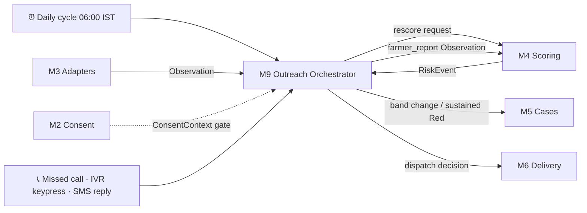
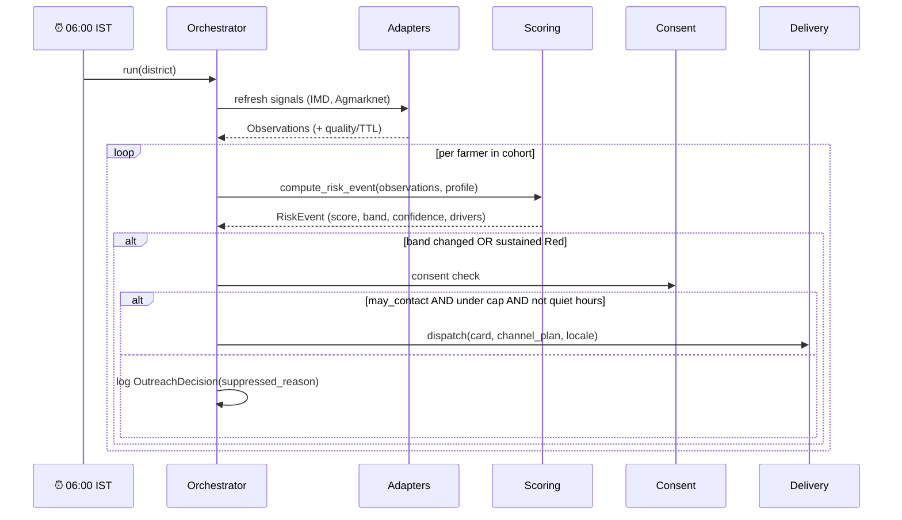

# Module 9 — Outreach Automation & Channel Strategy

> **Founding premise:** a farmer will never open our site. If the system requires them to check
> something, it has already failed. The farmer does nothing; **the phone rings.**

This module fills a gap the original specs left open: M3 pulls signals, M4 scores, M5 makes cases,
M6 delivers — but **nothing owned the clock**. Nothing said *every morning, rescore everyone and
reach the ones who need reaching*. Module 9 owns that, plus the channel strategy that makes the
outreach land on the phones farmers actually carry.

---

## 1. Module purpose & responsibilities

- Own the **daily cycle**: refresh signals → rescore cohort → diff bands → decide who to contact.
- Own the **outreach decision policy**: trigger rules, quiet hours, daily caps, escalation ladder.
- Own the **channel strategy & fallback ladder** (SMS → IVR → WhatsApp → push).
- Own the **inbound return paths** that need no app: missed call, IVR keypress, SMS reply.
- Hand execution to M6 (delivery) and M5 (case creation); this module decides *whether, when and
  by which channel* — never *how to send*.

## 2. Scope

**In scope:** scheduler/orchestration, trigger policy, channel selection + fallback, quiet hours &
caps, inbound handler (missed call / keypress / SMS reply), outreach audit.

**Out of scope:** provider integrations and payload rendering (M6) · scoring (M4) · case lifecycle
(M5) · consent state (M2 — this module *reads* it) · signal fetching (M3).

## 3. Position in the architecture



**Consumes:** `Observation`, `RiskEvent`, `ConsentContext`, `AlertCase`
**Produces:** dispatch decisions (→ M6), `farmer_report` Observations (→ M4), `OutreachDecision` (own)

## 4. Internal structure

```
services/outreach/
  scheduler/
    daily_cycle.py          # the clock: orchestrates refresh → rescore → diff → dispatch
    cohort.py               # who is in scope for today's run (district/village batching)
  policy/
    triggers.py             # band-change + sustained-Red rules
    quiet_hours.py          # no calls 21:00–07:00 IST; SMS queued not sent
    caps.py                 # per-farmer daily/weekly ceiling (alert fatigue)
    escalation.py           # channel ladder + fallback-on-failure logic
    channel_selector.py     # picks channel from device capability + literacy + consent
  inbound/
    missed_call.py          # webhook: farmer gave a missed call → queue callback
    ivr_keypress.py         # DTMF handler → farmer_report / request-officer-callback
    sms_reply.py            # short-code keyword parser
    to_observation.py       # normalises any inbound into a farmer_report Observation
  audit/
    outreach_log.py         # every decision: who, why, channel, outcome
  tests/
```

## 5. Data models

**Owned by M9** (proposed addition to the shared set):

```
OutreachDecision {
  decision_id, farmer_token, event_id,
  trigger,            # band_change | sustained_red | farmer_requested
  from_band, to_band,
  channel_plan[],     # ordered ladder, e.g. [sms, ivr, whatsapp]
  suppressed_reason,  # consent | cap | quiet_hours | low_confidence | none
  decided_at
}
InboundEvent {
  inbound_id, channel, from_number_token, payload,
  intent,             # request_callback | report_damage | report_no_buyer | opt_out
  received_at
}
```

**Imported from M1:** `Observation`, `RiskEvent`, `AlertCase`, `ConsentContext`, `DeliveryAttempt`.

## 6. Interfaces

**Inbound (to this module):**

| Endpoint / entry | Purpose |
|---|---|
| `daily_cycle.run(district_id, date)` | The scheduled job (cron/worker) |
| `POST /outreach/inbound/missed-call` | Telephony webhook |
| `POST /outreach/inbound/ivr-keypress` | DTMF webhook |
| `POST /outreach/inbound/sms` | Inbound SMS webhook |
| `GET /outreach/decisions?farmer_token=` | Audit/debug view |

**Outbound (this module calls):** `M4.compute_risk_event()` · `M5.create_or_update_case()` ·
`M6.dispatch(action_card, channel, locale)` · `M2.get_consent()`

## 7. Dependencies

Internal: M1 (models/DB), M2 (consent), M3 (signals), M4 (scoring), M5 (cases), M6 (delivery).
External: a telephony provider for SMS/IVR/missed-call (mock first), WhatsApp Business API (stretch).

## 8. Tech stack

Python + FastAPI (webhooks) · APScheduler or Render cron worker · Redis for the run lock and
idempotency keys · Postgres for decisions/audit.

---

## 9. The channel ladder (the core product decision)

Ordered by **reach**, not by what's fun to build. Reach beats richness every time.

| Rank | Channel | Reaches | Needs internet? | Literacy needed | Role |
|---:|---|---|---|---|---|
| **1** | **SMS** | **Any phone**, incl. feature phones | ❌ No | Reading | **Backbone.** Never fails for connectivity. |
| **2** | **IVR / outbound voice** | **Any phone** | ❌ No | **None** | **Accessibility hero** — phone rings, a voice speaks Marathi. |
| **3** | **WhatsApp** | Smartphones (high rural penetration) | ✅ Yes | Low (voice notes) | Rich: voice note + image + link. |
| 4 | PWA push | Only if installed | ✅ Yes | Reading | Bonus for engaged users. |
| — | ~~Email~~ | ~~—~~ | — | — | **Officers only. Not a farmer channel.** |

### Why email is excluded for farmers

Smallholder farmers overwhelmingly do not hold or check email. Routing life-relevant alerts through
a channel the user never opens is indistinguishable from not sending them. Email remains a valid
**officer/district** channel (digests, weekly reports) and is retained there only.

### Channel selection logic

```
if band == RED:
    plan = [SMS, IVR]              # both — redundancy on the case that matters
    if whatsapp_opted_in: plan += [WHATSAPP]
elif band == AMBER:
    plan = [SMS]                    # or WhatsApp if opted in
if pwa_installed: plan += [PUSH]    # always additive, never primary
```

Fallback: if channel *n* returns `FAILED`, escalate to *n+1* after backoff. IVR is retried once at
a different hour before giving up (farmers are in the field).

---

## 10. Two-way, without an app

The return path is what makes this a *service* rather than a broadcast — and it works on a ₹1,200
feature phone with zero data.

| Pattern | How it works | Feeds |
|---|---|---|
| **Missed call** | Farmer rings a published number and hangs up → system calls back and speaks the advisory. **Free for the farmer.** A well-established Indian pattern. | callback + engagement metric |
| **IVR keypress** | "Press 1 if you want an officer to call you. Press 2 to report crop damage." | `acute_farmer_report` Observation (S14, up to 7 pts) + opens an M5 case |
| **SMS reply** | Short keyword (`1`, `HELP`, `STOP`) to a short code | same as above; `STOP` → consent withdrawal in M2 |

Every inbound normalises through `inbound/to_observation.py` into a `farmer_report` Observation, so
the scoring engine treats farmer-initiated signals identically to machine-collected ones. **A farmer
who never installs anything can still raise their hand and get a human.**

---

## 11. The daily cycle



**Trigger rule:** contact on **band change** (Green→Amber, Amber→Red) or **sustained Red**
(re-contact at most every N days). No contact on unchanged Green — silence is the correct output
for a farmer who is fine.

**Failure path:** if a signal feed is stale, M4 returns lower confidence; below the confidence
threshold M9 **suppresses escalation** and logs `suppressed_reason=low_confidence`. Stale data must
never generate an alert.

## 12. Guardrails

| Guardrail | Rule |
|---|---|
| Consent | No outbound without `ConsentContext.may_contact()`. `STOP` is honoured immediately. |
| Quiet hours | No voice calls 21:00–07:00 IST. SMS queued, not sent. |
| Caps | Max 1 proactive contact/farmer/day, 3/week (excludes farmer-initiated). |
| Hysteresis | M4's 2-observation/3-day rule prevents band flapping → prevents contact spam. |
| Idempotency | `(farmer_token, event_id, channel)` key — a retry never double-sends. |
| Confidence floor | Below threshold → suppress, never guess. |
| Audit | Every decision logged with its reason, including suppressions. |

## 13. Testing & acceptance

- [ ] Band change Green→Red triggers SMS **and** IVR within one cycle
- [ ] Unchanged Green produces **zero** outreach
- [ ] Consent withheld / `STOP` → `suppressed_reason=consent`, nothing sent
- [ ] Quiet hours → voice deferred, SMS queued
- [ ] Daily cap exceeded → suppressed and logged
- [ ] Stale feed → low confidence → escalation suppressed (masterspec §14)
- [ ] Missed call → callback queued; IVR keypress `1` → case opened with `farmer_report` signal
- [ ] Duplicate cycle run is idempotent (no double-send)

## 14. MVP boundary

**MVP:** scheduler + trigger policy + **mock SMS and mock IVR** + suppression rules + inbound
keypress simulation + the audit log. Demo shows a real daily cycle driving the traffic-light change
and an outbound message, with no app open.

**Stretch:** live telephony provider (needs DLT/TRAI registration for A2P SMS in India), WhatsApp
Business API, real missed-call number, per-farmer channel preference learning.

## 15. Risks

| Risk | Mitigation |
|---|---|
| Indian A2P SMS needs DLT registration + approved templates | Mock provider for the demo; templates pre-registered in pilot planning |
| IVR call fatigue / farmers not answering | Retry once at a different hour; SMS always sent in parallel for Red |
| Telephony cost at scale | SMS-first, IVR only for Red; caps bound worst-case spend per farmer |
| Wrong-number / recycled SIM leaks info | Messages contain no financial detail; identity-light content by design |

## 16. Open questions

1. Telephony provider choice (affects webhook shapes) — needs a decision before M6 real adapters.
2. Is WhatsApp opt-in captured at onboarding, or later via SMS?
3. Cycle time — is 06:00 IST daily right, or twice-daily during monsoon peak?
