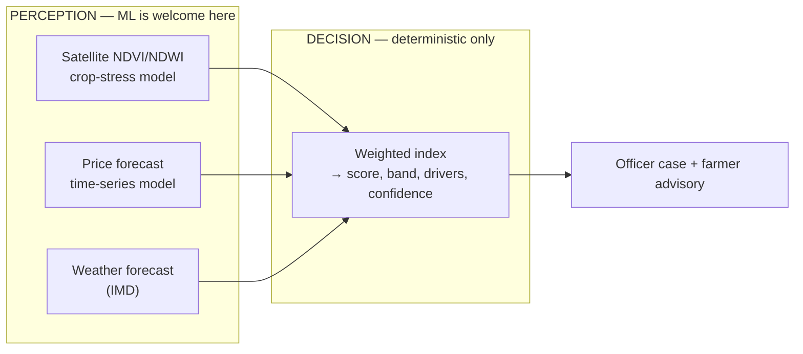

# Research — Risk Modelling Approach (evidence review)

**Question:** is a deterministic weighted rules engine the right core, or should the distress score
be an ML model?

**Short answer:** the binary framing was wrong. The evidence supports a **hybrid**:
**ML for perception, rules for the decision.** But two upgrades to the current design are strongly
indicated by the literature, and one of them is a significant credibility win.

---

## 1. Direct evidence for *our* task (distress / early warning)

The closest real-world analogue to what we are building is famine & food-security early warning.
That field has run the exact experiment we are debating.

| Finding | Source |
|---|---|
| **FEWS NET — a rules-based expert system — has been the dominant approach for decades and is ~84% accurate overall, >93% at lower severity levels.** | [FEWS NET](https://fews.net/blog/2026-06-03/ai-can-boost-not-replace-early-warning-systems-predict-hunger-crises), [Busker et al., *Earth's Future* 2024](https://agupubs.onlinelibrary.wiley.com/doi/full/10.1029/2023EF004211) |
| ML models achieved **similar** performance to the operational rules system — and **in crop-farming regions the rules-based FEWS NET outlooks clearly outperformed the XGBoost model.** | [Busker et al. 2024](https://agupubs.onlinelibrary.wiley.com/doi/full/10.1029/2023EF004211) |
| Field consensus: **"AI can boost, not replace"** early-warning systems; ML should be applied *selectively alongside expert oversight and governance.* | [FEWS NET](https://fews.net/blog/2026-06-03/ai-can-boost-not-replace-early-warning-systems-predict-hunger-crises), [*Nature Food* 2026](https://www.nature.com/articles/s43016-026-01400-6) |
| ML's real advantages here are **cost, timeliness, and transparency of generation** — not raw accuracy. | [Busker et al. 2024](https://agupubs.onlinelibrary.wiley.com/doi/full/10.1029/2023EF004211) |

**Read:** for *distress triage specifically*, a well-designed rules engine is not the naive choice —
it is the incumbent state of the art, and ML has not displaced it in crop-farming contexts.

## 2. Where ML *does* clearly win

| Task | ML performance | Why it works there |
|---|---|---|
| **Crop yield prediction** | **R² = 0.85–0.93** vs. 0.60–0.75 for traditional models | Abundant labels: decades of historical yields + satellite time series |
| **Crop/drought stress from satellite** | NDVI/NDWI correlate strongly with drought severity and crop loss | Direct physical observation, 10 m resolution, 5-day revisit, free |

Sources: [ScienceDirect review](https://www.sciencedirect.com/science/article/pii/S2772375525009037),
[MDPI 2025](https://www.mdpi.com/2077-0472/15/23/2438),
[Sentinel-2 drought review](https://www.mdpi.com/2072-4292/13/17/3355).

**The distinction that matters:** yield prediction has *ground truth*. Farmer distress does not —
nobody records "this farmer needed support in April." Any ML trained on a proxy label (most
plausibly **loan default**) would quietly become the credit-risk model we have publicly promised
this is not. That is a product and ethics failure, not just a technical one.

## 3. The find that changes our positioning: ICAR-CRIDA's Farmers' Distress Index

India's **Central Research Institute for Dryland Agriculture (CRIDA / ICAR)** has built a
**Farmers' Distress Index** — an early-warning system for exactly our problem.
([Drishti IAS summary](https://www.drishtiias.com/daily-updates/daily-news-analysis/farmers-distress-index),
[MDPI *Land* 2021](https://www.mdpi.com/2073-445X/10/11/1236),
[SSRN](https://papers.ssrn.com/sol3/papers.cfm?abstract_id=4505231))

- **Seven dimensions:** exposure to risk · debt · adaptive capacity · landholding · irrigation ·
  mitigation strategies · socio-psychological factors
- **Scored 0–1**, banded: **0–0.5 low · 0.5–0.7 moderate · >0.7 severe**
- **Collection:** 21 structured interview questions + media monitoring
- **Intervention:** identifies the top contributing component, then targeted response
  (cash transfer, expedited PMFBY payout)

Three consequences for us:

1. **It validates the problem** — a national research institute is building this. That is a
   citation, not a competitor.
2. **It validates our architecture** — a *transparent, component-weighted index that names the
   top contributing driver* is precisely our design. Independent convergence on the same shape.
3. **It defines our differentiation.** CRIDA's instrument is **survey-based, periodic, and
   sub-district level.** Ours is **automated, continuous, and per-farmer**, delivered to the
   farmer's phone and closed by an officer. We are not competing with the FDI — we are the
   real-time delivery layer it lacks.

**Positioning line for the pitch:**
> "Our score operationalises ICAR-CRIDA's Farmers' Distress Index — turning a periodic,
> survey-based, block-level research instrument into a continuous, per-farmer signal that
> reaches the farmer and closes with a human officer."

No other team will have that alignment.

---

## 4. Revised recommendation

**Keep the deterministic core. Upgrade it in three ways.**

### 4.1 Architecture: ML perceives, rules decide

ML estimates *what is happening in the world* (is this field stressed? where are prices heading?).
Rules decide *what we do about a person* (does this farmer need a human today?). This is the
standard safety-critical pattern — the same split as ML perception inside a rule-based safety
envelope in automotive ADAS — and it is far stronger technically than either pure approach.

### 4.2 Add a satellite crop-stress signal — the real accuracy upgrade

Our biggest current weakness is **not** the rules engine; it is that we *infer* crop stress from
rainfall as a proxy instead of *observing the crop*. Sentinel-2 NDVI/NDWI is free, 10 m, 5-day
revisit, and correlates strongly with drought severity and crop loss.

Proposed weight revision (still summing to 100):

| Signal | Current | Proposed | Note |
|---|---:|---:|---|
| Rainfall / forecast shock | 35 | **25** | still primary weather driver |
| **Satellite crop stress (NDVI/NDWI anomaly)** | — | **15** | **new — direct observation** |
| Mandi price stress | 30 | 25 | + below-MSP flag |
| Opt-in repayment window | 20 | 20 | unchanged |
| Crop / soil vulnerability | 10 | 10 | growth-stage sensitivity |
| Farmer-reported shock | 5 | 5 | unchanged |

This is a **stretch/roadmap item**, not MVP — but naming it in the deck answers "how do you get
more accurate?" with a concrete, evidence-backed answer instead of "we'd add AI."

### 4.3 Align dimensions with the CRIDA FDI

Map our signals onto the seven FDI dimensions and note the gaps honestly:

| FDI dimension | Our coverage |
|---|---|
| Exposure to risk | ✅ rainfall + price + satellite |
| Debt | ⚠️ partial — coarse opt-in due window only (deliberate privacy limit) |
| Adaptive capacity | ⚠️ proxy — irrigation type, area band |
| Landholding | ✅ area band |
| Irrigation | ✅ irrigation type |
| Mitigation strategies | ❌ not modelled — roadmap |
| Socio-psychological | ❌ not modelled — out of scope (and appropriately so) |

Stating these gaps openly is a strength in Q&A: it shows we know the science and chose a
defensible, privacy-respecting subset.

### 4.4 The ML path stays — earned, not assumed

The shadow challenger (already scaffolded at `scoring_engine/shadow/`) remains the plan, and the
closed loop is what makes it possible: **every officer resolution is a training label.** After one
season we hold a labelled distress dataset that does not currently exist anywhere. The challenger
runs logged-only until it beats the rules on *recall*, then graduates. v1 earns v2.

---

## 5. What to say when a judge asks "why not AI/ML for the score?"

> "We use ML where it has ground truth — satellite crop-stress and price forecasting — and
> deterministic rules where a decision affects a person's livelihood. That's the same split
> safety-critical systems use. The evidence backs it: in food-security early warning, rules-based
> expert systems like FEWS NET run ~84% accuracy and beat XGBoost in crop-farming regions, and the
> field's own conclusion is that AI should boost rather than replace them. There's also no honest
> label for 'this farmer needed help' — the only available proxy is loan default, and training on
> that would make this the credit score we promised it isn't. Our system generates the labels that
> make a future model possible."

That answer wins the room. "We used a neural network" does not.
