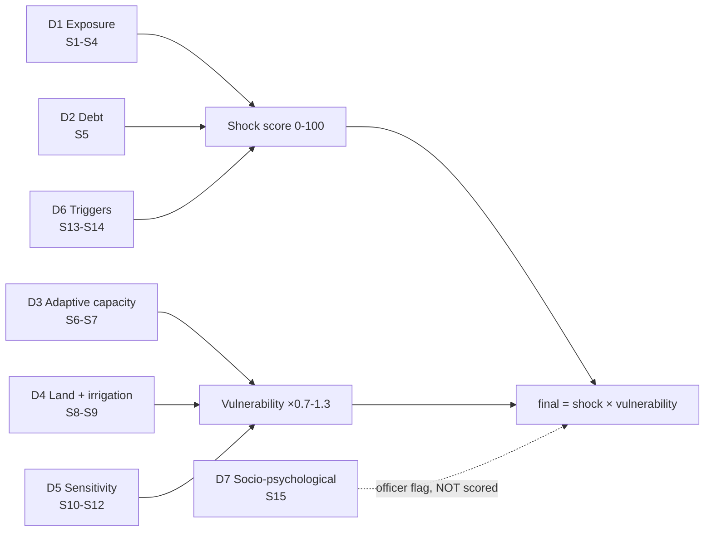

# Signal Model v2 — FDI-Aligned (15 signals across 7 dimensions)

Supersedes the 5-signal model in `masterspecv1.md §3`. This version **operationalises
ICAR-CRIDA's Farmers' Distress Index (FDI)**: it adopts the FDI's seven dimensions, its 0–1 scale
and its band cutoffs, and populates them with **automated, continuous data streams** instead of a
periodic 21-question telephonic survey.

Evidence and rationale: [`research_risk_modelling.md`](./research_risk_modelling.md).

---

## 1. What we adopt from CRIDA, and what we change

| Aspect | CRIDA FDI | This platform | Why |
|---|---|---|---|
| Dimensions | 7 | **Same 7** | Direct comparability + scientific grounding |
| Collection | 21-question telephonic survey, periodic | **Automated streams, daily** | Our differentiation: continuous, per-farmer |
| Scale | 0–1 | **0–100 (= FDI × 100)** | Same scale, friendlier integer display |
| Bands | <0.5 low · 0.5–0.7 moderate · >0.7 severe | **Green <50 · Amber 50–69 · Red ≥70** | **Aligned to CRIDA's cutoffs** (was 30/60) |
| Weighting | Equal weights within dimensions | **Equal within dimension**, dimensions combined as shock × vulnerability | Keeps CRIDA's anti-subjectivity principle |
| Level | Farmer + sub-district | Farmer + village + district | Same granularity, live |

> **Band change is deliberate.** Our Red threshold is now CRIDA's "severe distress" threshold.
> A judge can check our number against the national instrument.

## 2. Scoring structure — shock × vulnerability

A flat sum treats a rainfed marginal farmer and an irrigated large farmer identically under the same
rainfall deficit. They are not the same. The FDI separates *exposure/triggers* from
*adaptive capacity/sensitivity*, so we do too:

```
final_score = clamp( shock_score × vulnerability_multiplier , 0 , 100 )

  shock_score            0–100   acute, fast-moving   (D1 exposure, D2 debt, D6 triggers)
  vulnerability_multiplier 0.7–1.3 structural, slow   (D3 capacity, D4 land/irrigation, D5 sensitivity)
```

This is the standard risk framing (hazard × vulnerability) and it makes the explanation *better*,
not worse: *"Rainfall is 28% below normal — and it hits you harder because you are rainfed with no
crop insurance."* That second clause is exactly what the flat model could never say.

**D7 (socio-psychological) is deliberately excluded from the score** — see §5.



---

## 3. The 15 signals

### Shock signals → `shock_score` (0–100)

| # | Signal | FDI dim | Metric | Source | Pts |
|---|---|---|---|---|---:|
| **S1** | Rainfall deficit | D1 | `deviation_pct` vs LPA, rolling 14/30d + forecast | IMD | 0–20 |
| **S2** | Rainfall excess / flood | D1 | deviation ≥ +50%, waterlogging proxy | IMD | 0–10 |
| **S3** | **Satellite crop stress** | D1 | NDVI/NDWI anomaly vs. village-season baseline | **Sentinel-2** ⭐ | 0–15 |
| **S4** | Pest / disease pressure | D1 | farmer reports in village + district advisory | Farmer / advisory | 0–8 |
| **S5** | Repayment pressure | D2 | `days_to_due` × amount band (**opt-in only**) | Farmer opt-in | 0–20 |
| **S13** | Market price shock | D6 | `drop_pct` vs 90-day median **+ below-MSP flag** | Agmarknet + MSP table | 0–20 |
| **S14** | Acute farmer-reported shock | D6 | health expense, livestock death, no buyer | Farmer (IVR/SMS) | 0–7 |

Sub-total: **100**. Equal weighting *within* each dimension, per CRIDA's method.

### Vulnerability signals → `vulnerability_multiplier` (0.7–1.3)

| # | Signal | FDI dim | Metric | Source | Effect |
|---|---|---|---|---|---|
| **S6** | Scheme coverage gap | D3 | enrolled in PMFBY / PM-Kisan / KCC? | AgriStack / self-declared | −0.10 covered → +0.10 uncovered |
| **S7** | Institutional access | D3 | distance to KVK/FPO; officer-per-farmer ratio | Derived (geo + roster) | ±0.05 |
| **S8** | Land holding | D4 | area band (<1 / 1–2 / >2 ha) | Farmer profile | +0.10 marginal → −0.05 large |
| **S9** | Irrigation | D4 | rainfed / partial / assured | Farmer profile | +0.10 rainfed → −0.10 assured |
| **S10** | Crop growth-stage sensitivity | D5 | in moisture-critical window (flowering/grain-fill)? | Derived from `sowing_date` | +0.10 if critical |
| **S11** | Crop diversification | D5 | monocrop vs. has contingency/secondary crop | Farmer profile | +0.05 monocrop |
| **S12** | Soil moisture retention | D5 | soil type water-holding capacity | SoilHealthCard / Bhuvan | ±0.05 |

Multiplier = `1.0 + Σ(adjustments)`, clamped to **[0.7, 1.3]**.

### Non-scoring

| # | Signal | FDI dim | Use |
|---|---|---|---|
| **S15** | Engagement / withdrawal | D7 | **Officer context flag only — never scored, never shown to the farmer.** See §5. |

---

## 4. New data streams required

| Stream | Feeds | Status | MVP |
|---|---|---|---|
| **Sentinel-2 NDVI/NDWI** ⭐ | S3 | **New adapter** — free, 10 m, 5-day revisit | Fixture; live is stretch |
| **MSP reference table** | S13 | **New static reference** (CACP-published minimum support prices) | Static JSON — cheap, high value |
| **Soil type / SoilHealthCard** | S12 | New (or static per village) | Static per village |
| **Scheme enrolment status** | S6 | Extend AgriStack adapter + self-declared fallback | Self-declared at onboarding |
| **KVK/FPO locations + officer roster** | S7 | Internal reference data | Seeded table |
| **Engagement telemetry** | S15 | Internal, from M6/M9 delivery + inbound | Derived |

Existing streams (IMD, Agmarknet, farmer reports, farmer profile) continue unchanged.

**Onboarding additions** (still under 60 seconds, still zero typing):
`secondary_crop` (icon picker, optional) and `schemes_enrolled` (multi-select chips: PM-Kisan /
PMFBY / KCC / none). Both are single-tap and both materially improve the score.

---

## 5. D7 — why socio-psychological signals are excluded from the score

CRIDA's D7 is collected by **trained humans asking direct questions**. We cannot responsibly infer
psychological distress from telemetry, and attempting it would be both unreliable and invasive.

**Our rule:**
- S15 aggregates only *behavioural* facts — repeated unanswered IVR calls, opt-out, or an explicit
  distress keyword in an inbound SMS.
- It **never contributes points** and is **never shown to the farmer**.
- It appears only as an officer-side context flag: *"3 outreach attempts unanswered."*
- An explicit distress keyword routes to a **human immediately** and surfaces helpline information —
  it never becomes a number.

State this openly in the deck. Naming the dimension we deliberately refuse to model is a maturity
signal, and it pre-empts the obvious ethics question.

---

## 6. Explainability is preserved

Every score still yields top-3 drivers, now with a vulnerability clause:

> **Score 78 · Red** (CRIDA severe-distress band)
> **Shock 65** — rainfall 28% below normal (S1, 18 pts) · cotton 18% below 90-day median and below
> MSP (S13, 20 pts) · satellite crop stress in your plot (S3, 12 pts)
> **Vulnerability ×1.20** — rainfed (+0.10), marginal holding (+0.10), no crop insurance (+0.10),
> assured-irrigation neighbours unaffected (−0.10 n/a)
> *This is not a credit, loan-default, or insurance score.*

Confidence, hysteresis, TTL/stale-suppression and expiry are unchanged from
`masterspecv1.md §3` and apply to the shock score.

---

## 7. Migration from v1 (5-signal)

| v1 signal | v2 mapping |
|---|---|
| Rainfall shock 0–35 (×irrigation modifier) | **Split**: S1 deficit 0–20 + S2 flood 0–10; irrigation becomes S9 in the multiplier |
| Price stress 0–30 | **S13** 0–20, now with below-MSP flag |
| Repayment window 0–20 | **S5** unchanged, 0–20 |
| Crop/soil vulnerability 0–10 | **Split**: S10 growth stage + S12 soil → multiplier |
| Farmer report 0–5 | **Split**: S4 pest 0–8 + S14 acute shock 0–7 |
| — | **New**: S3 satellite, S6 schemes, S7 access, S8 land, S11 diversification, S15 flag |
| Bands 30/60 | **Bands 50/70** (CRIDA-aligned) |

Implementation impact: `scoring_engine/rules/` gains modules; `constants.py` weights and band
cutoffs change; the multiplier path is new. The **public contract is unchanged** — `compute_risk_event()`
still returns a `RiskEvent` with score/band/confidence/contributors, so M5/M6/M7/M8 need no changes.

---

## 8. What this buys us

1. **Scientific grounding** — "our index operationalises ICAR-CRIDA's Farmers' Distress Index,"
   with aligned dimensions and band cutoffs. Citable, checkable.
2. **Real accuracy gain** — S3 observes the crop directly instead of proxying it through rainfall.
3. **Better explanations** — shock vs. vulnerability tells the farmer not just *what happened* but
   *why it hits them harder*.
4. **A defensible ethics position** — we implement 6 of 7 dimensions and say precisely why we
   refuse the seventh.
